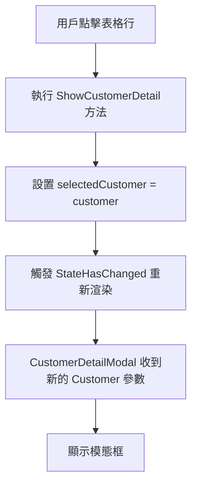

# Blazor 參數綁定機制詳細解釋

## 問題：為什麼需要 `selectedCustomer = customer;` 這一步？

在 `CustomersIndex.razor` 中，當點擊表格行時會執行以下代碼：

```csharp
private async Task ShowCustomerDetail(Customer customer)
{
    selectedCustomer = customer;  // 📌 這一步為什麼必要？
    await JS.InvokeVoidAsync("bootstrap.Modal.getOrCreateInstance", 
        "#customerDetailModal").InvokeVoidAsync("show");
}
```

## Blazor 參數綁定的工作原理

### 1. 參數綁定 vs 方法調用

**錯誤理解：**
```csharp
// 這樣想是錯誤的 - 以為直接傳遞參數
<CustomerDetailModal Customer="customer" />  // ❌ 這不是方法調用！
```

**正確理解：**
```csharp
// 這是參數綁定 - 需要一個變數來持有值
<CustomerDetailModal Customer="selectedCustomer" />  // ✅ 綁定到變數
```

### 2. 參數綁定的生命週期



### 3. 為什麼不能直接使用方法參數？

#### 問題示例：
```csharp
// ❌ 如果不設置 selectedCustomer，會發生什麼？
private async Task ShowCustomerDetail(Customer customer)
{
    // 直接顯示模態框，不設置 selectedCustomer
    await JS.InvokeVoidAsync("bootstrap.Modal.getOrCreateInstance", 
        "#customerDetailModal").InvokeVoidAsync("show");
}
```

**結果：**
- `selectedCustomer` 仍然是 `null` 或之前的值
- `CustomerDetailModal` 的 `Customer` 參數沒有更新
- 模態框顯示空白或錯誤的客戶資料

#### 正確做法：
```csharp
// ✅ 正確的做法
private async Task ShowCustomerDetail(Customer customer)
{
    selectedCustomer = customer;  // 更新綁定的變數
    // Blazor 自動觸發重新渲染，CustomerDetailModal 收到新參數
    await JS.InvokeVoidAsync("bootstrap.Modal.getOrCreateInstance", 
        "#customerDetailModal").InvokeVoidAsync("show");
}
```

## 詳細的執行過程

### 步驟 1：初始狀態
```html
<!-- selectedCustomer = null -->
<CustomerDetailModal Customer="selectedCustomer" />
<!-- CustomerDetailModal.Customer = null -->
```

### 步驟 2：用戶點擊表格行
```csharp
// TableComponent 觸發事件
await OnRowClick.InvokeAsync(customer);  // customer = 特定的客戶物件
```

### 步驟 3：父組件處理事件
```csharp
private async Task ShowCustomerDetail(Customer customer)
{
    // customer = { Id: 1, CompanyName: "ABC公司", ... }
    
    selectedCustomer = customer;  // 📌 關鍵步驟！
    
    // 現在 selectedCustomer 指向具體的客戶物件
}
```

### 步驟 4：Blazor 重新渲染
```html
<!-- selectedCustomer = { Id: 1, CompanyName: "ABC公司", ... } -->
<CustomerDetailModal Customer="selectedCustomer" />
<!-- CustomerDetailModal.Customer = { Id: 1, CompanyName: "ABC公司", ... } -->
```

### 步驟 5：CustomerDetailModal 收到新參數
```csharp
// CustomerDetailModal.razor.cs
[Parameter] public Customer? Customer { get; set; }

// OnParametersSet 被觸發
protected override void OnParametersSet()
{
    // Customer 現在有值了！
    // 模態框內容會正確顯示客戶資料
}
```

## 參數綁定 vs 傳統程式設計的差異

### 傳統程式設計 (如 WinForms)：
```csharp
// 傳統方式 - 直接調用方法傳遞參數
CustomerDetailForm form = new CustomerDetailForm();
form.ShowCustomer(customer);  // 直接傳遞
form.Show();
```

### Blazor 方式：
```csharp
// Blazor 方式 - 通過參數綁定
selectedCustomer = customer;  // 設置綁定的變數
// Blazor 自動處理參數傳遞和重新渲染
```

## 常見錯誤和解決方案

### 錯誤 1：忘記設置綁定變數
```csharp
// ❌ 錯誤
private async Task ShowCustomerDetail(Customer customer)
{
    // 忘記設置 selectedCustomer
    await JS.InvokeVoidAsync("bootstrap.Modal.getOrCreateInstance", 
        "#customerDetailModal").InvokeVoidAsync("show");
}
```

**結果：** 模態框顯示空白或舊資料

### 錯誤 2：嘗試直接傳遞方法參數
```html
<!-- ❌ 這樣不工作 -->
<CustomerDetailModal Customer="@GetCurrentCustomer()" />
```

**問題：** 每次渲染都會調用方法，效能差且可能出錯

### 正確做法：
```csharp
// ✅ 正確
private Customer? selectedCustomer;

private async Task ShowCustomerDetail(Customer customer)
{
    selectedCustomer = customer;  // 設置綁定變數
    await ShowModal();
}
```

## 最佳實踐

### 1. 始終使用變數進行參數綁定
```csharp
// ✅ 好的做法
private Customer? selectedCustomer;
<CustomerDetailModal Customer="selectedCustomer" />
```

### 2. 在事件處理器中更新綁定變數
```csharp
// ✅ 好的做法
private async Task ShowCustomerDetail(Customer customer)
{
    selectedCustomer = customer;  // 先更新綁定變數
    await ShowModal();            // 再執行其他操作
}
```

### 3. 考慮使用 StateHasChanged（如果需要）
```csharp
private async Task ShowCustomerDetail(Customer customer)
{
    selectedCustomer = customer;
    StateHasChanged();  // 強制重新渲染（通常不需要）
    await ShowModal();
}
```

## 總結

`selectedCustomer = customer;` 這一步是必要的，因為：

1. **Blazor 使用參數綁定機制**，不是直接的方法調用
2. **組件需要通過參數接收資料**，參數必須綁定到變數
3. **重新渲染時才會傳遞新的參數值**到子組件
4. **這是 Blazor 響應式 UI 框架的核心機制**

沒有這一步，`CustomerDetailModal` 就無法收到正確的客戶資料，模態框會顯示空白或錯誤的內容。
