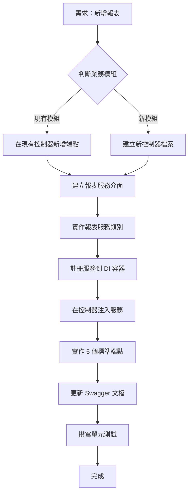

# 報表控制器開發規範

> **版本**: 1.0  
> **更新日期**: 2025年10月20日  
> **適用範圍**: 所有報表類型的 API 控制器開發

---

## 📋 目錄

1. [架構概述](#架構概述)
2. [目錄結構](#目錄結構)
3. [開發流程](#開發流程)
4. [程式碼範例](#程式碼範例)
5. [命名規範](#命名規範)
6. [API 路由規範](#api-路由規範)
7. [錯誤處理](#錯誤處理)
8. [測試要求](#測試要求)
9. [遷移指南](#遷移指南)

---

## 🏗 架構概述

### 設計原則

報表控制器採用**三層架構**設計：

```
BaseReportController (基底抽象類別)
    ↓ 繼承
PurchaseReportController / SalesReportController / ... (業務控制器)
    ↓ 呼叫
IPurchaseOrderReportService / ISalesOrderReportService / ... (報表服務)
```

### 核心優勢

✅ **減少重複程式碼**：通用邏輯集中在 `BaseReportController`  
✅ **易於維護**：每個業務模組獨立檔案（200-400 行）  
✅ **團隊協作友好**：不同開發者可同時修改不同控制器  
✅ **統一錯誤處理**：所有報表控制器共用錯誤處理邏輯  
✅ **清晰的 Swagger 文檔**：自動按業務模組分組

---

## 📁 目錄結構

```
Controllers/
├── ReportController.cs                    ⚠️ 舊版控制器（已棄用，保留相容性）
│
└── Reports/                               ✅ 新版報表控制器目錄
    ├── BaseReportController.cs            🔧 基底抽象類別（所有控制器繼承）
    │
    ├── PurchaseReportController.cs        📦 採購模組報表
    │   ├── 採購單報表 (order)
    │   ├── 進貨單報表 (receiving)
    │   ├── 採購退貨單報表 (return)
    │   └── 沖款單報表 (setoff)
    │
    ├── SalesReportController.cs           💰 銷售模組報表
    │   ├── 銷售訂單報表 (order)
    │   ├── 出貨單報表 (shipment)
    │   └── 銷售退貨單報表 (return)
    │
    ├── InventoryReportController.cs       📊 庫存模組報表
    │   ├── 庫存盤點報表 (stocktaking)
    │   └── 庫存異動報表 (movement)
    │
    └── FinanceReportController.cs         💵 財務模組報表
        ├── 應收帳款報表 (receivable)
        └── 應付帳款報表 (payable)
```

---

## 🔄 開發流程

### 流程圖



### 詳細步驟

#### **情境一：在現有控制器新增報表（例如：在採購模組新增「採購退貨單報表」）**

##### Step 1: 建立報表服務介面

```csharp
// Services/Reports/IPurchaseReturnReportService.cs
namespace ERPCore2.Services.Reports
{
    public interface IPurchaseReturnReportService
    {
        /// <summary>
        /// 生成採購退貨單報表
        /// </summary>
        Task<string> GeneratePurchaseReturnReportAsync(
            int id, 
            ReportFormat format = ReportFormat.Html,
            ReportPrintConfiguration? config = null);
        
        /// <summary>
        /// 批次生成採購退貨單報表
        /// </summary>
        Task<string> GenerateBatchReportAsync(
            BatchPrintCriteria criteria,
            ReportFormat format = ReportFormat.Html,
            ReportPrintConfiguration? config = null);
    }
}
```

##### Step 2: 實作報表服務

```csharp
// Services/Reports/PurchaseReturnReportService.cs
namespace ERPCore2.Services.Reports
{
    public class PurchaseReturnReportService : IPurchaseReturnReportService
    {
        // 依照 PurchaseOrderReportService 的模式實作
        // 包含報表 HTML 生成、分頁處理、批次列印等邏輯
    }
}
```

##### Step 3: 註冊服務

```csharp
// Data/ServiceRegistration.cs
services.AddScoped<IPurchaseReturnReportService, PurchaseReturnReportService>();
```

##### Step 4: 在控制器中注入服務並新增端點

```csharp
// Controllers/Reports/PurchaseReportController.cs
public class PurchaseReportController : BaseReportController
{
    private readonly IPurchaseOrderReportService _orderService;
    private readonly IPurchaseReceivingReportService _receivingService;
    private readonly IPurchaseReturnReportService _returnService; // ✅ 新增

    public PurchaseReportController(
        IPurchaseOrderReportService orderService,
        IPurchaseReceivingReportService receivingService,
        IPurchaseReturnReportService returnService, // ✅ 新增
        IReportPrintConfigurationService configService,
        ILogger<PurchaseReportController> logger)
        : base(configService, logger)
    {
        _orderService = orderService;
        _receivingService = receivingService;
        _returnService = returnService; // ✅ 新增
    }

    // === 現有端點保持不變 ===

    #region 採購退貨單報表 ✅ 新增區塊

    /// <summary>
    /// 生成採購退貨單報表
    /// </summary>
    [HttpGet("return/{id}")]
    public async Task<IActionResult> GetPurchaseReturnReport(
        int id,
        [FromQuery] string format = "html",
        [FromQuery] int? configId = null,
        [FromQuery] string? reportType = null)
    {
        return await GenerateReportAsync(
            _returnService,
            (svc, id, fmt, cfg) => svc.GeneratePurchaseReturnReportAsync(id, fmt, cfg),
            id, format, configId, reportType,
            "採購退貨單");
    }

    /// <summary>
    /// 生成採購退貨單列印報表（自動觸發列印對話框）
    /// </summary>
    [HttpGet("return/{id}/print")]
    public async Task<IActionResult> PrintPurchaseReturnReport(
        int id,
        [FromQuery] int? configId = null,
        [FromQuery] string? reportType = null)
    {
        return await PrintReportAsync(
            _returnService,
            (svc, id, fmt, cfg) => svc.GeneratePurchaseReturnReportAsync(id, fmt, cfg),
            id, configId, reportType,
            "採購退貨單");
    }

    /// <summary>
    /// 預覽採購退貨單報表
    /// </summary>
    [HttpGet("return/{id}/preview")]
    public async Task<IActionResult> PreviewPurchaseReturnReport(
        int id,
        [FromQuery] int? configId = null,
        [FromQuery] string? reportType = null)
    {
        return await GetPurchaseReturnReport(id, "html", configId, reportType);
    }

    /// <summary>
    /// 批次生成採購退貨單報表（支援多條件篩選）
    /// </summary>
    [HttpPost("return/batch")]
    public async Task<IActionResult> BatchPrintPurchaseReturns(
        [FromBody] BatchPrintCriteria criteria,
        [FromQuery] int? configId = null,
        [FromQuery] string? reportType = null)
    {
        return await BatchReportAsync(
            _returnService,
            (svc, cri, fmt, cfg) => svc.GenerateBatchReportAsync(cri, fmt, cfg),
            criteria, configId, reportType,
            "採購退貨單");
    }

    /// <summary>
    /// 批次生成採購退貨單報表並自動列印（支援多條件篩選）
    /// </summary>
    [HttpPost("return/batch/print")]
    public async Task<IActionResult> BatchPrintPurchaseReturnsWithAuto(
        [FromBody] BatchPrintCriteria criteria,
        [FromQuery] int? configId = null,
        [FromQuery] string? reportType = null)
    {
        return await BatchPrintReportAsync(
            _returnService,
            (svc, cri, fmt, cfg) => svc.GenerateBatchReportAsync(cri, fmt, cfg),
            criteria, configId, reportType,
            "採購退貨單");
    }

    #endregion
}
```

---

#### **情境二：建立全新業務模組控制器（例如：銷售報表控制器）**

##### Step 1: 建立新控制器檔案

```csharp
// Controllers/Reports/SalesReportController.cs
using Microsoft.AspNetCore.Mvc;
using ERPCore2.Services.Reports;
using ERPCore2.Services;
using ERPCore2.Models;
using ERPCore2.Controllers.Reports;

namespace ERPCore2.Controllers.Reports
{
    /// <summary>
    /// 銷售報表控制器 - 處理所有銷售相關的報表生成
    /// 包含：銷售訂單、出貨單、銷售退貨單等報表
    /// </summary>
    [Route("api/sales-report")]
    [ApiController]
    [ApiExplorerSettings(GroupName = "銷售報表")]
    public class SalesReportController : BaseReportController
    {
        private readonly ISalesOrderReportService _salesOrderService;
        private readonly IShipmentReportService _shipmentService;

        public SalesReportController(
            ISalesOrderReportService salesOrderService,
            IShipmentReportService shipmentService,
            IReportPrintConfigurationService configService,
            ILogger<SalesReportController> logger)
            : base(configService, logger)
        {
            _salesOrderService = salesOrderService;
            _shipmentService = shipmentService;
        }

        #region 銷售訂單報表

        /// <summary>
        /// 生成銷售訂單報表
        /// </summary>
        [HttpGet("order/{id}")]
        public async Task<IActionResult> GetSalesOrderReport(
            int id,
            [FromQuery] string format = "html",
            [FromQuery] int? configId = null,
            [FromQuery] string? reportType = null)
        {
            return await GenerateReportAsync(
                _salesOrderService,
                (svc, id, fmt, cfg) => svc.GenerateSalesOrderReportAsync(id, fmt, cfg),
                id, format, configId, reportType,
                "銷售訂單");
        }

        // ... 其他 4 個標準端點（print, preview, batch, batch/print）

        #endregion

        #region 出貨單報表

        /// <summary>
        /// 生成出貨單報表
        /// </summary>
        [HttpGet("shipment/{id}")]
        public async Task<IActionResult> GetShipmentReport(
            int id,
            [FromQuery] string format = "html",
            [FromQuery] int? configId = null,
            [FromQuery] string? reportType = null)
        {
            return await GenerateReportAsync(
                _shipmentService,
                (svc, id, fmt, cfg) => svc.GenerateShipmentReportAsync(id, fmt, cfg),
                id, format, configId, reportType,
                "出貨單");
        }

        // ... 其他 4 個標準端點

        #endregion
    }
}
```

---

## 📝 程式碼範例

### 標準的 5 個端點模板

每個報表類型都需要實作以下 5 個標準端點：

```csharp
#region {報表名稱}報表

/// <summary>
/// 生成{報表名稱}報表
/// </summary>
[HttpGet("{路由}/{id}")]
public async Task<IActionResult> Get{報表名稱}Report(
    int id,
    [FromQuery] string format = "html",
    [FromQuery] int? configId = null,
    [FromQuery] string? reportType = null)
{
    return await GenerateReportAsync(
        _{服務變數名稱},
        (svc, id, fmt, cfg) => svc.Generate{報表名稱}ReportAsync(id, fmt, cfg),
        id, format, configId, reportType,
        "{中文報表名稱}");
}

/// <summary>
/// 生成{報表名稱}列印報表（自動觸發列印對話框）
/// </summary>
[HttpGet("{路由}/{id}/print")]
public async Task<IActionResult> Print{報表名稱}Report(
    int id,
    [FromQuery] int? configId = null,
    [FromQuery] string? reportType = null)
{
    return await PrintReportAsync(
        _{服務變數名稱},
        (svc, id, fmt, cfg) => svc.Generate{報表名稱}ReportAsync(id, fmt, cfg),
        id, configId, reportType,
        "{中文報表名稱}");
}

/// <summary>
/// 預覽{報表名稱}報表
/// </summary>
[HttpGet("{路由}/{id}/preview")]
public async Task<IActionResult> Preview{報表名稱}Report(
    int id,
    [FromQuery] int? configId = null,
    [FromQuery] string? reportType = null)
{
    return await Get{報表名稱}Report(id, "html", configId, reportType);
}

/// <summary>
/// 批次生成{報表名稱}報表（支援多條件篩選）
/// </summary>
[HttpPost("{路由}/batch")]
public async Task<IActionResult> BatchPrint{報表名稱複數}(
    [FromBody] BatchPrintCriteria criteria,
    [FromQuery] int? configId = null,
    [FromQuery] string? reportType = null)
{
    return await BatchReportAsync(
        _{服務變數名稱},
        (svc, cri, fmt, cfg) => svc.GenerateBatchReportAsync(cri, fmt, cfg),
        criteria, configId, reportType,
        "{中文報表名稱}");
}

/// <summary>
/// 批次生成{報表名稱}報表並自動列印（支援多條件篩選）
/// </summary>
[HttpPost("{路由}/batch/print")]
public async Task<IActionResult> BatchPrint{報表名稱複數}WithAuto(
    [FromBody] BatchPrintCriteria criteria,
    [FromQuery] int? configId = null,
    [FromQuery] string? reportType = null)
{
    return await BatchPrintReportAsync(
        _{服務變數名稱},
        (svc, cri, fmt, cfg) => svc.GenerateBatchReportAsync(cri, fmt, cfg),
        criteria, configId, reportType,
        "{中文報表名稱}");
}

#endregion
```

---

## 🏷 命名規範

### 控制器命名

| 類型 | 格式 | 範例 |
|------|------|------|
| 控制器類別名稱 | `{業務模組}ReportController` | `PurchaseReportController` |
| 控制器檔案名稱 | `{業務模組}ReportController.cs` | `PurchaseReportController.cs` |
| 命名空間 | `ERPCore2.Controllers.Reports` | ✅ 統一放在此命名空間下 |

### 方法命名

| 端點類型 | 方法名稱格式 | 範例 |
|---------|------------|------|
| 單筆報表 | `Get{報表名稱}Report` | `GetPurchaseOrderReport` |
| 列印報表 | `Print{報表名稱}Report` | `PrintPurchaseOrderReport` |
| 預覽報表 | `Preview{報表名稱}Report` | `PreviewPurchaseOrderReport` |
| 批次報表 | `BatchPrint{報表名稱複數}` | `BatchPrintPurchaseOrders` |
| 批次列印 | `BatchPrint{報表名稱複數}WithAuto` | `BatchPrintPurchaseOrdersWithAuto` |

### 變數命名

| 類型 | 格式 | 範例 |
|------|------|------|
| 服務欄位 | `_{報表類型小寫}Service` | `_purchaseOrderService` |
| 服務介面 | `I{報表名稱}ReportService` | `IPurchaseOrderReportService` |
| 服務實作 | `{報表名稱}ReportService` | `PurchaseOrderReportService` |

---

## 🛣 API 路由規範

### 路由結構

```
/api/{業務模組}-report/{報表類型}/{操作}
```

### 範例

| 業務模組 | 報表類型 | 完整路由 | 說明 |
|---------|---------|---------|------|
| 採購 | 採購單 | `/api/purchase-report/order/{id}` | 生成採購單報表 |
| 採購 | 進貨單 | `/api/purchase-report/receiving/{id}` | 生成進貨單報表 |
| 採購 | 採購退貨 | `/api/purchase-report/return/{id}` | 生成採購退貨單報表 |
| 銷售 | 銷售訂單 | `/api/sales-report/order/{id}` | 生成銷售訂單報表 |
| 銷售 | 出貨單 | `/api/sales-report/shipment/{id}` | 生成出貨單報表 |
| 庫存 | 庫存盤點 | `/api/inventory-report/stocktaking/{id}` | 生成庫存盤點報表 |
| 財務 | 應收帳款 | `/api/finance-report/receivable/{id}` | 生成應收帳款報表 |

### 完整端點列表（以採購單為例）

| HTTP 方法 | 路由 | 說明 |
|----------|------|------|
| GET | `/api/purchase-report/order/{id}?format=html` | 生成報表 |
| GET | `/api/purchase-report/order/{id}/print` | 列印報表（自動觸發列印） |
| GET | `/api/purchase-report/order/{id}/preview` | 預覽報表 |
| POST | `/api/purchase-report/order/batch` | 批次生成報表 |
| POST | `/api/purchase-report/order/batch/print` | 批次列印報表 |

---

## ⚠️ 錯誤處理

### 標準錯誤回應

所有報表端點的錯誤處理已在 `BaseReportController` 統一實作：

| HTTP 狀態碼 | 情境 | 回應格式 |
|------------|------|---------|
| 404 Not Found | 找不到報表資料 | `{ "message": "找不到採購單 - ID: 123" }` |
| 400 Bad Request | 參數驗證失敗 | `{ "message": "篩選條件驗證失敗", "errors": {...} }` |
| 501 Not Implemented | 不支援的格式 | `{ "message": "PDF 格式尚未實作" }` |
| 500 Internal Server Error | 系統錯誤 | `{ "message": "生成報表時發生錯誤", "detail": "..." }` |

### 自訂錯誤處理

如需在子控制器中加入額外的錯誤處理，可覆寫基底方法或在呼叫前加入驗證：

```csharp
[HttpGet("order/{id}")]
public async Task<IActionResult> GetPurchaseOrderReport(int id, ...)
{
    // ✅ 自訂驗證邏輯
    if (id <= 0)
    {
        return BadRequest(new { message = "無效的採購單ID" });
    }

    // ✅ 自訂權限檢查
    if (!User.HasClaim("Permission", "PurchaseOrder.Read"))
    {
        return Forbid();
    }

    // 呼叫基底方法處理標準邏輯
    return await GenerateReportAsync(...);
}
```

---

## 🧪 測試要求

### 單元測試

每個報表控制器都應該撰寫以下測試：

```csharp
// Tests/Controllers/Reports/PurchaseReportControllerTests.cs
public class PurchaseReportControllerTests
{
    [Fact]
    public async Task GetPurchaseOrderReport_ValidId_ReturnsHtml()
    {
        // Arrange
        var mockService = new Mock<IPurchaseOrderReportService>();
        mockService.Setup(s => s.GeneratePurchaseOrderReportAsync(It.IsAny<int>(), It.IsAny<ReportFormat>(), It.IsAny<ReportPrintConfiguration?>()))
            .ReturnsAsync("<html>...</html>");
        
        var controller = new PurchaseReportController(mockService.Object, ...);

        // Act
        var result = await controller.GetPurchaseOrderReport(1);

        // Assert
        Assert.IsType<ContentResult>(result);
        var content = (result as ContentResult)?.Content;
        Assert.Contains("<html>", content);
    }

    [Fact]
    public async Task GetPurchaseOrderReport_InvalidId_ReturnsNotFound()
    {
        // Arrange
        var mockService = new Mock<IPurchaseOrderReportService>();
        mockService.Setup(s => s.GeneratePurchaseOrderReportAsync(It.IsAny<int>(), It.IsAny<ReportFormat>(), It.IsAny<ReportPrintConfiguration?>()))
            .ThrowsAsync(new ArgumentException("找不到採購單"));
        
        var controller = new PurchaseReportController(mockService.Object, ...);

        // Act
        var result = await controller.GetPurchaseOrderReport(999);

        // Assert
        Assert.IsType<NotFoundObjectResult>(result);
    }
}
```

### 整合測試

```csharp
// Tests/Integration/ReportControllerIntegrationTests.cs
public class ReportControllerIntegrationTests : IClassFixture<WebApplicationFactory<Program>>
{
    [Fact]
    public async Task GET_PurchaseOrderReport_ReturnsSuccessAndCorrectContentType()
    {
        // Arrange
        var client = _factory.CreateClient();

        // Act
        var response = await client.GetAsync("/api/purchase-report/order/1");

        // Assert
        response.EnsureSuccessStatusCode();
        Assert.Equal("text/html; charset=utf-8", response.Content.Headers.ContentType.ToString());
    }
}
```

---

## 🔄 遷移指南

### 從舊版 ReportController 遷移

#### 舊版路由（已棄用）
```
GET  /api/report/purchase-order/123
GET  /api/report/purchase-receiving/456
```

#### 新版路由
```
GET  /api/purchase-report/order/123
GET  /api/purchase-report/receiving/456
```

### 前端遷移步驟

#### Step 1: 更新 API 呼叫路徑

**舊版**：
```javascript
// 舊版前端程式碼
const reportUrl = `/api/report/purchase-order/${orderId}`;
```

**新版**：
```javascript
// 新版前端程式碼
const reportUrl = `/api/purchase-report/order/${orderId}`;
```

#### Step 2: 更新 Blazor 元件

**舊版**：
```csharp
// 舊版 Blazor 元件
var printUrl = $"{NavigationManager.BaseUri}api/report/purchase-order/{orderId}?autoprint=true";
```

**新版**：
```csharp
// 新版 Blazor 元件
var printUrl = ReportPrintHelper.BuildPrintUrl(
    baseUrl: NavigationManager.BaseUri,
    reportType: "purchase-report/order",  // ✅ 更新路徑
    documentId: orderId,
    configuration: printConfig,
    autoprint: true
);
```

### 遷移時間表

| 階段 | 時間 | 行動 |
|-----|------|------|
| **第一階段** | 2025 Q4 | 新功能使用新架構，舊路由保留相容性 |
| **第二階段** | 2026 Q1 | 前端逐步遷移至新路由 |
| **第三階段** | 2026 Q2 | 標記舊路由為 Obsolete，顯示警告 |
| **第四階段** | 2026 Q3 | 移除舊路由（`ReportController.cs`） |

---

## 📊 Swagger 文檔配置

### 自動分組

每個報表控制器會在 Swagger 中自動分組：

```csharp
[ApiExplorerSettings(GroupName = "採購報表")]
public class PurchaseReportController : BaseReportController { }

[ApiExplorerSettings(GroupName = "銷售報表")]
public class SalesReportController : BaseReportController { }

[ApiExplorerSettings(GroupName = "庫存報表")]
public class InventoryReportController : BaseReportController { }
```

### Swagger UI 顯示效果

```
📦 採購報表
  └─ GET  /api/purchase-report/order/{id}
  └─ GET  /api/purchase-report/order/{id}/print
  └─ GET  /api/purchase-report/order/{id}/preview
  └─ POST /api/purchase-report/order/batch
  └─ POST /api/purchase-report/order/batch/print
  └─ GET  /api/purchase-report/receiving/{id}
  └─ ...

💰 銷售報表
  └─ GET  /api/sales-report/order/{id}
  └─ ...

📊 庫存報表
  └─ GET  /api/inventory-report/stocktaking/{id}
  └─ ...
```

---

## ✅ 檢查清單

在提交程式碼前，請確認以下項目：

### 控制器開發檢查清單

- [ ] 繼承自 `BaseReportController`
- [ ] 設定正確的路由 `[Route("api/{模組}-report")]`
- [ ] 加入 `[ApiExplorerSettings(GroupName = "{模組}報表")]`
- [ ] 實作完整的 5 個標準端點（Get, Print, Preview, Batch, BatchPrint）
- [ ] 所有端點都有完整的 XML 註解（`<summary>`）
- [ ] 變數命名符合規範
- [ ] 程式碼格式化（使用 IDE 自動格式化）

### 服務開發檢查清單

- [ ] 建立服務介面 `I{報表名稱}ReportService`
- [ ] 實作服務類別 `{報表名稱}ReportService`
- [ ] 在 `ServiceRegistration.cs` 註冊服務
- [ ] 實作單筆報表生成方法
- [ ] 實作批次報表生成方法
- [ ] 支援 `ReportPrintConfiguration` 參數

### 測試檢查清單

- [ ] 撰寫單元測試（至少覆蓋正常情境和錯誤情境）
- [ ] 撰寫整合測試（測試實際 HTTP 請求）
- [ ] 測試所有 5 個端點
- [ ] 測試錯誤處理邏輯
- [ ] 手動測試 Swagger UI 顯示正確

### 文檔檢查清單

- [ ] 更新 API 文檔（如有）
- [ ] 更新 Swagger 註解
- [ ] 如有特殊邏輯，更新此 README 檔案
- [ ] 提交前執行 Code Review

---

## 💡 最佳實踐

### DO ✅

1. **統一使用 BaseReportController 的方法**：不要重複實作報表生成邏輯
2. **保持控制器輕量**：業務邏輯應在服務層，控制器只做路由和參數轉換
3. **完整的錯誤處理**：善用 `try-catch` 並記錄日誌
4. **遵循 RESTful 規範**：GET 用於查詢，POST 用於批次操作
5. **撰寫清晰的註解**：每個端點都要有 `<summary>` 說明

### DON'T ❌

1. **不要在控制器中寫業務邏輯**：應該委託給服務層
2. **不要硬編碼錯誤訊息**：使用資源檔或常數
3. **不要忽略參數驗證**：善用 `[Required]`、`[Range]` 等屬性
4. **不要返回原始例外訊息**：避免洩漏系統資訊
5. **不要複製貼上程式碼**：善用基底類別的通用方法

---

## 📚 相關文件

- [報表服務開發指南](README_ReportBuilders.md)
- [報表列印配置說明](README_ReportPrintConfiguration.md)
- [通用分頁框架說明](README_ReportPagination.md)
- [錯誤處理規範](README_ErrorHandling.md)

---

## 🔗 快速連結

- [BaseReportController.cs](../Controllers/Reports/BaseReportController.cs)
- [PurchaseReportController.cs](../Controllers/Reports/PurchaseReportController.cs)
- [ReportPrintHelper.cs](../Helpers/ReportPrintHelper.cs)