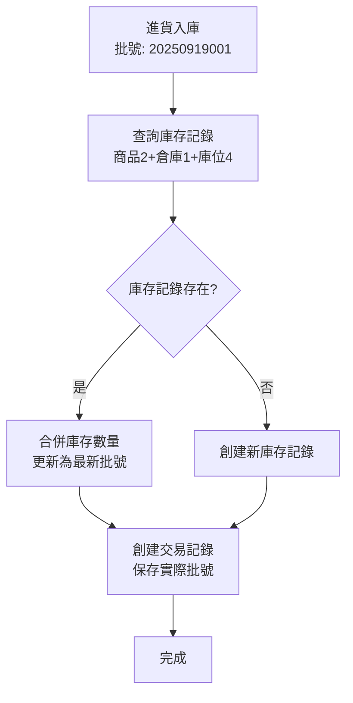

# 庫存批號處理邏輯重構 - 2025年9月19日

## 📋 修改概述

本次修改解決了庫存管理系統中**批號追蹤與庫存合併**的核心問題。之前系統會因為不同批號而產生多筆相同商品在相同倉庫位置的庫存記錄，現在改為**批號追蹤但庫存合併**的策略。

## 🚨 問題背景

### **原有問題**
當同一商品在相同倉庫位置多次進貨時，由於每次進貨都會產生唯一批號（如 `20250919001`, `20250919002`），導致：

```sql
-- 問題示例：相同商品在相同位置產生多筆庫存記錄
InventoryStock 表：
Id | ProductId | WarehouseId | WarehouseLocationId | BatchNumber   | CurrentStock
1  | 2         | 1           | 4                   | 20250919002   | 10
2  | 2         | 1           | 4                   | 20250919003   | 15  
3  | 2         | 1           | 4                   | 20250919004   | 8
-- 總庫存需要手動計算：10 + 15 + 8 = 33
```

### **業務影響**
1. 庫存查詢複雜化，需要手動合併相同位置的記錄
2. 庫存報表顯示不直觀
3. 庫存檢查邏輯需要處理多筆記錄
4. 違背一般庫存管理系統的期望行為

## 🔧 解決方案：方案1 - 批號追蹤但庫存合併

### **設計理念**
- **庫存合併**：相同商品在相同倉庫位置只有一筆庫存記錄
- **批號追蹤**：透過交易記錄保留完整的批號追蹤能力
- **溯源能力**：支援批號查詢和追蹤功能

## 📊 核心修改

### **1. InventoryStock 實體調整**

#### **修改前**
```csharp
[Index(nameof(ProductId), nameof(WarehouseId), nameof(WarehouseLocationId), nameof(BatchNumber), IsUnique = true)]
public class InventoryStock : BaseEntity
{
    [Display(Name = "批號")]
    public string? BatchNumber { get; set; }
    // ...
}
```

#### **修改後**
```csharp
[Index(nameof(ProductId), nameof(WarehouseId), nameof(WarehouseLocationId), IsUnique = true)]
public class InventoryStock : BaseEntity
{
    [Display(Name = "最新批號")]
    public string? BatchNumber { get; set; } // 僅用於顯示最新批號
    
    [Display(Name = "最新批次進貨日期")]
    public DateTime? BatchDate { get; set; }
    
    [Display(Name = "最新到期日期")]
    public DateTime? ExpiryDate { get; set; }
    // ...
}
```

**關鍵變更**：
- ✅ 移除 `BatchNumber` 從唯一約束中
- ✅ 唯一約束改為：`ProductId + WarehouseId + WarehouseLocationId`
- ✅ 批號欄位保留作為"最新批號"的顯示用途

### **2. InventoryTransaction 實體擴充**

```csharp
public class InventoryTransaction : BaseEntity
{
    // 新增批號追蹤欄位
    [Display(Name = "交易批號")]
    public string? TransactionBatchNumber { get; set; }
    
    [Display(Name = "交易批次進貨日期")]
    public DateTime? TransactionBatchDate { get; set; }
    
    [Display(Name = "交易批次到期日期")]
    public DateTime? TransactionExpiryDate { get; set; }
    // ...
}
```

**用途**：
- ✅ 保存每筆交易的實際批號信息
- ✅ 提供完整的批號追蹤和溯源能力
- ✅ 支援批號查詢和到期日管理

### **3. InventoryStockService 邏輯重構**

#### **AddStockAsync 方法修改**

**修改前**：
```csharp
// 根據批號查詢庫存記錄
if (!string.IsNullOrEmpty(batchNumber))
{
    stock = await context.InventoryStocks
        .FirstOrDefaultAsync(i => i.ProductId == productId && 
                                 i.WarehouseId == warehouseId &&
                                 i.WarehouseLocationId == locationId && 
                                 i.BatchNumber == batchNumber);
}
```

**修改後**：
```csharp
// 根據商品+倉庫+庫位查詢庫存記錄，忽略批號
var stock = await context.InventoryStocks
    .FirstOrDefaultAsync(i => i.ProductId == productId && 
                             i.WarehouseId == warehouseId &&
                             i.WarehouseLocationId == locationId && 
                             !i.IsDeleted);

// 更新為最新的批次資訊
if (!string.IsNullOrEmpty(batchNumber))
    stock.BatchNumber = batchNumber;
```

**結果**：
- ✅ 相同位置的庫存會自動合併
- ✅ 批號信息更新為最新的
- ✅ 交易記錄保存實際的批號詳情

## 🎯 修改後的行為

### **庫存管理流程**



### **數據結構對比**

#### **修改前**
```sql
-- InventoryStock 表（多筆記錄）
Id | ProductId | WarehouseId | LocationId | BatchNumber   | CurrentStock
1  | 2         | 1          | 4          | 20250919002   | 10
2  | 2         | 1          | 4          | 20250919003   | 15
3  | 2         | 1          | 4          | 20250919004   | 8

-- 需要手動計算總庫存：10 + 15 + 8 = 33
```

#### **修改後**
```sql
-- InventoryStock 表（單筆記錄）
Id | ProductId | WarehouseId | LocationId | BatchNumber   | CurrentStock
1  | 2         | 1          | 4          | 20250919004   | 33

-- InventoryTransaction 表（詳細追蹤）
Id | ProductId | WarehouseId | LocationId | TransactionBatchNumber | Quantity
1  | 2         | 1          | 4          | 20250919002           | 10
2  | 2         | 1          | 4          | 20250919003           | 15
3  | 2         | 1          | 4          | 20250919004           | 8
```

## ⚠️ 影響範圍與調整建議

### **1. 採購入庫 (PurchaseReceiving)**

#### **影響程度**：✅ **無需調整**
- `PurchaseReceivingService.ConfirmReceiptAsync` 已正確調用 `AddStockAsync`
- 系統會自動合併相同位置的庫存
- 批號信息會正確保存到交易記錄

#### **確認點**：
```csharp
// PurchaseReceivingService.cs - ConfirmReceiptAsync 方法
var addStockResult = await _inventoryStockService.AddStockAsync(
    detail.ProductId,
    detail.WarehouseId,
    detail.ReceivedQuantity,
    InventoryTransactionTypeEnum.Purchase,
    purchaseReceiving.ReceiptNumber,
    detail.UnitPrice,
    detail.WarehouseLocationId,
    $"採購進貨確認 - {purchaseReceiving.ReceiptNumber}",
    detail.BatchNumber,           // ✅ 批號正確傳遞
    purchaseReceiving.ReceiptDate,
    detail.ExpiryDate
);
```

### **2. 庫存入庫 (其他入庫類型)**

#### **影響程度**：✅ **無需調整**
- 所有調用 `InventoryStockService.AddStockAsync` 的地方都會自動受益
- 系統行為保持一致

### **3. 銷貨出庫 (Sales)**

#### **影響程度**：⚠️ **需要檢查**
- 檢查銷貨時是否正確調用 `ReduceStockAsync`
- 確認庫存檢查邏輯是否需要調整

#### **需要確認的服務**：
```csharp
// 需檢查的方法
SalesOrderService.ConfirmOrderAsync()
SalesDeliveryService.DeliverAsync()
// 確保正確調用：
await _inventoryStockService.ReduceStockAsync(
    productId, warehouseId, quantity,
    InventoryTransactionTypeEnum.Sales,
    orderNumber, locationId, remarks
);
```

#### **潛在調整點**：
- 庫存查詢：從多筆記錄改為單筆記錄
- 可用庫存計算：簡化為 `AvailableStock` 屬性
- 批號管理：如需 FIFO 出庫，需要從交易記錄查詢

### **4. 銷貨退回 (Sales Return)**

#### **影響程度**：⚠️ **需要檢查**
- 退回商品應該調用 `AddStockAsync` 增加庫存
- 確認退回的批號信息處理

#### **建議調整**：
```csharp
// SalesReturnService.cs 範例
public async Task<ServiceResult> ProcessReturnAsync(SalesReturn salesReturn)
{
    foreach (var detail in salesReturn.Details)
    {
        // 銷貨退回 - 增加庫存
        var addResult = await _inventoryStockService.AddStockAsync(
            detail.ProductId,
            detail.WarehouseId,
            detail.ReturnQuantity,
            InventoryTransactionTypeEnum.Return,
            salesReturn.ReturnNumber,
            detail.UnitPrice,
            detail.WarehouseLocationId,
            $"銷貨退回 - {salesReturn.ReturnNumber}",
            detail.BatchNumber,      // 原批號信息
            detail.BatchDate,
            detail.ExpiryDate
        );
        
        if (!addResult.IsSuccess)
            return addResult;
    }
    return ServiceResult.Success();
}
```

## 🔄 資料庫遷移狀態

### **當前狀態**
- ✅ `InventoryTransaction` 批號欄位已添加
- ⚠️ `InventoryStock` 唯一約束尚未更新（因現有重複記錄）
- ⚠️ 現有重複庫存記錄尚未合併

### **遷移待辦**
```sql
-- 需要執行的清理工作
-- 1. 合併重複的庫存記錄
-- 2. 更新唯一約束
-- 3. 重新建立索引
```

## 📈 預期效果

### **immediate Benefits**
1. ✅ 新的進貨操作會自動合併庫存
2. ✅ 批號信息完整保存在交易記錄中
3. ✅ 庫存查詢簡化為單筆記錄

### **長期效果**
1. 🎯 庫存管理更直觀
2. 🎯 報表生成更簡單
3. 🎯 系統性能提升
4. 🎯 維護完整的批號追蹤能力

## 🧪 測試建議

### **測試場景**
1. **採購入庫測試**：
   - 相同商品多次入庫到相同位置
   - 驗證庫存是否正確合併
   - 檢查交易記錄是否保存正確批號

2. **銷貨出庫測試**：
   - 驗證庫存扣減是否正確
   - 檢查可用庫存計算

3. **銷貨退回測試**：
   - 驗證退回商品是否正確增加庫存
   - 檢查批號信息處理

### **驗證 SQL**
```sql
-- 檢查庫存合併效果
SELECT ProductId, WarehouseId, WarehouseLocationId, 
       COUNT(*) as RecordCount,
       SUM(CurrentStock) as TotalStock,
       STRING_AGG(BatchNumber, ', ') as AllBatchNumbers
FROM InventoryStocks 
WHERE IsDeleted = 0
GROUP BY ProductId, WarehouseId, WarehouseLocationId
HAVING COUNT(*) > 1;  -- 應該回傳空結果

-- 檢查交易記錄批號
SELECT TOP 10 
    TransactionNumber,
    TransactionBatchNumber,
    Quantity,
    TransactionType
FROM InventoryTransactions 
WHERE TransactionBatchNumber IS NOT NULL
ORDER BY CreatedAt DESC;
```

## 📚 相關文件

- `Data/Entities/Warehouses/InventoryStock.cs` - 庫存實體
- `Data/Entities/Inventory/InventoryTransaction.cs` - 交易記錄實體  
- `Services/Warehouses/InventoryStockService.cs` - 庫存服務
- `Services/Purchase/PurchaseReceivingService.cs` - 採購入庫服務

## ✅ 檢查清單

### **實施前檢查**
- [ ] 備份現有資料庫
- [ ] 檢查所有調用 `InventoryStockService` 的服務
- [ ] 準備測試數據和測試案例

### **實施後驗證**
- [ ] 進貨入庫功能測試
- [ ] 庫存查詢功能測試  
- [ ] 銷貨出庫功能測試
- [ ] 銷貨退回功能測試
- [ ] 批號追蹤功能測試
- [ ] 庫存報表功能測試

---

**修改日期**：2025年9月19日  
**修改人員**：系統架構調整  
**版本**：v1.0 - 庫存批號處理邏輯重構