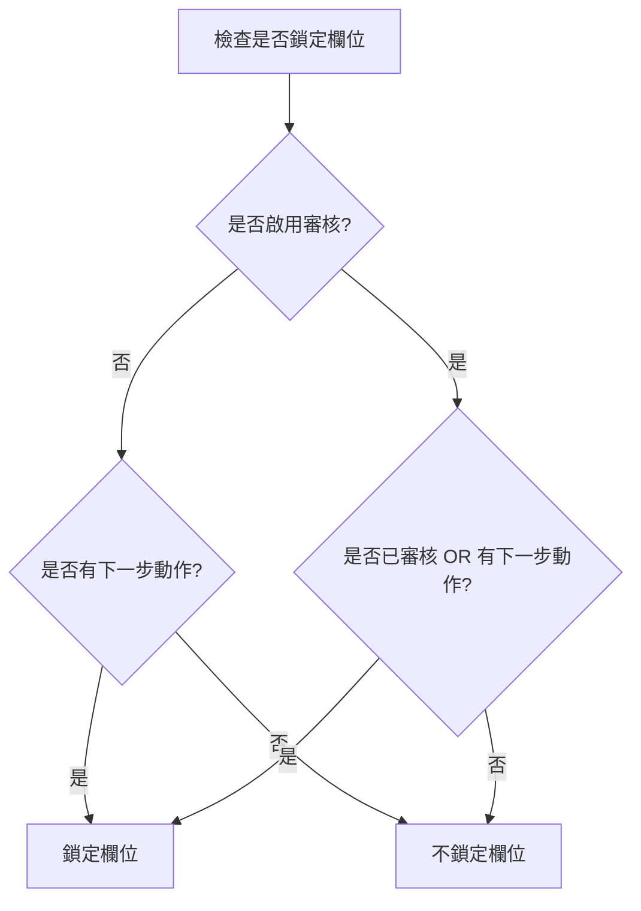
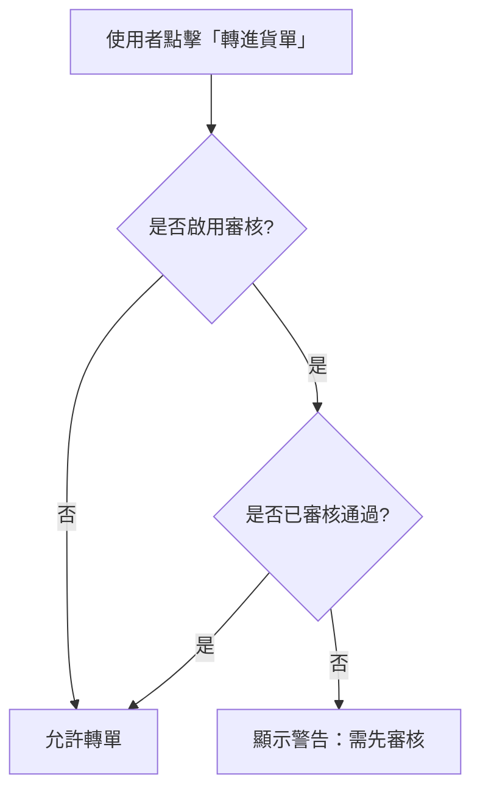

# 使用者控制審核機制

## 📋 概述

本功能允許管理員透過系統參數設定頁面，自由開啟或關閉各種單據的審核流程，提供高度彈性以適應不同規模企業的需求。

---

## 🎯 功能目標

### 業務需求
1. **彈性控制**：不同企業對審核流程的需求不同，小型企業可能不需要嚴格審核，大型企業則需要完整的審核機制
2. **即時切換**：管理員可以隨時開啟或關閉審核功能，無需修改程式碼
3. **分類管理**：採購、銷售、庫存等不同流程可獨立設定審核需求
4. **向下相容**：預設值保持與現有系統一致，不影響現有功能

### 技術目標
1. 統一的審核邏輯管理
2. 高效能的設定查詢（帶快取機制）
3. 易於擴充的架構設計
4. 清晰的使用者介面

---

## 🏗️ 系統架構

### 層級結構

```
┌─────────────────────────────────────────────────────────┐
│                    UI Layer (前端層)                      │
│  - ApprovalSettingsTab.razor (審核設定 Tab)              │
│  - PurchaseOrderEditModalComponent.razor (採購單編輯)    │
├─────────────────────────────────────────────────────────┤
│                  Helper Layer (輔助層)                    │
│  - ApprovalConfigHelper (審核邏輯統一管理)               │
├─────────────────────────────────────────────────────────┤
│                 Service Layer (服務層)                    │
│  - ISystemParameterService (審核查詢介面)                │
│  - SystemParameterService (帶快取的實作)                 │
├─────────────────────────────────────────────────────────┤
│                   Data Layer (資料層)                     │
│  - SystemParameter Entity (審核開關欄位)                 │
│  - Migration: AddApprovalConfigToSystemParameter         │
└─────────────────────────────────────────────────────────┘
```

---

## 📦 新增/修改的檔案

### 1. 資料層 (Data Layer)

#### ✨ 修改：`Data/Entities/Systems/SystemParameter.cs`
新增以下欄位：

```csharp
/// <summary>
/// 是否啟用採購單審核
/// </summary>
[Display(Name = "啟用採購單審核")]
public bool EnablePurchaseOrderApproval { get; set; } = true;

/// <summary>
/// 是否啟用進貨單審核
/// </summary>
[Display(Name = "啟用進貨單審核")]
public bool EnablePurchaseReceivingApproval { get; set; } = false;

/// <summary>
/// 是否啟用進貨退回審核
/// </summary>
[Display(Name = "啟用進貨退回審核")]
public bool EnablePurchaseReturnApproval { get; set; } = false;

/// <summary>
/// 是否啟用銷貨單審核
/// </summary>
[Display(Name = "啟用銷貨單審核")]
public bool EnableSalesOrderApproval { get; set; } = false;

/// <summary>
/// 是否啟用銷貨退回審核
/// </summary>
[Display(Name = "啟用銷貨退回審核")]
public bool EnableSalesReturnApproval { get; set; } = false;

/// <summary>
/// 是否啟用庫存調撥審核
/// </summary>
[Display(Name = "啟用庫存調撥審核")]
public bool EnableInventoryTransferApproval { get; set; } = false;
```

**預設值說明：**
- 採購單審核：預設 `true`（保持現有行為）
- 其他審核：預設 `false`（預設不啟用，由管理員決定）

#### ✨ 新增：Migration
- **檔案名稱：** `20251024234825_AddApprovalConfigToSystemParameter.cs`
- **說明：** 在 `SystemParameters` 資料表新增 6 個審核開關欄位

---

### 2. 服務層 (Service Layer)

#### ✨ 修改：`Services/Systems/ISystemParameterService.cs`

**新增審核類型列舉：**
```csharp
public enum ApprovalType
{
    PurchaseOrder,        // 採購單
    PurchaseReceiving,    // 進貨單
    PurchaseReturn,       // 進貨退回
    SalesOrder,           // 銷貨單
    SalesReturn,          // 銷貨退回
    InventoryTransfer     // 庫存調撥
}
```

**新增介面方法：**
```csharp
// 統一查詢方法
Task<bool> IsApprovalEnabledAsync(ApprovalType approvalType);

// 個別查詢方法
Task<bool> IsPurchaseOrderApprovalEnabledAsync();
Task<bool> IsPurchaseReceivingApprovalEnabledAsync();
Task<bool> IsPurchaseReturnApprovalEnabledAsync();
Task<bool> IsSalesOrderApprovalEnabledAsync();
Task<bool> IsSalesReturnApprovalEnabledAsync();
Task<bool> IsInventoryTransferApprovalEnabledAsync();

// 快取管理
void ClearApprovalConfigCache();
```

#### ✨ 修改：`Services/Systems/SystemParameterService.cs`

**實作重點：**
1. **快取機制**：5 分鐘快取，減少資料庫查詢
   ```csharp
   private SystemParameter? _cachedParameter;
   private DateTime _cacheExpiration = DateTime.MinValue;
   private readonly TimeSpan _cacheDuration = TimeSpan.FromMinutes(5);
   ```

2. **統一查詢邏輯**：
   ```csharp
   public async Task<bool> IsApprovalEnabledAsync(ApprovalType approvalType)
   {
       var parameter = await GetCachedSystemParameterAsync();
       return approvalType switch
       {
           ApprovalType.PurchaseOrder => parameter.EnablePurchaseOrderApproval,
           // ... 其他類型
       };
   }
   ```

3. **自動清除快取**：覆寫 `UpdateAsync` 方法，更新參數時自動清除快取

---

### 3. 輔助層 (Helper Layer)

#### ✨ 新增：`Helpers/ApprovalConfigHelper.cs`

**功能：** 統一管理審核相關的判斷邏輯

**主要方法：**

1. **判斷欄位是否鎖定**
   ```csharp
   public static bool ShouldLockFieldByApproval(
       bool isApprovalEnabled,
       bool isApproved,
       bool hasUndeletableDetails)
   {
       if (!isApprovalEnabled)
       {
           // 未啟用審核：只根據「是否有下一步動作」鎖定
           return hasUndeletableDetails;
       }
       else
       {
           // 已啟用審核：根據「審核狀態 或 是否有下一步動作」鎖定
           return isApproved || hasUndeletableDetails;
       }
   }
   ```

2. **判斷是否可執行需審核的動作**
   ```csharp
   public static bool CanPerformActionRequiringApproval(
       bool isApprovalEnabled,
       bool isApproved)
   {
       return !isApprovalEnabled || isApproved;
   }
   ```

3. **判斷是否可儲存**
   ```csharp
   public static bool CanSaveWhenApproved(
       bool isApprovalEnabled,
       bool isApproved,
       bool isPreApprovalSave = false)
   {
       if (!isApprovalEnabled || isPreApprovalSave)
           return true;
       
       return !isApproved;
   }
   ```

4. **取得警告訊息**
   ```csharp
   public static string? GetApprovalWarningMessage(
       bool isApprovalEnabled,
       bool isApproved,
       string entityName = "單據")
   ```

---

### 4. UI 層 (UI Layer)

#### ✨ 新增：`Components/Pages/Systems/SystemParameterSettings/Shared/Tabs/ApprovalSettingsTab.razor`

**功能：** 審核流程設定介面

**UI 特色：**
- **分區設計**：採購流程、銷售流程、庫存流程三個區段
- **即時預覽**：右側預覽區顯示當前所有設定狀態
- **狀態提示**：每個開關都有清楚的狀態說明（已啟用/未啟用）
- **操作說明**：底部說明區域解釋審核流程的意義和建議

**UI 結構：**
```
┌─────────────────────────────────────────────────┐
│  採購流程審核                                    │
│  ├─ 採購單審核      [✓]                         │
│  ├─ 進貨單審核      [ ]                         │
│  └─ 進貨退回審核    [ ]                         │
├─────────────────────────────────────────────────┤
│  銷售流程審核                                    │
│  ├─ 銷貨單審核      [ ]                         │
│  └─ 銷貨退回審核    [ ]                         │
├─────────────────────────────────────────────────┤
│  庫存流程審核                                    │
│  └─ 庫存調撥審核    [ ]                         │
├─────────────────────────────────────────────────┤
│  [說明區域]                                      │
│  - 啟用審核：需經審核通過後才能執行下一步        │
│  - 未啟用審核：儲存後可直接執行後續操作          │
└─────────────────────────────────────────────────┘
```

#### ✨ 修改：`Components/Pages/Systems/SystemParameterSettings/SystemParameterSettings.razor`

**變更內容：**
1. 新增「審核流程設定」Tab 定義
2. 新增 Tab 內容區域，整合 `ApprovalSettingsTab`

**新增 Tab：**
```csharp
tabDefinitions = new()
{
    new("basic", "系統基本設定", ""),
    new("approval", "審核流程設定", ""),  // ← 新增
    new("appearance", "外觀設定", ""),
    // ...
};
```

#### ✨ 修改：`Components/Pages/Purchase/PurchaseOrderEditModalComponent.razor`

**整合審核開關邏輯：**

1. **載入審核設定**
   ```csharp
   protected override async Task OnInitializedAsync()
   {
       // 載入審核開關設定
       isApprovalEnabled = await SystemParameterService
           .IsPurchaseOrderApprovalEnabledAsync();
       
       InitializeSupplierModalManager();
   }
   ```

2. **使用 Helper 判斷鎖定狀態**
   ```csharp
   private async Task InitializeFormFieldsAsync()
   {
       var shouldLock = ApprovalConfigHelper.ShouldLockFieldByApproval(
           isApprovalEnabled,
           editModalComponent?.Entity?.IsApproved ?? false,
           hasUndeletableDetails
       );
       
       // 根據 shouldLock 設定欄位唯讀狀態
   }
   ```

3. **動態顯示審核區域**
   ```csharp
   private bool ShouldShowApprovalSection()
   {
       // 只有在啟用審核 + 編輯現有單據時才顯示
       return isApprovalEnabled && 
              PurchaseOrderId.HasValue && 
              PurchaseOrderId.Value > 0;
   }
   ```

4. **檢查轉單權限**
   ```csharp
   private async Task HandleCreateReceivingFromOrder()
   {
       if (!ApprovalConfigHelper.CanPerformActionRequiringApproval(
           isApprovalEnabled, 
           editModalComponent.Entity.IsApproved))
       {
           await NotificationService.ShowWarningAsync(
               "只有已核准的採購單才能轉進貨單");
           return;
       }
       // ...
   }
   ```

5. **新增 using 指令**
   ```csharp
   @using ERPCore2.Helpers
   ```

6. **新增建構函數**
   ```csharp
   public PurchaseOrderEditModalComponent()
   {
       // 提前初始化 supplierModalManager 以避免 NullReferenceException
       supplierModalManager = new RelatedEntityModalManager<Supplier>();
   }
   ```

#### ✨ 修改：`Components/Pages/Purchase/PurchaseReceivingEditModalComponent.razor`

**整合審核開關邏輯：**

1. **新增審核開關欄位**
   ```csharp
   // ===== 審核開關狀態 =====
   private bool isApprovalEnabled = true; // 是否啟用採購單審核功能（從系統參數載入）
   ```

2. **載入審核設定**
   ```csharp
   protected override async Task OnInitializedAsync()
   {
       // 載入審核開關設定（優先執行，影響後續邏輯）
       isApprovalEnabled = await SystemParameterService
           .IsPurchaseOrderApprovalEnabledAsync();
       
       // 初始化 Modal 管理器
       InitializeSupplierModalManager();
   }
   ```

3. **傳遞審核開關給子組件**
   ```csharp
   <PurchaseReceivingDetailManagerComponent 
       IsApprovalEnabled="@isApprovalEnabled"
       ... />
   ```

4. **新增建構函數**
   ```csharp
   public PurchaseReceivingEditModalComponent()
   {
       // 提前初始化 supplierModalManager 以避免 NullReferenceException
       supplierModalManager = new RelatedEntityModalManager<Supplier>();
   }
   ```

#### ✨ 修改：`Components/Shared/SubCollections/PurchaseReceivingDetailManagerComponent.razor`

**整合審核開關邏輯：**

1. **新增審核開關參數**
   ```csharp
   // ===== 審核控制參數 =====
   [Parameter] public bool IsApprovalEnabled { get; set; } = true; // 是否啟用採購單審核（從系統參數載入）
   ```

2. **在載入採購明細時傳遞審核開關**
   ```csharp
   private async Task LoadAvailableProductsAsync()
   {
       if (SelectedSupplierId.HasValue && SelectedSupplierId.Value > 0)
       {
           // 載入該廠商未完成進貨的採購明細
           // 根據審核開關決定是否只載入已審核的採購單
           AvailablePurchaseDetails = await PurchaseOrderService
               .GetReceivingDetailsBySupplierAsync(
                   SelectedSupplierId.Value, 
                   includeCompleted: false,
                   checkApproval: IsApprovalEnabled); // 傳遞審核開關
           
           // 從採購明細中提取商品清單
           AvailableProducts = AvailablePurchaseDetails
               .Where(pd => pd.Product != null)
               .Select(pd => pd.Product!)
               .Distinct()
               .ToList();
       }
   }
   ```

#### ✨ 修改：`Services/Purchase/IPurchaseOrderService.cs`

**新增審核檢查參數：**

```csharp
/// <summary>
/// 獲取廠商的可進貨採購明細（含審核過濾）
/// </summary>
/// <param name="supplierId">廠商ID</param>
/// <param name="includeCompleted">是否包含已完成的明細</param>
/// <param name="checkApproval">是否檢查審核狀態（true=只載入已審核，false=不檢查審核）</param>
Task<List<PurchaseOrderDetail>> GetReceivingDetailsBySupplierAsync(
    int supplierId, 
    bool includeCompleted, 
    bool checkApproval = true);
```

#### ✨ 修改：`Services/Purchase/PurchaseOrderService.cs`

**實作審核檢查邏輯：**

```csharp
public async Task<List<PurchaseOrderDetail>> GetReceivingDetailsBySupplierAsync(
    int supplierId, 
    bool includeCompleted, 
    bool checkApproval = true)
{
    try
    {
        using var context = await _contextFactory.CreateDbContextAsync();
        
        var query = context.PurchaseOrderDetails
            .Include(pod => pod.PurchaseOrder)
                .ThenInclude(po => po.Supplier)
            .Include(pod => pod.PurchaseOrder)
                .ThenInclude(po => po.Warehouse)
            .Include(pod => pod.Product)
            .Where(pod => pod.PurchaseOrder.SupplierId == supplierId);

        // 根據參數決定是否檢查審核狀態
        if (checkApproval)
        {
            query = query.Where(pod => pod.PurchaseOrder.IsApproved);
        }

        if (!includeCompleted)
        {
            // 只包含未完成的明細：既未手動完成，且數量未滿
            query = query.Where(pod => !pod.IsReceivingCompleted && 
                                     pod.ReceivedQuantity < pod.OrderQuantity);
        }

        return await query.OrderBy(pod => pod.PurchaseOrder.PurchaseOrderNumber)
                        .ThenBy(pod => pod.Product.Name)
                        .ToListAsync();
    }
    catch (Exception ex)
    {
        await ErrorHandlingHelper.HandleServiceErrorAsync(ex, 
            nameof(GetReceivingDetailsBySupplierAsync), GetType(), _logger, 
            new { 
                SupplierId = supplierId,
                IncludeCompleted = includeCompleted,
                CheckApproval = checkApproval
            });
        return new List<PurchaseOrderDetail>();
    }
}
```

---

## 🔄 核心邏輯流程

### 1. 審核開關查詢流程

```
使用者操作
    ↓
前端組件載入
    ↓
呼叫 SystemParameterService.IsApprovalEnabledAsync()
    ↓
檢查快取 (5分鐘有效期)
    ↓ (快取未命中)
從資料庫查詢 SystemParameter
    ↓
更新快取
    ↓
返回審核開關狀態
    ↓
前端根據狀態調整 UI 行為
```

### 2. 欄位鎖定邏輯



**說明：**
- **未啟用審核**：只根據「是否有下一步動作」（如已有進貨記錄）鎖定
- **已啟用審核**：已審核通過 OR 有下一步動作時鎖定

### 3. 轉單權限檢查



### 4. 進貨單「載入未入庫」流程

```
使用者點擊「載入未入庫」
    ↓
PurchaseReceivingDetailManagerComponent.LoadAllUnreceivedItems()
    ↓
呼叫 LoadAvailableProductsAsync()
    ↓
Service: GetReceivingDetailsBySupplierAsync(supplierId, false, isApprovalEnabled)
    ↓
Service 層判斷審核過濾:
  - if (checkApproval == true) 
      → WHERE IsApproved = true (只載入已審核的採購單)
  - if (checkApproval == false) 
      → 不檢查 IsApproved (載入所有採購單)
    ↓
GetAvailablePurchaseDetails() 進行二次篩選:
  - 篩選採購單ID（如有指定）
  - 篩選商品ID（如有指定）
    ↓
返回可用的採購明細列表
    ↓
LoadUnreceivedItemsInternal() 批次載入明細
    ↓
顯示載入成功訊息
```

**說明：**
- **啟用審核時**：`isApprovalEnabled = true` → 只能載入已審核通過的採購單明細
- **未啟用審核時**：`isApprovalEnabled = false` → 可載入所有採購單明細（不管審核狀態）

---

## 💾 資料庫變更

### Migration: AddApprovalConfigToSystemParameter

**執行命令：**
```bash
dotnet ef migrations add AddApprovalConfigToSystemParameter
dotnet ef database update
```

**變更內容：**
在 `SystemParameters` 資料表新增以下欄位：

| 欄位名稱 | 資料型別 | 預設值 | 說明 |
|---------|---------|--------|------|
| `EnablePurchaseOrderApproval` | bit | 0 (false) | 啟用採購單審核 |
| `EnablePurchaseReceivingApproval` | bit | 0 (false) | 啟用進貨單審核 |
| `EnablePurchaseReturnApproval` | bit | 0 (false) | 啟用進貨退回審核 |
| `EnableSalesOrderApproval` | bit | 0 (false) | 啟用銷貨單審核 |
| `EnableSalesReturnApproval` | bit | 0 (false) | 啟用銷貨退回審核 |
| `EnableInventoryTransferApproval` | bit | 0 (false) | 啟用庫存調撥審核 |

**注意事項：**
- Migration 預設值為 `false`（資料庫層級）
- Entity 預設值中 `EnablePurchaseOrderApproval` 為 `true`（程式碼層級）
- 新建立的 SystemParameter 記錄會使用 Entity 預設值

---

## 📖 使用說明

### 管理員操作指南

#### 1. 進入設定頁面
1. 登入系統
2. 進入「系統管理」→「系統參數設定」
3. 點擊「審核流程設定」Tab

#### 2. 設定審核開關
1. 每個單據類型都有獨立的開關
2. 點擊開關即可切換狀態
3. 綠色 ✓ = 已啟用審核
4. 灰色 ✗ = 未啟用審核

#### 3. 儲存設定
1. 調整完所有開關後，點擊「儲存設定」按鈕
2. 系統會顯示「系統參數已成功儲存！」訊息
3. 設定立即生效（快取會在 5 分鐘內更新）

#### 4. 重新載入
- 如需恢復到資料庫中的設定，點擊「重新載入」按鈕

### 審核開關效果說明

#### ✅ 啟用審核時
- **採購單**：需審核通過才能轉進貨單
- **進貨單**：需審核通過才能影響庫存
- **進貨退回**：需審核通過才能影響庫存
- **銷貨單**：需審核通過才能影響庫存
- **銷貨退回**：需審核通過才能影響庫存
- **庫存調撥**：需審核通過才能執行調撥

#### ❌ 未啟用審核時
- 單據儲存後可直接執行後續操作
- 不顯示「審核」和「駁回」按鈕
- 適合小型企業或信任度高的環境

### 進貨單與採購單審核的關聯

#### 關聯說明

進貨單的「載入未入庫」功能會受到**採購單審核開關**的影響：

| 採購單審核開關 | 進貨單「載入未入庫」行為 |
|--------------|---------------------|
| **啟用審核** (`EnablePurchaseOrderApproval = true`) | 只能載入**已審核通過**的採購單明細 |
| **未啟用審核** (`EnablePurchaseOrderApproval = false`) | 可載入**所有採購單**的明細（不檢查審核狀態） |

#### 資料流向

```
採購單 → 審核 → 進貨單
   ↓       ↓       ↓
建立    通過/駁回  載入未入庫
```

**詳細流程：**

1. **採購單階段**
   - 採購人員建立採購單
   - 如果啟用審核：需等待審核通過
   - 如果未啟用審核：儲存後立即可用

2. **進貨單階段**
   - 倉管人員開啟進貨單編輯頁面
   - 選擇廠商
   - 點擊「載入未入庫」按鈕
   - **系統根據審核開關決定可載入的採購單範圍**

3. **審核開關影響**
   - **啟用審核**：
     - Service 查詢時加上 `WHERE IsApproved = true`
     - 只顯示已審核的採購單明細
     - 確保進貨資料的準確性
   
   - **未啟用審核**：
     - Service 查詢時不檢查 `IsApproved`
     - 顯示所有採購單明細（包含未審核的）
     - 提高作業效率

#### 實作細節

**PurchaseReceivingEditModalComponent** 載入審核開關：
```csharp
protected override async Task OnInitializedAsync()
{
    // 載入採購單審核開關（注意：不是進貨單審核開關）
    isApprovalEnabled = await SystemParameterService
        .IsPurchaseOrderApprovalEnabledAsync();
}
```

**傳遞給 PurchaseReceivingDetailManagerComponent**：
```csharp
<PurchaseReceivingDetailManagerComponent 
    IsApprovalEnabled="@isApprovalEnabled"  // 傳遞採購單審核開關
    ... />
```

**LoadAvailableProductsAsync** 使用審核開關：
```csharp
AvailablePurchaseDetails = await PurchaseOrderService
    .GetReceivingDetailsBySupplierAsync(
        SelectedSupplierId.Value, 
        includeCompleted: false,
        checkApproval: IsApprovalEnabled);  // 根據開關決定是否過濾
```

**Service 層的條件過濾**：
```csharp
var query = context.PurchaseOrderDetails
    .Where(pod => pod.PurchaseOrder.SupplierId == supplierId);

// 根據參數決定是否檢查審核狀態
if (checkApproval)
{
    query = query.Where(pod => pod.PurchaseOrder.IsApproved);
}
```

#### 使用情境範例

**情境 1：嚴格審核模式（大型企業）**
- 設定：`EnablePurchaseOrderApproval = true`
- 流程：
  1. 採購員建立採購單 → 送審
  2. 主管審核通過
  3. 倉管開啟進貨單，點擊「載入未入庫」
  4. **只看到已審核的採購單明細**
  5. 選擇明細進行入庫

**情境 2：彈性作業模式（小型企業）**
- 設定：`EnablePurchaseOrderApproval = false`
- 流程：
  1. 採購員建立採購單 → 直接儲存
  2. 倉管開啟進貨單，點擊「載入未入庫」
  3. **看到所有採購單明細**（包含剛建立的）
  4. 選擇明細進行入庫

#### 向下相容性

**預設行為：**
- `checkApproval` 參數預設為 `true`
- 現有程式碼不傳遞此參數時，仍然只載入已審核的採購單
- 確保系統升級後不影響現有業務流程

**Service 方法簽名：**
```csharp
Task<List<PurchaseOrderDetail>> GetReceivingDetailsBySupplierAsync(
    int supplierId, 
    bool includeCompleted, 
    bool checkApproval = true);  // 預設值確保向下相容
```

---

## 🎯 設計亮點

### 1. 高度彈性
- 每種單據獨立設定，滿足不同業務需求
- 即時切換，無需重啟系統

### 2. 效能優化
- **快取機制**：5 分鐘快取，大幅減少資料庫查詢
- **自動失效**：更新參數時自動清除快取
- **安全預設**：查詢失敗時預設為不啟用審核

### 3. 統一管理
- **ApprovalConfigHelper**：集中所有審核邏輯判斷
- **一致性**：所有單據使用相同的判斷邏輯
- **易維護**：修改邏輯只需更新 Helper

### 4. 向下相容
- 採購單預設啟用審核（與現有行為一致）
- 不影響已存在的單據
- 漸進式升級

### 5. 使用者友善
- **清晰的 UI**：每個開關都有詳細說明
- **即時預覽**：右側顯示當前設定狀態
- **操作提示**：底部說明區域解釋功能意義

---

## 🚀 未來擴充建議

### 1. 多級審核
```
採購單
  ↓
部門主管審核
  ↓
財務審核
  ↓
總經理審核
  ↓
核准通過
```

**實施方向：**
- 新增 `ApprovalLevel` 欄位（審核層級）
- 新增 `ApprovalFlow` 資料表（定義審核流程）
- 擴充 `ApprovalType` 支援多級審核

### 2. 審核權限配置
```
角色設定
  ├─ 採購主管：可審核採購單
  ├─ 財務人員：可審核所有涉及金額的單據
  └─ 倉管人員：可審核庫存調撥
```

**實施方向：**
- 新增 `ApprovalPermission` 資料表
- 整合現有的 Permission 系統
- UI 新增「審核權限配置」Tab

### 3. 審核歷史記錄
```
記錄內容
  ├─ 審核人員
  ├─ 審核時間
  ├─ 審核動作（核准/駁回）
  ├─ 駁回原因
  └─ 附加意見
```

**實施方向：**
- 新增 `ApprovalHistory` 資料表
- 在單據詳情頁面顯示審核歷史
- 提供審核記錄查詢功能

### 4. 條件式審核
```
規則範例
  - 採購金額 > 100,000：需要審核
  - 採購金額 <= 100,000：不需審核
```

**實施方向：**
- 新增 `ApprovalRule` 資料表（定義條件）
- 擴充 `IsApprovalEnabledAsync` 支援規則判斷
- UI 新增「審核規則配置」功能

### 5. 通知提醒
```
通知時機
  ├─ 單據送審時：通知審核人員
  ├─ 審核完成時：通知申請人員
  └─ 逾期未審時：通知相關人員
```

**實施方向：**
- 整合郵件通知系統
- 新增站內訊息功能
- 建立審核儀表板

---

## 🔍 測試建議

### 功能測試

#### 1. 審核開關設定測試
- [ ] 成功開啟/關閉採購單審核
- [ ] 成功開啟/關閉其他單據審核
- [ ] 設定儲存後立即生效
- [ ] 重新載入恢復資料庫設定

#### 2. 採購單審核流程測試（啟用審核）
- [ ] 未審核的採購單無法轉進貨單
- [ ] 未審核的採購單主檔欄位不鎖定
- [ ] 審核通過後可以轉進貨單
- [ ] 審核通過後主檔欄位鎖定
- [ ] 顯示審核和駁回按鈕

#### 3. 採購單非審核流程測試（關閉審核）
- [ ] 儲存後可直接轉進貨單
- [ ] 不顯示審核和駁回按鈕
- [ ] 只有「有下一步動作」時才鎖定欄位

#### 4. 快取機制測試
- [ ] 首次查詢會存入快取
- [ ] 5 分鐘內不重複查詢資料庫
- [ ] 更新參數後快取自動清除

#### 5. 錯誤處理測試
- [ ] 資料庫查詢失敗時預設為不啟用審核
- [ ] 顯示友善的錯誤訊息

---

## � 已知問題與解決方案

### 問題 1: NullReferenceException in BuildRenderTree

**發生時間：** 2025年10月25日  
**影響範圍：** PurchaseOrderEditModalComponent 組件初始化

#### 問題描述
在整合審核邏輯後，開啟採購單編輯 Modal 時出現 `NullReferenceException`：

```
System.NullReferenceException: Object reference not set to an instance of an object.
   at ERPCore2.Components.Pages.Purchase.PurchaseOrderEditModalComponent.BuildRenderTree(RenderTreeBuilder __builder)
```

#### 根本原因
**Blazor 組件渲染順序問題：**

```csharp
// ❌ 錯誤的初始化方式
private RelatedEntityModalManager<Supplier> supplierModalManager = default!;

// Blazor 組件宣告時就調用 GetModalManagers()
<GenericEditModalComponent ModalManagers="@GetModalManagers()" ... />

// GetModalManagers() 返回 supplierModalManager
// 但此時 supplierModalManager 還是 null (default!)
// → NullReferenceException！
```

**Blazor 組件生命週期：**
1. ✅ **建構函數執行** → 欄位初始化
2. ✅ **組件標記渲染** → `GetModalManagers()` 被調用（❌ 此時 supplierModalManager 是 null）
3. ❌ `OnInitializedAsync()` → `InitializeSupplierModalManager()` 才執行（太晚了！）

#### 解決方案

**在建構函數中提前初始化 `supplierModalManager`：**

```csharp
// ✅ 正確的初始化方式
private RelatedEntityModalManager<Supplier> supplierModalManager;

// 建構函數中提前初始化
public PurchaseOrderEditModalComponent()
{
    // 提前初始化 supplierModalManager 以避免 NullReferenceException
    // 實際配置會在 OnInitializedAsync 中完成
    supplierModalManager = new RelatedEntityModalManager<Supplier>();
}

// 之後在 OnInitializedAsync 中配置細節
protected override async Task OnInitializedAsync()
{
    // 載入審核開關設定
    isApprovalEnabled = await SystemParameterService
        .IsPurchaseOrderApprovalEnabledAsync();
    
    // 配置 Modal 管理器的 callbacks 等
    InitializeSupplierModalManager();
}
```

#### 修改檔案
- `Components/Pages/Purchase/PurchaseOrderEditModalComponent.razor`
  - 新增建構函數 `PurchaseOrderEditModalComponent()`
  - 在建構函數中初始化 `supplierModalManager`

#### 經驗教訓
1. **Blazor 組件屬性綁定在組件宣告時就會執行**，不是在 `OnInitializedAsync` 之後
2. **`default!` 只是壓制編譯器警告**，並不會真正初始化物件
3. **需要在組件宣告時使用的物件，必須在建構函數或欄位初始化時就建立**
4. **`OnInitializedAsync` 適合做非同步載入和配置，不適合做必要物件的初始化**

#### 相關問題
此問題與審核邏輯無關，而是 Blazor 組件生命週期的理解問題。即使沒有新增審核功能，在其他需要在組件宣告時使用的物件上也可能遇到類似問題。

#### 預防措施
- 檢查所有在組件標記中使用的方法（如 `GetXxx()`），確保它們不會存取未初始化的物件
- 優先使用欄位初始化（`= new()`）或建構函數初始化，而非依賴 `OnInitializedAsync`
- 避免使用 `default!` 來壓制警告，應該真正初始化物件

---

## �📝 開發筆記

### 設計考量

#### 為何採用「系統參數」而非「權限系統」？
1. **彈性需求**：審核機制是業務流程的一部分，而非存取權限
2. **簡化管理**：管理員無需設定複雜的權限規則
3. **統一配置**：所有審核設定集中在一處
4. **易於理解**：使用者容易理解開關的意義

#### 為何使用快取？
1. **效能考量**：審核開關查詢頻繁，需要減少資料庫負擔
2. **即時性要求**：5 分鐘快取提供即時性和效能的平衡
3. **自動失效**：更新參數時自動清除，確保資料一致性

#### 為何建立 ApprovalConfigHelper？
1. **統一邏輯**：避免每個組件都重複判斷邏輯
2. **易於維護**：修改邏輯只需更新一處
3. **測試友善**：靜態方法容易進行單元測試
4. **可讀性**：語意化的方法名稱提高程式碼可讀性

### 技術債務

#### 目前的限制
1. **單一層級審核**：目前只支援「審核通過/駁回」，無法多級審核
2. **全域設定**：所有使用者共用同一套審核規則
3. **無歷史記錄**：無法追蹤審核設定的變更歷史

#### 潛在風險
1. **快取不一致**：分散式部署時需要考慮快取同步問題
2. **向下相容**：未來新增審核類型時需要注意向下相容

---

## 📚 相關文件

- [README_主檔鎖住設計.md](README_主檔鎖住設計.md) - 主檔鎖定機制說明
- [README_進貨明細鎖定主檔欄位.md](README_進貨明細鎖定主檔欄位.md) - 明細鎖定邏輯
- [README_Services.md](README_Services.md) - Service 層架構說明

---

## 👥 維護資訊

**開發團隊：** ERPCore2 開發團隊  
**最後更新：** 2025年10月25日  
**維護狀態：** 🟢 積極維護中

如有問題或建議，請聯繫開發團隊或提交 Issue。
