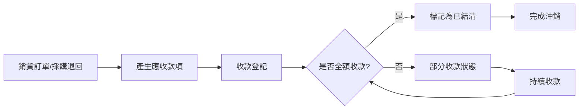

# 應收帳款沖款系統設計紀錄

## 📋 專案概覽

**建立日期**: 2025年9月26日  
**系統版本**: ERPCore2 v1.0  
**設計目標**: 統一管理銷貨訂單和採購退回的應收款項，提供完整的收款管理功能

## 🎯 業務需求

### 核心功能
1. **統一應收管理**: 整合銷貨訂單和採購退回的應收款項於單一介面
2. **收款沖銷**: 支援部分收款、全額收款和批次收款
3. **逾期管理**: 自動計算逾期天數和逾期金額
4. **統計報表**: 提供應收款項統計和分析功能

### 業務流程


## 🏗️ 系統架構

### 核心組件架構
```
應收沖款系統
├── 📁 Models/
│   └── ReceivableViewModel.cs          # 統一視圖模型
├── 📁 Services/FinancialManagement/
│   ├── IReceivableService.cs           # 服務介面
│   └── ReceivableService.cs            # 服務實現
├── 📁 Helpers/FieldConfiguration/
│   └── ReceivableFieldConfiguration.cs # 欄位配置
└── 📁 Components/Pages/FinancialManagement/
    └── ReceivableIndex.razor           # 主要UI頁面
```

### 技術架構特點
- **🎯 統一模型**: `ReceivableViewModel` 整合不同單據類型
- **⚡ 泛型組件**: 使用 `GenericIndexPageComponent` 減少重複代碼
- **🔒 強型別**: 完整的 TypeScript 類型支援
- **🛡️ 錯誤處理**: 遵循 `ErrorHandlingHelper` 統一錯誤處理模式

## 📊 資料模型設計

### ReceivableViewModel 核心屬性

| 屬性名稱 | 類型 | 說明 |
|---------|------|------|
| `DocumentType` | string | 單據類型 (SalesOrder/PurchaseReturn) |
| `DocumentNumber` | string | 單據編號 |
| `DocumentDate` | DateTime | 單據日期 |
| `CustomerOrSupplier` | string | 往來對象名稱 |
| `TotalAmount` | decimal | 應收總額 |
| `ReceivedAmount` | decimal | 本次收款金額 |
| `TotalReceivedAmount` | decimal | 累計收款金額 |
| `BalanceAmount` | decimal | 餘額 (計算屬性) |
| `IsSettled` | bool | 是否結清 |
| `IsOverdue` | bool | 是否逾期 (計算屬性) |
| `OverdueDays` | int | 逾期天數 (計算屬性) |

### 關聯實體對應

#### 銷貨訂單 (SalesOrderDetail)
```csharp
// 實體屬性 → ViewModel 屬性
OrderQuantity → Quantity
UnitPrice → 用於計算 TotalAmount
ReceivedAmount → ReceivedAmount
TotalReceivedAmount → TotalReceivedAmount
IsSettled → IsSettled
```

#### 採購退回 (PurchaseReturnDetail)
```csharp
// 實體屬性 → ViewModel 屬性
ReturnQuantity → Quantity
ReturnUnitPrice → 用於計算 TotalAmount
ReceivedAmount → ReceivedAmount
TotalReceivedAmount → TotalReceivedAmount
IsSettled → IsSettled
```

## 🔧 服務層設計

### IReceivableService 接口方法

#### 查詢方法
- `GetAllReceivablesAsync()`: 取得所有應收款項
- `GetUnSettledReceivablesAsync()`: 取得未結清款項
- `GetOverdueReceivablesAsync()`: 取得逾期款項
- `SearchReceivablesAsync()`: 條件式搜尋
- `GetReceivableByIdAsync()`: 取得單一款項詳情
- `GetReceivableStatisticsAsync()`: 取得統計資訊

#### 異動方法
- `UpdateReceivedAmountAsync()`: 更新收款金額
- `SettleReceivableAsync()`: 結清單一款項
- `BatchUpdateReceivedAmountAsync()`: 批次更新收款
- `BatchSettleReceivablesAsync()`: 批次結清款項

#### 驗證方法
- `ValidateReceivedAmountAsync()`: 驗證收款金額有效性

### 錯誤處理機制
```csharp
try
{
    // 業務邏輯
    return ServiceResult<T>.Success(result);
}
catch (Exception ex)
{
    await ErrorHandlingHelper.HandleServiceErrorAsync(ex, nameof(方法名), GetType(), _logger);
    return ServiceResult<T>.Failure($"操作失敗: {ex.Message}");
}
```

## 🎨 UI 設計

### 主要頁面結構
```razor
@page "/receivables"
@rendermode InteractiveServer

<!-- 使用泛型索引頁組件 -->
<GenericIndexPageComponent TEntity="ReceivableViewModel"
                          TService="IReceivableService"
                          FieldConfiguration="fieldConfiguration"
                          DataLoader="LoadReceivablesAsync"
                          OnRowClick="OnReceivableRowClickAsync" />

<!-- 收款模態框 -->
<收款模態框 />
```

### 欄位配置系統
```csharp
public class ReceivableFieldConfiguration : BaseFieldConfiguration<ReceivableViewModel>
{
    public override Dictionary<string, FieldDefinition> BuildFilters()
    {
        return new Dictionary<string, FieldDefinition>
        {
            ["DocumentType"] = new FieldDefinition { ... },
            ["CustomerOrSupplier"] = new FieldDefinition { ... },
            ["IsSettled"] = new FieldDefinition { ... }
        };
    }
}
```

## 🔍 關鍵功能實現

### 1. 統一資料查詢
```csharp
public async Task<ServiceResult<List<ReceivableViewModel>>> GetAllReceivablesAsync()
{
    var salesReceivables = await GetSalesOrderReceivablesAsync(context);
    var purchaseReturnReceivables = await GetPurchaseReturnReceivablesAsync(context);
    
    var allReceivables = salesReceivables
        .Concat(purchaseReturnReceivables)
        .OrderByDescending(r => r.DocumentDate)
        .ToList();
        
    return ServiceResult<List<ReceivableViewModel>>.Success(allReceivables);
}
```

### 2. 收款金額驗證
```csharp
public async Task<ServiceResult<bool>> ValidateReceivedAmountAsync(int id, string documentType, decimal receivedAmount)
{
    // 驗證邏輯
    if (receivedAmount < 0)
        return ServiceResult<bool>.Failure("收款金額不能為負數");
        
    if (receivedAmount > totalAmount)
        return ServiceResult<bool>.Failure($"收款金額不能超過總金額 {totalAmount:C}");
        
    return ServiceResult<bool>.Success(true);
}
```

### 3. 逾期計算邏輯
```csharp
public int OverdueDays 
{ 
    get
    {
        if (IsSettled || !ExpectedReceiveDate.HasValue)
            return 0;

        var days = (DateTime.Now.Date - ExpectedReceiveDate.Value.Date).Days;
        return days > 0 ? days : 0;
    }
}
```

## 📝 依賴注入配置

### ServiceRegistration.cs 註冊
```csharp
// 應收沖款服務
services.AddScoped<IReceivableService, ReceivableService>();

// 欄位配置
services.AddTransient<ReceivableFieldConfiguration>();
```

## 🚀 使用方式

### 1. 訪問頁面
- URL: `/receivables`
- 權限: `Receivable.Read`

### 2. 主要操作流程
1. **查看應收款項列表**: 系統自動載入所有未結清款項
2. **篩選和搜尋**: 使用頂部篩選器縮小範圍
3. **點擊行進行收款**: 開啟收款模態框
4. **輸入收款金額**: 系統驗證金額有效性
5. **確認收款**: 更新資料庫並重新整理列表

### 3. 批次操作
- 選取多筆款項進行批次收款
- 批次結清已收足額的款項

## 🔄 系統整合

### 與其他模組的整合點
1. **銷貨管理**: 讀取 `SalesOrderDetail` 資料
2. **採購管理**: 讀取 `PurchaseReturnDetail` 資料
3. **客戶管理**: 顯示客戶公司名稱
4. **供應商管理**: 顯示供應商公司名稱
5. **商品管理**: 顯示商品名稱和單位
6. **通知系統**: 操作結果通知

## 📈 效能考量

### 查詢優化
- 使用 `Include()` 減少 N+1 查詢問題
- 實施適當的索引策略
- 分頁載入大量資料

### 記憶體管理
- 使用 `using` 語句管理 DbContext
- 避免載入不必要的導航屬性

## 🛡️ 安全考量

### 權限控制
- 頁面訪問權限: `Receivable.Read`
- 操作權限: `Receivable.Update`
- 批次操作權限: `Receivable.BatchUpdate`

### 資料驗證
- 收款金額不能為負數
- 收款金額不能超過總金額
- 已結清款項不能重複收款

## 🐛 已知問題與解決方案

### 問題 1: 實體屬性對應不一致
**問題描述**: 不同實體使用不同的屬性名稱  
**解決方案**: 在服務層統一對應到 ViewModel 屬性

### 問題 2: 命名空間衝突
**問題描述**: `ERPCore2.Services.Notifications` 不存在  
**解決方案**: 修正為正確的 `ERPCore2.Services`

### 問題 3: 缺少接口方法實現
**問題描述**: 服務類未實現完整的接口方法  
**解決方案**: 補齊所有接口方法的實現

## 🔮 未來擴展計畫

### 短期計畫
- [ ] 加入應收帳齡分析
- [ ] 實現 Excel 匯出功能
- [ ] 加入收款提醒功能

### 長期計畫
- [ ] 整合發票系統
- [ ] 支援多幣別收款
- [ ] 加入自動沖帳功能
- [ ] 整合銀行對帳系統

## 📚 相關文件

- [README_Index_Design.md](./README_Index_Design.md) - 索引頁設計指南
- [README_Blazor_Error_Handling.md](./README_Blazor_Error_Handling.md) - 錯誤處理指南
- [README_Services.md](./README_Services.md) - 服務層設計指南

## 👥 開發團隊

**主要開發者**: GitHub Copilot & 開發團隊  
**設計審核**: 系統架構師  
**測試負責**: QA 團隊

---

**最後更新**: 2025年9月26日  
**文件版本**: v1.0  
**系統狀態**: ✅ 開發完成，編譯通過，待測試