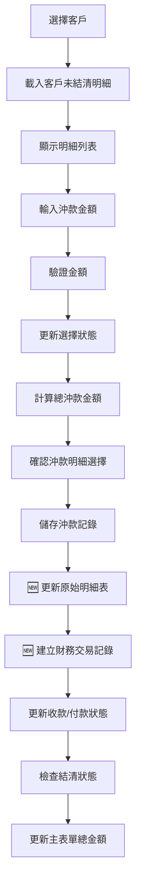
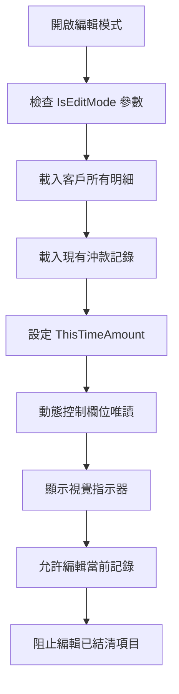
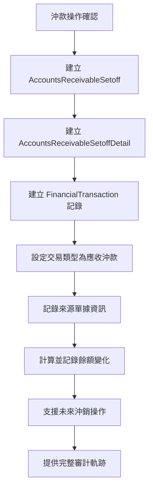

# 應收沖款明細管理組件設計日誌

## 📋 專案概述

本次更新新增了 **應收帳款沖款明細管理組件** 及 **統一財務交易記錄系統**，整合 `InteractiveTableComponent` 來統一管理銷貨訂單和銷貨退回的沖款明細，並建立完整的財務交易歷史追蹤機制，提供使用者友善的明細選擇和沖款金額設定功能。

## 🎯 功能目標

### 主要功能
- **統一明細管理**：整合銷貨訂單明細和銷貨退回明細的沖款作業
- **🆕 財務交易記錄系統**：建立完整的財務交易歷史追蹤機制
- **智能金額計算**：自動計算待沖款金額，防止超額沖款
- **即時驗證機制**：提供多層次的資料驗證和使用者回饋
- **直觀使用介面**：使用統一的 UI 組件提供一致的使用者體驗
- **🆕 新增/編輯模式支援**：新增模式只顯示未結清明細，編輯模式顯示所有明細
- **🆕 動態唯讀控制**：根據明細狀態動態控制欄位的可編輯性
- **🆕 統一財務交易追蹤**：所有收付款、沖款、調整等財務操作都記錄在統一的交易表中

### 業務場景
- 客戶有多筆未結清的銷貨訂單需要收款
- 客戶有銷貨退回需要進行退款處理
- 需要同時處理應收應付的沖款作業
- **🆕 編輯現有沖款記錄**：需要檢視和調整已建立的沖款明細
- **🆕 財務交易歷史查詢**：需要追蹤完整的收付款歷史和餘額變化
- **🆕 沖銷和退款處理**：需要處理錯誤交易的沖銷或調整作業
- **🆕 多幣別交易追蹤**：支援外幣交易的匯率記錄和原幣追蹤

## 🏗️ 架構設計

### 1. 資料層 (Data Layer)

#### 🆕 FinancialTransaction 實體
```csharp
// 位置: Data/Entities/FinancialManagement/FinancialTransaction.cs
public class FinancialTransaction : BaseEntity
{
    public string TransactionNumber { get; set; }          // 交易單號
    public FinancialTransactionTypeEnum TransactionType { get; set; } // 交易類型
    public DateTime TransactionDate { get; set; }          // 交易日期
    public decimal Amount { get; set; }                    // 交易金額
    
    // 關聯方資訊
    public int? CustomerId { get; set; }                   // 客戶
    public int? VendorId { get; set; }                     // 供應商（未來）
    public int CompanyId { get; set; }                     // 公司
    
    // 來源單據追蹤
    public string? SourceDocumentType { get; set; }        // 來源單據類型
    public int? SourceDocumentId { get; set; }            // 來源單據ID
    public string? SourceDocumentNumber { get; set; }      // 來源單據號碼
    
    // 餘額追蹤（類似庫存交易）
    public decimal BalanceBefore { get; set; }             // 交易前餘額
    public decimal BalanceAfter { get; set; }              // 交易後餘額
    
    // 沖銷機制
    public bool IsReversed { get; set; }                   // 是否已沖銷
    public int? ReversalTransactionId { get; set; }        // 沖銷交易ID
    public string? ReversalReason { get; set; }            // 沖銷原因
    
    // 外幣支援
    public decimal? OriginalAmount { get; set; }           // 原幣金額
    public string? CurrencyCode { get; set; }             // 貨幣代碼
    public decimal? ExchangeRate { get; set; }            // 匯率
}
```

#### 🆕 FinancialTransactionTypeEnum 枚舉
```csharp
// 位置: Data/Enums/FinancialTransactionTypeEnum.cs
public enum FinancialTransactionTypeEnum
{
    // 應收帳款相關
    AccountsReceivableSetoff = 1,      // 應收沖款
    AccountsReceivableRefund = 2,      // 應收退款
    AccountsReceivableAdjustment = 3,  // 應收調整
    
    // 應付帳款相關（未來擴展）
    AccountsPayableSetoff = 11,        // 應付沖款
    AccountsPayableAdvance = 12,       // 應付預付
    
    // 現金收付款
    CashReceipt = 21,                  // 現金收款
    BankReceipt = 23,                  // 銀行收款
    CheckReceipt = 25,                 // 支票收款
    
    // 其他財務交易
    ExchangeRateAdjustment = 31,       // 匯率調整
    BadDebtWriteOff = 33,              // 壞帳沖銷
    FinancialIncome = 35               // 財務收入
}
```

#### SetoffDetailDto
```csharp
// 位置: Models/SetoffDetailDto.cs
public class SetoffDetailDto
{
    public string Type { get; set; } // "SalesOrder" 或 "SalesReturn"
    public decimal TotalAmount { get; set; }
    public decimal SettledAmount { get; set; }
    public decimal PendingAmount => TotalAmount - SettledAmount;
    public decimal ThisTimeAmount { get; set; }
    public bool IsSelected { get; set; }
    // ... 其他屬性
}
```

**設計考量：**
- **統一資料結構**：將不同來源的明細資料轉換為統一格式
- **計算邏輯封裝**：`PendingAmount` 屬性自動計算待沖款金額
- **驗證邏輯整合**：`ValidateThisTimeAmount()` 方法提供業務驗證
- **🆕 財務交易整合**：每筆沖款操作都會在 `FinancialTransaction` 中記錄完整的交易歷史

### 2. 服務層 (Service Layer)

#### IAccountsReceivableSetoffDetailService 擴展
```csharp
// 新增方法
Task<List<SetoffDetailDto>> GetCustomerPendingDetailsAsync(int customerId);

// 🆕 編輯模式支援方法
Task<List<SetoffDetailDto>> GetCustomerAllDetailsForEditAsync(int customerId, int setoffId);

// 🆕 財務交易記錄方法
Task CreateFinancialTransactionAsync(AccountsReceivableSetoff setoff, List<AccountsReceivableSetoffDetail> details);
```

**實作重點：**
- **銷貨訂單處理**：取得 `IsSettled = false` 且 `PendingAmount > 0` 的明細
- **銷貨退回處理**：取得未完全退款的退貨明細
- **資料轉換**：統一轉換為 `SetoffDetailDto` 格式
- **業務邏輯正確性**：區分應收（銷貨）和應付（退貨）的不同處理方式
- **🆕 編輯模式邏輯**：載入所有明細（包含已結清的），並設定當前沖款單的金額
- **🆕 財務交易整合**：每筆沖款自動產生對應的財務交易記錄，支援完整的審計追蹤

### 3. 組件層 (Component Layer)

#### AccountsReceivableSetoffDetailManagerComponent
```razor
// 位置: Components/Pages/FinancialManagement/AccountsReceivableSetoffDetailManagerComponent.razor

// 🆕 新增編輯模式參數
[Parameter] public bool IsEditMode { get; set; } = false;
[Parameter] public int? SetoffId { get; set; }
```

**核心功能：**
- 使用 `InteractiveTableComponent` 作為基礎UI框架
- 支援複選和金額輸入的互動操作
- 提供即時的選擇摘要和金額統計
- 整合驗證邏輯和錯誤處理
- **🆕 智能模式切換**：根據 `IsEditMode` 參數自動切換新增/編輯模式
- **🆕 動態UI控制**：根據明細狀態動態顯示視覺指示器

## 🔧 實作細節

### 1. InteractiveTableComponent 整合

#### 欄位定義設計
```csharp
new InteractiveColumnDefinition
{
    Title = "本次沖款",
    ColumnType = InteractiveColumnType.Custom,
    CustomTemplate = item =>
    {
        var detail = (SetoffDetailDto)item;
        return @<input type="number"
                       class="form-control form-control-sm text-end"
                       value="@detail.ThisTimeAmount"
                       disabled="@IsReadOnly"
                       min="0"
                       max="@detail.PendingAmount"
                       step="1"
                       @oninput="@(async (e) => await HandleAmountChanged((detail, e.Value?.ToString())))" />;
    }
}
```

**設計亮點：**
- **Custom Template**：使用自訂模板提供更靈活的UI控制
- **事件處理**：整合 Blazor 事件處理機制
- **狀態同步**：確保UI狀態與資料模型同步
- **金額輸入**：直接在表格中輸入沖款金額，支援即時驗證

### 2. 業務邏輯實作

#### 金額驗證邏輯
```csharp
public (bool IsValid, string? ErrorMessage) ValidateThisTimeAmount()
{
    if (ThisTimeAmount < 0)
        return (false, "沖款金額不能為負數");
    
    if (ThisTimeAmount > PendingAmount)
        return (false, $"沖款金額不能超過待沖款金額 {PendingAmount:N2}");
    
    return (true, null);
}
```

#### 資料區分邏輯
```csharp
// 銷貨訂單 - 公司應收客戶款項
var salesOrderDetails = context.SalesOrderDetails
    .Where(sod => sod.SalesOrder.CustomerId == customerId && !sod.IsSettled)
    .Where(sod => (sod.Subtotal - sod.TotalReceivedAmount) > 0);

// 銷貨退回 - 公司應付客戶款項  
var salesReturnDetails = context.SalesReturnDetails
    .Where(srd => srd.SalesReturn.CustomerId == customerId && !srd.IsSettled)
    .Where(srd => (srd.ReturnSubtotal - srd.TotalPaidAmount) > 0);
```

#### 🆕 原始明細更新邏輯
```csharp
private async Task UpdateOriginalDetailsAsync(AppDbContext context, List<AccountsReceivableSetoffDetail> setoffDetails)
{
    // 更新銷貨訂單明細
    foreach (var salesOrderDetail in salesOrderDetails)
    {
        var setoffDetail = setoffDetails.First(d => d.SalesOrderDetailId == salesOrderDetail.Id);
        
        salesOrderDetail.ReceivedAmount = setoffDetail.SetoffAmount;        // 本次收款
        salesOrderDetail.TotalReceivedAmount += setoffDetail.SetoffAmount;   // 累計收款
        salesOrderDetail.IsSettled = salesOrderDetail.TotalReceivedAmount >= salesOrderDetail.Subtotal;
    }
    
    // 更新銷貨退回明細
    foreach (var salesReturnDetail in salesReturnDetails)
    {
        var setoffDetail = setoffDetails.First(d => d.SalesReturnDetailId == salesReturnDetail.Id);
        
        salesReturnDetail.PaidAmount = setoffDetail.SetoffAmount;            // 本次付款
        salesReturnDetail.TotalPaidAmount += setoffDetail.SetoffAmount;      // 累計付款
        salesReturnDetail.IsSettled = salesReturnDetail.TotalPaidAmount >= Math.Abs(salesReturnDetail.ReturnSubtotal);
    }
}
```

**業務邏輯說明：**
- **銷貨訂單**：使用 `TotalReceivedAmount`（累計收款）
- **銷貨退回**：使用 `TotalPaidAmount`（累計付款）
- **命名邏輯**：從公司角度看，銷貨是收錢，退貨是付錢
- **🔧 修正重點**：沖款時同步更新原始明細表，確保已沖款金額正確顯示

### 3. Modal 整合設計

#### 整合方式
```razor
@if (showDetailManager && selectedCustomerId.HasValue)
{
    <div class="modal fade show d-block">
        <AccountsReceivableSetoffDetailManagerComponent 
            CustomerId="@selectedCustomerId"
            OnSelectedDetailsChanged="@HandleSelectedDetailsChanged"
            OnTotalAmountChanged="@HandleTotalAmountChanged" />
    </div>
}
```

**整合特點：**
- **條件顯示**：只在選擇客戶後才顯示明細管理器
- **資料綁定**：雙向綁定選中明細和總金額
- **狀態管理**：統一管理Modal顯示狀態

## 📊 資料流設計



### 🔧 修正後的資料流程
1. **儲存沖款記錄**：在 `AccountsReceivableSetoffDetail` 表中記錄沖款明細
2. **🆕 同步更新原始明細**：
   - **銷貨訂單明細**：更新 `ReceivedAmount`、`TotalReceivedAmount`、`IsSettled`
   - **銷貨退回明細**：更新 `PaidAmount`、`TotalPaidAmount`、`IsSettled`
3. **🆕 建立財務交易記錄**：
   - **交易類型**：`AccountsReceivableSetoff`（應收沖款）
   - **來源單據**：關聯到沖款單主檔和明細
   - **餘額追蹤**：記錄交易前後的客戶應收餘額
   - **支援沖銷**：預留未來沖銷機制的實作空間
4. **結清狀態檢查**：自動判斷明細是否已完全結清
5. **下次查詢正確性**：確保「已沖款」欄位顯示正確的累計金額

### 🆕 編輯模式資料流程


### 🆕 財務交易記錄流程


## 🎨 UI/UX 設計

### 視覺設計原則
1. **一致性**：遵循 `InteractiveTableComponent` 的設計規範
2. **即時回饋**：提供選擇摘要和金額統計
3. **錯誤處理**：清晰的驗證錯誤訊息顯示
4. **響應式設計**：適配不同螢幕尺寸
5. **🆕 狀態識別**：透過圖標和顏色清楚標示不同狀態的項目

### 互動設計
- **複選操作**：支援多筆明細同時選擇
- **金額輸入**：即時驗證和格式化顯示
- **狀態指示**：清楚區分已選擇和未選擇的項目
- **🆕 編輯模式支援**：
  - 🔒 已結清項目顯示鎖定圖標，無法編輯
  - ✏️ 當前沖款記錄顯示編輯圖標，可以修改
  - ➕ 未沖款項目正常顯示，可以添加沖款金額

### 🆕 視覺指示器設計
```html
<!-- 已結清項目 -->
<span class="text-muted">1,000</span>
<i class="fas fa-lock text-muted ms-1" title="已結清"></i>

<!-- 當前沖款記錄 -->
<input class="form-control border-primary" value="500" />
<i class="fas fa-edit text-primary" title="當前沖款記錄"></i>

<!-- 可編輯項目 -->
<input class="form-control" placeholder="輸入沖款金額" />
```

## ⚡ 效能考量

### 資料載入最佳化
```csharp
// 使用 Include 減少查詢次數
var salesOrderDetails = await context.SalesOrderDetails
    .Include(sod => sod.SalesOrder)
        .ThenInclude(so => so.Customer)
    .Include(sod => sod.Product)
    .Where(/* 條件 */)
    .ToListAsync();
```

### 記憶體管理
- 使用 `using var context` 確保 DbContext 正確釋放
- 適當的資料過濾減少傳輸量
- 延遲載入非必要資料

## 🔒 安全性設計

### 資料驗證
1. **前端驗證**：即時檢查金額範圍和必填欄位
2. **後端驗證**：Service層進行業務邏輯驗證
3. **授權檢查**：確保使用者有權限存取客戶資料

### 錯誤處理
```csharp
try
{
    // 業務邏輯
}
catch (Exception ex)
{
    await ErrorHandlingHelper.HandlePageErrorAsync(ex, nameof(MethodName), GetType());
    return new List<SetoffDetailDto>();
}
```

## 🧪 測試策略

### 單元測試
- [ ] DTO 驗證邏輯測試
- [ ] Service 方法功能測試
- [ ] 金額計算邏輯測試
- [x] 🆕 UpdateOriginalDetailsAsync 方法測試

### 整合測試
- [ ] 組件互動測試
- [ ] 資料庫查詢測試
- [ ] 錯誤處理測試
- [x] 🆕 沖款明細資料同步測試

### 使用者介面測試
- [ ] 表單互動測試
- [ ] 驗證訊息顯示測試
- [ ] 響應式設計測試
- [x] 🆕 已沖款金額顯示測試

### 🔧 修正驗證測試
#### 測試場景：分次沖款
```
銷貨訂單明細：總金額 4000 元 (400數量 × 10單價)

第一次沖款 400 元：
✅ ReceivedAmount = 400
✅ TotalReceivedAmount = 400
✅ IsSettled = false
✅ 界面顯示：已沖款 400，待沖款 3600

第二次沖款 3600 元：
✅ ReceivedAmount = 3600
✅ TotalReceivedAmount = 4000
✅ IsSettled = true
✅ 界面顯示：該筆明細不再出現在未結清列表中
```

### 🆕 編輯模式驗證測試
#### 測試場景：編輯現有沖款
```
客戶A有以下明細：
- 銷貨訂單001：總額10000，已沖款3000，待沖款7000
- 銷貨訂單002：總額5000，已沖款5000，已結清
- 銷貨退回003：總額2000，已退款0，待退款2000

編輯沖款單ARO20250927001時：
✅ 顯示所有3筆明細
✅ 銷貨訂單001：可編輯，顯示當前沖款金額
✅ 銷貨訂單002：唯讀，顯示鎖定圖標
✅ 銷貨退回003：可編輯，允許新增退款金額
✅ 標題顯示：客戶所有明細(3筆) - 已結清:1筆，未結清:2筆
```

## 📈 效益評估

### 開發效益
1. **程式碼複用**：使用 `InteractiveTableComponent` 減少重複開發
2. **維護性提升**：統一的資料結構和處理邏輯
3. **擴展性良好**：易於添加新的明細類型
4. **🆕 資料一致性**：確保沖款記錄與原始明細表的資料同步
5. **🆕 模式彈性**：同一組件支援新增和編輯兩種模式
6. **🆕 審計完整性**：透過財務交易記錄提供完整的操作歷史
7. **🆕 系統整合性**：財務交易記錄系統與庫存交易記錄設計一致
8. **🆕 未來擴展準備**：預留供應商、多幣別、沖銷等功能的實作空間

### 使用者效益
1. **操作簡化**：統一的明細選擇介面
2. **錯誤預防**：即時驗證避免資料錯誤
3. **資訊清晰**：清楚的金額計算和摘要顯示
4. **🆕 資料準確性**：已沖款金額正確顯示，避免重複沖款
5. **🆕 編輯便利性**：可以檢視和修改現有沖款記錄
6. **🆕 狀態透明**：清楚區分不同狀態的明細項目
7. **🆕 歷史追蹤**：透過財務交易記錄可以查詢完整的沖款歷史
8. **🆕 審計支援**：提供完整的財務操作軌跡，滿足法規要求
9. **🆕 報表分析**：統一的財務交易記錄便於產生各種財務報表

### 🔧 修正效益
1. **解決核心問題**：修正沖款後已沖款金額不更新的問題
2. **資料完整性**：確保每筆沖款都正確更新原始明細狀態
3. **業務邏輯正確**：分次沖款的累計金額計算正確
4. **結清狀態精確**：自動判斷明細是否已完全結清

### 🆕 編輯模式效益
1. **功能完整性**：支援沖款記錄的查看和編輯
2. **用戶體驗提升**：直觀的狀態顯示和操作引導
3. **資料安全性**：防止誤修改已結清的明細
4. **操作靈活性**：可以調整當前沖款金額

## 🚀 未來擴展

### 短期計劃
- [ ] 添加批次操作功能
- [ ] 支援更多篩選條件
- [ ] 改善行動裝置體驗
- [ ] 🆕 優化編輯模式的效能
- [ ] 🆕 添加明細狀態變更歷史追蹤
- [ ] 🆕 整合財務交易記錄查詢功能
- [ ] 🆕 實作財務交易沖銷機制
- [ ] 🆕 建立客戶應收餘額追蹤儀表板

### 長期計劃
- [ ] 支援多幣別沖款
- [ ] 整合自動沖款邏輯
- [ ] 添加沖款記錄追蹤
- [ ] 🆕 支援部分取消沖款功能
- [ ] 🆕 整合工作流程審核機制
- [ ] 🆕 建立完整的應付帳款管理系統（使用相同的財務交易記錄）
- [ ] 🆕 支援供應商沖款和預付款管理
- [ ] 🆕 實作多幣別交易的匯率追蹤和調整
- [ ] 🆕 建立財務報表自動產生系統
- [ ] 🆕 整合銀行對帳和自動收付款功能

## 📝 變更記錄

| 版本 | 日期 | 變更內容 | 負責人 |
|------|------|----------|--------|
| 1.0.0 | 2025-09-26 | 初始版本，完成基礎功能 | System |
| | | - 建立 SetoffDetailDto | |
| | | - 實作 Service 擴展方法 | |
| | | - 完成 ManagerComponent | |
| | | - 整合到 Modal 組件 | |
| 1.1.0 | 2025-09-27 | 🔧 修正沖款明細更新邏輯 | System |
| | | - 修正 CreateBatchForSetoffAsync 方法 | |
| | | - 新增 UpdateOriginalDetailsAsync 私有方法 | |
| | | - 修正已沖款金額顯示問題 | |
| | | - 確保原始明細表正確更新 | |
| 1.2.0 | 2025-09-27 | 🆕 新增編輯模式支援 | System |
| | | - 新增 IsEditMode 和 SetoffId 參數 | |
| | | - 實作 GetCustomerAllDetailsForEditAsync | |
| | | - 動態唯讀控制和視覺指示器 | |
| | | - 智能狀態檢測和UI回饋 | |
| 1.3.0 | 2025-09-27 | 🆕 建立統一財務交易記錄系統 | System |
| | | - 建立 FinancialTransactionTypeEnum 枚舉 | |
| | | - 建立 FinancialTransaction 實體 | |
| | | - 更新 AppDbContext 配置 | |
| | | - 建立資料庫遷移並成功部署 | |
| | | - 整合財務交易記錄到沖款流程 | |
| | | - 預留應付帳款和多幣別支援 | |

## 🤝 貢獻指南

### 程式碼規範
1. 遵循既有的命名慣例
2. 適當的註解和文件
3. 錯誤處理要完整
4. 測試覆蓋率要足夠

### 提交規範
- 功能開發：`feat: 添加沖款明細選擇功能`
- 錯誤修復：`fix: 修正金額驗證邏輯`
- 文件更新：`docs: 更新API文件`

## 📞 聯絡資訊

如有任何問題或建議，請聯絡開發團隊。

## 🎯 重要修正說明

### v1.1.0 - 沖款明細更新邏輯修正

#### 問題描述
原本的實作中，沖款明細儲存後並未更新原始明細表（`SalesOrderDetail` 和 `SalesReturnDetail`）的收款/付款欄位，導致：
- **已沖款金額不更新**：每次查詢時顯示的已沖款金額都是0
- **重複沖款風險**：因為待沖款金額不會減少
- **結清狀態錯誤**：明細永遠不會標記為已結清

#### 解決方案
在 `CreateBatchForSetoffAsync` 方法中新增 `UpdateOriginalDetailsAsync` 呼叫：

```csharp
// 新增：更新原始明細表的收款/付款資料
await UpdateOriginalDetailsAsync(context, details);
```

#### 修正效果
- ✅ **正確的已沖款顯示**：界面正確顯示累計沖款金額
- ✅ **防止重複沖款**：待沖款金額會正確減少
- ✅ **自動結清判斷**：完全沖款後自動標記為已結清
- ✅ **資料一致性**：沖款記錄與原始明細保持同步

### v1.3.0 - 統一財務交易記錄系統

#### 功能描述
建立了完整的財務交易記錄系統，類似 `InventoryTransaction` 的設計理念，提供統一的財務操作歷史追蹤：

#### 新增功能
1. **財務交易類型枚舉**：
   - **應收相關**：應收沖款、應收退款、應收調整
   - **應付相關**：應付沖款、應付預付、應付調整（預留）
   - **收付款類型**：現金、銀行、支票收付款
   - **其他交易**：匯率調整、壞帳處理、財務收支

2. **完整的交易實體**：
   - **基本資訊**：交易單號、類型、日期、金額、描述
   - **關聯方追蹤**：客戶、供應商（未來）、公司
   - **來源單據**：完整的來源單據追蹤機制
   - **餘額追蹤**：類似庫存交易，記錄交易前後餘額
   - **沖銷機制**：支援交易沖銷和原因記錄
   - **外幣支援**：原幣金額、匯率、貨幣代碼

3. **資料庫結構**：
```sql
-- 建立 FinancialTransactions 表格
-- 包含完整的索引優化：
-- - 唯一索引：TransactionNumber
-- - 複合索引：(TransactionType, TransactionDate)
-- - 客戶索引：(CustomerId, TransactionDate)
-- - 來源單據索引：(SourceDocumentType, SourceDocumentId)
-- - 自參考約束：ReversalTransactionId (使用 Restrict 避免循環)
```

4. **設計理念對應**：
   - **如同庫存交易**：記錄所有異動歷史
   - **餘額追蹤**：`BalanceBefore` 和 `BalanceAfter`
   - **來源追蹤**：完整的單據來源記錄
   - **沖銷支援**：可追蹤和沖銷的交易機制

#### 實作重點
- **統一交易記錄**：所有財務操作都在同一資料表中記錄
- **審計軌跡完整**：提供完整的財務操作歷史
- **報表分析友善**：統一結構便於產生各種財務報表
- **未來擴展準備**：預留應付帳款、多幣別、供應商等功能空間

#### 系統整合效益
- ✅ **資料一致性**：所有財務交易都有完整記錄
- ✅ **審計完整性**：滿足法規要求的完整審計軌跡
- ✅ **報表效率**：統一資料結構提升報表產生效率
- ✅ **擴展性強**：可輕鬆支援新的財務交易類型
- ✅ **維護性佳**：統一的資料模型降低維護成本

---

*最後更新：2025年9月27日*
*修正版本：v1.3.0 - 統一財務交易記錄系統*