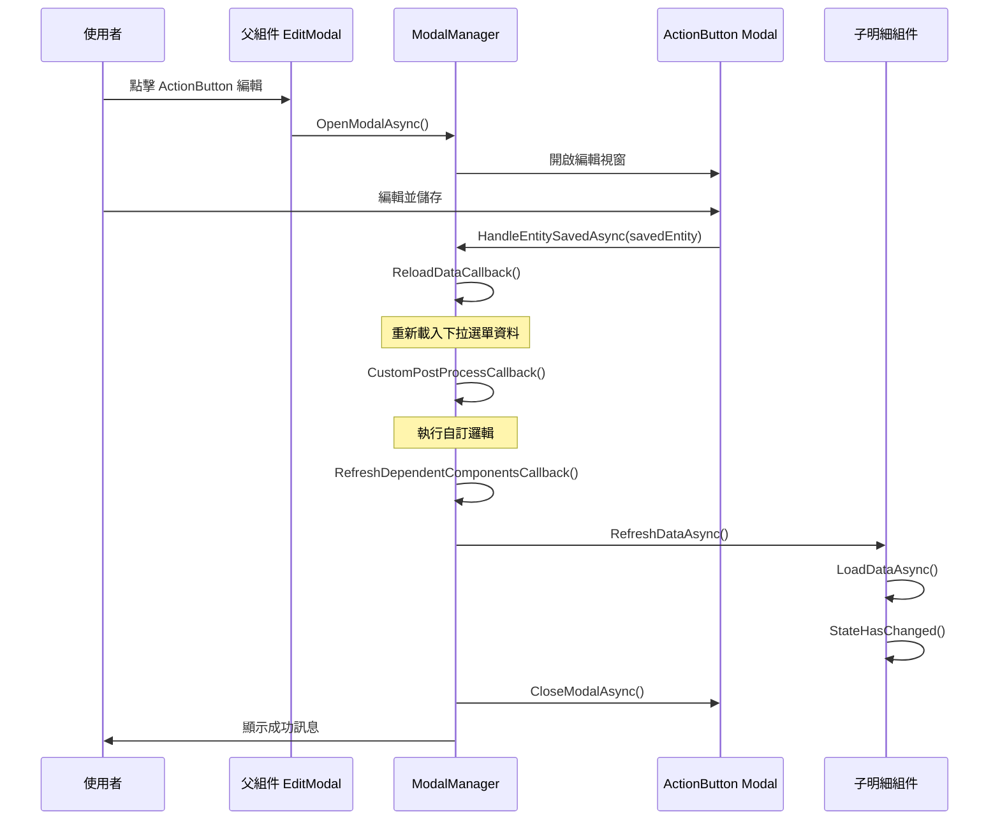

# 更新明細元件在 ActionButton 編輯之後的說明

## 問題描述

在使用 `GenericEditModalComponent` 的頁面中，當欄位使用 `ActionButton` 來新增或編輯相關實體（例如：廠商、類別等）時，如果該實體與子明細組件有依賴關係（例如：廠商與該廠商的商品），在透過 `ActionButton` 編輯完相關實體後，子明細組件無法立即取得更新後的資料，必須關閉 EditModal 重新開啟才能正確載入。

### 實際案例

在 `PurchaseOrderEditModalComponent` 中：
- 廠商欄位有 `ActionButton` 可以編輯廠商資料
- `PurchaseOrderDetailManagerComponent` 會根據選擇的廠商載入該廠商的商品
- 當透過 `ActionButton` 編輯廠商（例如：新增該廠商的商品關聯）後，商品列表不會自動更新
- 需要關閉採購單編輯視窗重新開啟才能看到更新的商品

## 解決方案

### 核心概念

在 `RelatedEntityModalManager` 中新增 `RefreshDependentComponentsCallback` 回調機制，讓父組件可以在相關實體儲存後，通知其他相依的子組件重新載入資料。

### 實作步驟

#### 1. 在 `RelatedEntityModalManager` 新增回調屬性

**檔案：** `Components/Shared/Modals/RelatedEntityModalManager.cs`

```csharp
/// <summary>
/// 重新整理相依組件的回調函式（在實體儲存成功後執行）
/// 用於通知其他組件重新載入與該實體相關的資料
/// 例如：編輯廠商後，通知商品管理器重新載入該廠商的商品
/// </summary>
public Func<TRelatedEntity, Task>? RefreshDependentComponentsCallback { get; set; }
```

#### 2. 在 `HandleEntitySavedAsync` 中執行回調

**檔案：** `Components/Shared/Modals/RelatedEntityModalManager.cs`

在實體儲存成功後，關閉 Modal 之前執行回調：

```csharp
public async Task HandleEntitySavedAsync(TRelatedEntity savedEntity, bool shouldAutoSelect = true)
{
    try
    {
        // 重新載入資料
        if (ReloadDataCallback != null)
        {
            await ReloadDataCallback();
        }
        
        // 執行自訂後處理邏輯
        if (CustomPostProcessCallback != null)
        {
            await CustomPostProcessCallback(savedEntity);
        }
        
        // 🔑 重新整理相依組件（在關閉 Modal 之前執行，確保資料已更新）
        if (RefreshDependentComponentsCallback != null)
        {
            await RefreshDependentComponentsCallback(savedEntity);
        }
        
        // 自動選擇新實體
        // 關閉 Modal
        // 顯示成功訊息
        // ...
    }
    catch (Exception ex)
    {
        await NotificationService.ShowErrorAsync($"處理{EntityDisplayName}儲存成功事件時發生錯誤：{ex.Message}");
    }
}
```

#### 3. 在 Builder 中新增設定方法

**檔案：** `Components/Shared/Modals/RelatedEntityModalManagerExtensions.cs`

```csharp
/// <summary>
/// 設定重新整理相依組件回調
/// 用於在實體儲存後通知其他組件重新載入相關資料
/// 例如：編輯廠商後，通知商品管理器重新載入該廠商的商品
/// </summary>
public RelatedEntityManagerBuilder<TRelatedEntity> WithRefreshDependentComponents(Func<TRelatedEntity, Task> callback)
{
    _manager.RefreshDependentComponentsCallback = callback;
    return this;
}
```

#### 4. 在子明細組件中提供公開的重新載入方法

**檔案：** `Components/Shared/SubCollections/PurchaseOrderDetailManagerComponent.razor`

```csharp
/// <summary>
/// 🔑 公開方法：重新載入可用商品（供父組件呼叫）
/// 當廠商資料被編輯後，父組件可以呼叫此方法來重新載入該廠商的商品
/// </summary>
public async Task RefreshAvailableProductsAsync()
{
    await LoadAvailableProductsAsync();
    StateHasChanged();
}
```

#### 5. 在父組件的 Modal 管理器初始化中設定回調

**檔案：** `Components/Pages/Purchase/PurchaseOrderEditModalComponent.razor`

```csharp
private void InitializeSupplierModalManager()
{
    supplierModalManager = new RelatedEntityManagerBuilder<Supplier>(NotificationService, "廠商")
        .WithPropertyName(nameof(PurchaseOrder.SupplierId))
        .WithReloadCallback(LoadAdditionalDataAsync)
        .WithStateChangedCallback(StateHasChanged)
        .WithAutoSelectCallback(supplierId => 
        {
            if (editModalComponent?.Entity != null)
            {
                editModalComponent.Entity.SupplierId = supplierId;
            }
        })
        .WithCustomPostProcess(async supplier => 
        {
            await InitializeFormFieldsAsync();
        })
        .WithRefreshDependentComponents(async supplier =>
        {
            // 🔑 當廠商被編輯後，重新載入該廠商的商品資料
            if (purchaseOrderDetailManager != null)
            {
                await purchaseOrderDetailManager.RefreshAvailableProductsAsync();
            }
        })
        .Build();
}
```

## 使用指南

### 基本使用步驟

1. **在子明細組件中提供公開的刷新方法**
   ```csharp
   public async Task RefreshDataAsync()
   {
       await LoadYourDataAsync();
       StateHasChanged();
   }
   ```

2. **在父組件中取得子組件的參考**
   ```razor
   <YourDetailManagerComponent @ref="detailManager" ... />
   ```
   
   ```csharp
   private YourDetailManagerComponent? detailManager;
   ```

3. **在初始化 ModalManager 時設定回調**
   ```csharp
   modalManager = new RelatedEntityManagerBuilder<YourEntity>(NotificationService, "實體名稱")
       .WithPropertyName(nameof(MainEntity.YourEntityId))
       .WithReloadCallback(LoadAdditionalDataAsync)
       .WithStateChangedCallback(StateHasChanged)
       .WithRefreshDependentComponents(async entity =>
       {
           // 重新載入子組件的資料
           if (detailManager != null)
           {
               await detailManager.RefreshDataAsync();
           }
       })
       .Build();
   ```

### 完整範例：訂單明細與商品類別

假設您有一個訂單編輯頁面，商品類別欄位有 ActionButton，訂單明細會根據商品類別顯示商品：

```csharp
// 1. 在明細組件中提供刷新方法
public class OrderDetailManagerComponent
{
    [Parameter] public int? SelectedCategoryId { get; set; }
    
    private List<Product> availableProducts = new();
    
    public async Task RefreshAvailableProductsAsync()
    {
        if (SelectedCategoryId.HasValue)
        {
            availableProducts = await ProductService.GetByCategoryAsync(SelectedCategoryId.Value);
            StateHasChanged();
        }
    }
}

// 2. 在父組件中設定
public class OrderEditModalComponent
{
    private OrderDetailManagerComponent? orderDetailManager;
    private RelatedEntityModalManager<ProductCategory> categoryModalManager;
    
    private void InitializeCategoryModalManager()
    {
        categoryModalManager = new RelatedEntityManagerBuilder<ProductCategory>(NotificationService, "商品類別")
            .WithPropertyName(nameof(Order.ProductCategoryId))
            .WithReloadCallback(LoadAdditionalDataAsync)
            .WithStateChangedCallback(StateHasChanged)
            .WithRefreshDependentComponents(async category =>
            {
                // 當類別被編輯後，重新載入該類別的商品
                if (orderDetailManager != null)
                {
                    await orderDetailManager.RefreshAvailableProductsAsync();
                }
            })
            .Build();
    }
}
```

## 執行流程



## 優點

1. **統一解決方案**：所有使用 `RelatedEntityModalManager` 的地方都可以使用此機制
2. **解耦合**：子組件不需要知道父組件的存在，只需提供公開的刷新方法
3. **可擴展**：可以同時刷新多個子組件
4. **清晰的責任劃分**：
   - `ReloadDataCallback`：重新載入父組件自己的資料（如下拉選單）
   - `CustomPostProcessCallback`：執行父組件的自訂邏輯
   - `RefreshDependentComponentsCallback`：通知子組件更新資料

## 適用場景

### 常見的應用場景

1. **廠商與商品**
   - 編輯廠商的商品關聯後，採購單明細的商品列表需要更新

2. **商品類別與商品**
   - 編輯商品類別後，商品選擇器需要重新載入該類別的商品

3. **客戶與聯絡人**
   - 編輯客戶後，訂單明細的聯絡人列表需要更新

4. **倉庫與庫位**
   - 編輯倉庫後，入庫單明細的庫位列表需要更新

### 不適用的場景

- 如果子組件的資料與被編輯的實體無關，不需要設定此回調
- 如果子組件會自動監聽參數變更並重新載入資料，也不需要此機制

## 注意事項

1. **空值檢查**：在回調中務必檢查子組件參考是否為 null
   ```csharp
   .WithRefreshDependentComponents(async entity =>
   {
       if (detailManager != null)  // 重要！
       {
           await detailManager.RefreshDataAsync();
       }
   })
   ```

2. **執行順序**：回調在關閉 Modal 之前執行，確保資料已更新
   - `ReloadDataCallback` → `CustomPostProcessCallback` → `RefreshDependentComponentsCallback` → CloseModal

3. **效能考量**：如果刷新操作很耗時，考慮顯示載入指示器

4. **錯誤處理**：在子組件的刷新方法中做好錯誤處理
   ```csharp
   public async Task RefreshDataAsync()
   {
       try
       {
           await LoadDataAsync();
           StateHasChanged();
       }
       catch (Exception ex)
       {
           // 記錄錯誤但不中斷使用者流程
           Console.Error.WriteLine($"刷新資料失敗：{ex.Message}");
       }
   }
   ```

## 常見問題

### Q1: 為什麼不直接在父組件的 `OnFieldValueChanged` 中處理？

**A:** `OnFieldValueChanged` 只在使用者直接修改欄位值時觸發，透過 ActionButton 編輯後，欄位值可能沒有變更（例如只是修改了廠商的其他屬性，而非更換廠商），因此不會觸發該事件。

### Q2: 可以同時刷新多個子組件嗎？

**A:** 可以！在回調中依序呼叫多個子組件的刷新方法：

```csharp
.WithRefreshDependentComponents(async entity =>
{
    if (detailManager1 != null)
        await detailManager1.RefreshDataAsync();
    
    if (detailManager2 != null)
        await detailManager2.RefreshDataAsync();
})
```

### Q3: 如果子組件還沒初始化怎麼辦？

**A:** 這就是為什麼要進行空值檢查。如果子組件還沒初始化（`@ref` 尚未設定），回調會安全地跳過。

### Q4: 這個機制會影響效能嗎？

**A:** 影響很小。只有在實際透過 ActionButton 儲存實體時才會執行，而且是必要的資料更新操作。如果擔心效能，可以在子組件中加入快取機制。

## 總結

透過 `RefreshDependentComponentsCallback` 機制，我們實現了：

- ✅ 統一的子組件刷新方式
- ✅ 清晰的責任劃分
- ✅ 良好的解耦合設計
- ✅ 適用於所有使用 `RelatedEntityModalManager` 的場景
- ✅ 不需要關閉重開 Modal 就能看到最新資料

這個設計模式可以應用到系統中所有類似的情況，確保使用者體驗的流暢性和資料的即時性。
