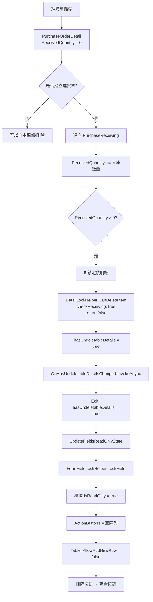
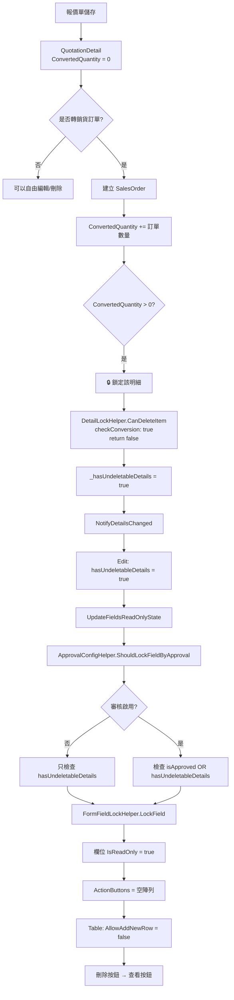

# 📋 有下一步動作時 Edit 和 Table 不能輸入機制說明

> **核心原則**：當單據明細有「下一步動作」時（如：採購單已入庫、報價單已轉訂單），系統會自動鎖定主檔欄位和明細表格,防止資料不一致。

**📅 文檔日期**: 2025-12-10  
**🔖 版本**: v2.0 (**新增銷貨訂單系統完整實作與陷阱解決方案**)  
**📝 作者**: System Analysis

---

## 📑 目錄

1. [核心概念](#核心概念)
2. [採購單系統 - PurchaseOrder](#採購單系統---purchaseorder)
3. [報價單系統 - Quotation](#報價單系統---quotation)
4. [銷貨訂單系統 - SalesOrder](#銷貨訂單系統---salesorder)
5. [共用 Helper 說明](#共用-helper-說明)
6. [資料表判斷邏輯](#資料表判斷邏輯)
7. [完整流程圖](#完整流程圖)
8. [⚠️ 實作陷阱與解決方案](#實作陷阱與解決方案)

---

## 🎯 核心概念

### 什麼是「下一步動作」？

在 ERP 系統中，單據之間存在業務流程關聯：

```
報價單 → 銷貨訂單 → 出貨單 → 銷貨發票
採購單 → 進貨單 → 驗收單 → 付款單
```

當 A 單據的明細已經產生 B 單據時：
- ✅ A 單據的明細 = **有下一步動作**（已被後續單據使用）
- 🔒 A 單據需要 **鎖定**，防止修改影響後續單據

### 鎖定的目的

1. **資料一致性**：確保前後單據數量、金額一致
2. **業務完整性**：防止刪除已執行的訂單項目
3. **稽核追蹤**：保持交易記錄的完整性

---

## 🛒 採購單系統 - PurchaseOrder

### 1️⃣ Edit Modal 如何鎖住欄位

#### 🔹 鎖定狀態變數

**檔案**: `PurchaseOrderEditModalComponent.razor`

```csharp
// ===== 鎖定狀態 =====
private bool hasUndeletableDetails = false; // 是否有不可刪除的明細（已有進貨記錄）
```

#### 🔹 鎖定觸發時機

**時機 1**: Table 明細變更時通知 Edit Modal

```csharp
/// <summary>
/// 處理有不可刪除明細的狀態變更
/// 當明細動態變化時（新增進貨、刪除進貨記錄等），這個方法會被調用
/// </summary>
private async Task HandleHasUndeletableDetailsChanged(bool hasUndeletable)
{
    if (hasUndeletableDetails != hasUndeletable)
    {
        hasUndeletableDetails = hasUndeletable;
        
        // 🔥 關鍵：狀態變更後立即更新欄位的唯讀狀態
        UpdateFieldsReadOnlyState();
    }
}
```

**時機 2**: 資料載入完成時

```csharp
private async Task LoadPurchaseOrderDetails(int purchaseOrderId)
{
    // 載入明細...
    
    // 檢查是否有不可刪除的明細
    bool hasUndeletableDetails = purchaseOrderDetails.Any(d => 
        d.ReceivedQuantity > 0  // 已有進貨記錄
    );
    
    if (this.hasUndeletableDetails != hasUndeletableDetails)
    {
        this.hasUndeletableDetails = hasUndeletableDetails;
        UpdateFieldsReadOnlyState();
    }
}
```

#### 🔹 欄位鎖定邏輯

使用 **`FormFieldLockHelper`** 統一處理：

```csharp
/// <summary>
/// 更新欄位的唯讀狀態 - 根據是否有不可刪除的明細
/// 使用 FormFieldLockHelper 統一處理欄位鎖定邏輯
/// </summary>
private async void UpdateFieldsReadOnlyState()
{
    // 使用 FormFieldLockHelper 批次鎖定/解鎖欄位
    var fieldsToLock = new[]
    {
        nameof(PurchaseOrder.CompanyId),
        nameof(PurchaseOrder.Code),
        nameof(PurchaseOrder.OrderDate),
        nameof(PurchaseOrder.ExpectedDeliveryDate),
        nameof(PurchaseOrder.Remarks),
        nameof(PurchaseOrder.RejectReason)
    };
    
    // 鎖定或解鎖一般欄位（不需要 ActionButtons）
    FormFieldLockHelper.LockMultipleFieldsSimple(
        formFields, 
        fieldsToLock, 
        isLocked: hasUndeletableDetails
    );
    
    // 特殊處理廠商欄位（需要 ActionButtons）
    if (hasUndeletableDetails)
    {
        // 鎖定：移除 ActionButtons
        FormFieldLockHelper.LockField(
            formFields,
            nameof(PurchaseOrder.SupplierId),
            isLocked: true
        );
    }
    else
    {
        // 解鎖：恢復 ActionButtons
        FormFieldLockHelper.LockField(
            formFields,
            nameof(PurchaseOrder.SupplierId),
            isLocked: false,
            actionButtonsGetter: GetSupplierActionButtonsAsync
        );
    }
    
    // 重新初始化表單欄位以強制更新 UI
    await InvokeAsync(async () =>
    {
        await InitializeFormFieldsAsync();
        StateHasChanged();
    });
}
```

#### 🔹 結合審核機制

使用 **`ApprovalConfigHelper`** 判斷是否鎖定：

```csharp
private async Task<List<FieldActionButton>> GetSupplierActionButtonsAsync()
{
    // 使用 ApprovalConfigHelper 統一判斷是否鎖定
    var shouldLock = ApprovalConfigHelper.ShouldLockFieldByApproval(
        isApprovalEnabled,                          // 是否啟用審核
        editModalComponent?.Entity?.IsApproved ?? false,  // 是否已審核
        hasUndeletableDetails                       // 是否有下一步動作
    );
    
    if (shouldLock)
    {
        return new List<FieldActionButton>();  // 鎖定：不顯示按鈕
    }
    
    // 未鎖定：顯示新增/編輯按鈕
    var buttons = await ActionButtonHelper.GenerateFieldActionButtonsAsync(
        editModalComponent, 
        supplierModalManager, 
        nameof(PurchaseOrder.SupplierId)
    );
    
    return buttons;
}
```

---

### 2️⃣ Table 如何鎖住明細

#### 🔹 鎖定狀態變數

**檔案**: `PurchaseOrderTable.razor`

```csharp
// ===== 不可刪除明細狀態追蹤 =====
private bool _hasUndeletableDetails = false;  // 是否有不可刪除的明細（已有進貨記錄）
```

#### 🔹 鎖定檢查邏輯

使用 **`DetailLockHelper`** 檢查每個明細項目：

```csharp
/// <summary>
/// 從現有明細資料載入到 ProductItems
/// </summary>
private async Task LoadExistingDetailsAsync()
{
    // ... 載入明細資料 ...
    
    foreach (var detail in ExistingDetails)
    {
        // 檢查是否已被入庫單使用
        item.HasUsageRecordCache = await HasUsageRecord(item);
        
        ProductItems.Add(item);
    }
    
    // 🔥 關鍵：載入後立即檢查是否有不可刪除的明細
    bool hasUndeletableDetails = ProductItems.Any(p => 
        !DetailLockHelper.CanDeleteItem(p, out _, checkReceiving: true)
    );
    
    if (_hasUndeletableDetails != hasUndeletableDetails)
    {
        _hasUndeletableDetails = hasUndeletableDetails;
    }
    
    // 資料載入完成 - 觸發空行檢查
    _dataLoadCompleted = true;
    StateHasChanged();
}
```

#### 🔹 通知父組件（Edit Modal）

```csharp
/// <summary>
/// 直接通知詳細資料變更
/// </summary>
private async Task NotifyDetailsChanged()
{
    var details = ConvertToDetailEntities();
    await DetailSyncHelper.SyncToParentAsync(details, OnDetailsChanged);
    
    // 檢查是否有不可刪除的明細（已有進貨記錄）
    bool hasUndeletableDetails = ProductItems.Any(p => 
        !DetailLockHelper.CanDeleteItem(p, out _, checkReceiving: true)
    );
    
    // 狀態變更時才通知父組件並觸發 UI 更新
    if (_hasUndeletableDetails != hasUndeletableDetails)
    {
        _hasUndeletableDetails = hasUndeletableDetails;
        
        // 🔥 通知父組件（Edit Modal）
        await OnHasUndeletableDetailsChanged.InvokeAsync(hasUndeletableDetails);
        
        // 🔥 關鍵：狀態變更後，立即刷新空行（移除或新增）
        tableComponent?.RefreshEmptyRow();
        
        StateHasChanged();  // 觸發 UI 更新
    }
}
```

#### 🔹 控制新增空行

透過 `InteractiveTableComponent` 的 `AllowAddNewRow` 參數：

```razor
<InteractiveTableComponent @ref="tableComponent"
                          TItem="ProductItem" 
                          Items="@ProductItems"
                          ColumnDefinitions="@GetColumnDefinitions()"
                          IsReadOnly="@IsReadOnly"
                          ShowBuiltInActions="true"
                          ShowBuiltInDeleteButton="false"
                          CustomActionsTemplate="@GetCustomActionsTemplate"
                          EnableAutoEmptyRow="true"
                          AllowAddNewRow="@(!_hasUndeletableDetails && !IsReadOnly)"
                          DataLoadCompleted="@_dataLoadCompleted"
                          CreateEmptyItem="@(() => new ProductItem())" />
```

**邏輯說明**：
- `AllowAddNewRow="@(!_hasUndeletableDetails && !IsReadOnly)"`
- 當 `_hasUndeletableDetails = true` 時，不允許新增空行
- 當 `IsReadOnly = true` 時，也不允許新增空行

#### 🔹 控制刪除按鈕顯示

```csharp
private RenderFragment<ProductItem> GetCustomActionsTemplate => item => __builder =>
{
    // 使用 DetailLockHelper 檢查是否可以刪除
    if (DetailLockHelper.CanDeleteItem(item, out _, checkReceiving: true))
    {
        // 可以刪除：顯示刪除按鈕
        <GenericButtonComponent Variant="ButtonVariant.Red"
                               IconClass="bi bi-trash text-white"
                               Size="ButtonSize.Large"
                               IsDisabled="@IsReadOnly"
                               Title="刪除"
                               OnClick="async () => await HandleItemDelete(item)"
                               StopPropagation="true"
                               CssClass="btn-square" />
    }
    else
    {
        // 已被使用：顯示查看相關單據按鈕
        <GenericButtonComponent Variant="ButtonVariant.Blue"
                               IconClass="bi bi-eye text-white"
                               Size="ButtonSize.Large"
                               Title="查看相關單據"
                               OnClick="async () => await ShowRelatedDocuments(item)"
                               StopPropagation="true"
                               CssClass="btn-square" />
    }
};
```

#### 🔹 欄位鎖定邏輯

**備註欄位** 特殊處理（核准後仍可編輯）：

```csharp
columns.Add(new() 
{ 
    Title = "備註", 
    PropertyName = "Remarks",
    CustomTemplate = item => 
    {
        var productItem = (ProductItem)item;
        // 🔥 備註欄位只受 IsReadOnly 影響，核准後仍可編輯
        var isFieldReadOnly = IsReadOnly;
        
        if (isFieldReadOnly)
        {
            var displayText = string.IsNullOrEmpty(productItem.Remarks) ? "無備註" : productItem.Remarks;
            return @<span class="text-muted">@displayText</span>;
        }
        
        return @<input type="text" class="form-control" 
                       value="@productItem.Remarks"
                       @oninput="(e) => OnRemarksInput(productItem, e.Value?.ToString())" />;
    }
});
```

---

### 3️⃣ 服務層變化

採購單系統的服務層**不需要特殊處理**，因為：

1. **明細鎖定檢查** 是在前端 UI 層完成（透過 `DetailLockHelper`）
2. **欄位鎖定** 是透過表單欄位的 `IsReadOnly` 屬性控制
3. **後端驗證** 是在 `SavePurchaseOrderWithDetails` 方法中進行

```csharp
private async Task<bool> SavePurchaseOrderWithDetails(PurchaseOrder purchaseOrder, bool isPreApprovalSave = false)
{
    try
    {
        // 🔥 特殊處理：審核通過後仍允許儲存（用於更新「完成進貨」等執行狀態）
        // 不使用 ApprovalConfigHelper.CanSaveWhenApproved 的限制
        
        // 驗證：如果已經有明細被入庫，不允許修改主檔的關鍵欄位
        if (hasUndeletableDetails && !isPreApprovalSave)
        {
            // 允許儲存，但前端已鎖定關鍵欄位，所以這裡不會收到被修改的值
            // 只會更新「完成進貨」、「備註」等允許編輯的欄位
        }
        
        // 儲存主檔和明細...
    }
}
```

---

### 4️⃣ 資料表判斷邏輯

#### 🔹 採購單明細 - PurchaseOrderDetail

**判斷依據**: `ReceivedQuantity` 欄位

```sql
-- 資料表結構（簡化）
CREATE TABLE PurchaseOrderDetail (
    Id INT PRIMARY KEY,
    PurchaseOrderId INT,
    ProductId INT,
    Quantity DECIMAL(18, 2),
    ReceivedQuantity DECIMAL(18, 2),  -- 🔥 已入庫數量
    ...
);
```

**判斷邏輯**:
```csharp
public static bool HasReceivingRecord<TEntity>(TEntity entity) where TEntity : class
{
    // 檢查 ReceivedQuantity 屬性
    var receivedProperty = type.GetProperty("ReceivedQuantity");
    if (receivedProperty != null)
    {
        var value = (decimal)(receivedProperty.GetValue(entity) ?? 0m);
        return value > 0;  // 🔥 只要 > 0 就表示有進貨記錄
    }
    
    return false;
}
```

**業務邏輯**:
1. 採購單儲存時，`ReceivedQuantity = 0`
2. 建立進貨單時，`ReceivedQuantity` 累加
3. 刪除進貨單時，`ReceivedQuantity` 減少
4. 當 `ReceivedQuantity > 0`，該明細項目鎖定

---

## 💰 報價單系統 - Quotation

### 1️⃣ Edit Modal 如何鎖住欄位

#### 🔹 鎖定狀態變數

**檔案**: `QuotationEditModalComponent.razor`

```csharp
// ===== 鎖定狀態 =====
private bool hasUndeletableDetails = false; // 是否有不可刪除的明細（已有轉單記錄）
```

#### 🔹 鎖定觸發邏輯

**觸發時機 1**: 明細變更時

```csharp
/// <summary>
/// 處理報價單明細變更 - 根據稅別自動計算金額欄位
/// </summary>
private async Task HandleQuotationDetailsChanged(List<QuotationDetail> details)
{
    quotationDetails = details;
    
    // 檢查是否有不可刪除的明細（已轉訂單）
    bool hasUndeletableDetails = quotationDetails.Any(d => d.ConvertedQuantity > 0);
    
    if (this.hasUndeletableDetails != hasUndeletableDetails)
    {
        this.hasUndeletableDetails = hasUndeletableDetails;
        
        // 🔥 更新欄位鎖定狀態
        UpdateFieldsReadOnlyState();
    }
}
```

**觸發時機 2**: 載入明細時

```csharp
private async Task LoadQuotationDetails(int quotationId)
{
    quotationDetails = await QuotationDetailService.GetByQuotationIdAsync(quotationId);
    
    // 檢查是否有已轉單的明細
    bool hasUndeletableDetails = quotationDetails.Any(d => d.ConvertedQuantity > 0);
    
    if (this.hasUndeletableDetails != hasUndeletableDetails)
    {
        this.hasUndeletableDetails = hasUndeletableDetails;
        UpdateFieldsReadOnlyState();
    }
}
```

#### 🔹 欄位鎖定邏輯

使用 **`FormFieldLockHelper`** + **`ApprovalConfigHelper`**:

```csharp
/// <summary>
/// 更新欄位的唯讀狀態 - 根據審核狀態和明細轉單狀態
/// 使用 FormFieldLockHelper 統一處理欄位鎖定邏輯
/// </summary>
private async void UpdateFieldsReadOnlyState()
{
    // 計算是否應該鎖定欄位
    var shouldLock = ApprovalConfigHelper.ShouldLockFieldByApproval(
        isApprovalEnabled,                          // 是否啟用審核
        editModalComponent?.Entity?.IsApproved ?? false,  // 是否已審核
        hasUndeletableDetails                       // 是否有下一步動作（已轉訂單）
    );

    // 使用 FormFieldLockHelper 批次鎖定/解鎖欄位
    var fieldsToLock = new[]
    {
        nameof(Quotation.Code),
        nameof(Quotation.QuotationDate),
        nameof(Quotation.PaymentTerms),
        nameof(Quotation.DeliveryTerms),
        nameof(Quotation.ProjectName),
        nameof(BaseEntity.Remarks)
    };
    
    // 鎖定或解鎖一般欄位（不需要 ActionButtons）
    FormFieldLockHelper.LockMultipleFieldsSimple(
        formFields, 
        fieldsToLock, 
        isLocked: shouldLock
    );
    
    // 特殊處理有 ActionButtons 的欄位
    var fieldsWithActionButtons = new Dictionary<string, Func<Task<List<FieldActionButton>>>>
    {
        { nameof(Quotation.CustomerId), GetCustomerActionButtonsAsync },
        { nameof(Quotation.CompanyId), GetCompanyActionButtonsAsync },
        { nameof(Quotation.EmployeeId), GetEmployeeActionButtonsAsync }
    };

    foreach (var kvp in fieldsWithActionButtons)
    {
        if (shouldLock)
        {
            // 鎖定：移除 ActionButtons
            FormFieldLockHelper.LockField(formFields, kvp.Key, isLocked: true);
        }
        else
        {
            // 解鎖：恢復 ActionButtons
            FormFieldLockHelper.LockField(
                formFields, 
                kvp.Key, 
                isLocked: false, 
                actionButtonsGetter: kvp.Value
            );
        }
    }
    
    // 強制更新 UI
    await InvokeAsync(() => StateHasChanged());
}
```

---

### 2️⃣ Table 如何鎖住明細

#### 🔹 鎖定狀態變數

**檔案**: `QuotationTable.razor`

```csharp
// ===== 私有欄位 =====
private bool _hasUndeletableDetails = false;  // 是否有不可刪除的明細（已轉訂單）
```

#### 🔹 鎖定檢查邏輯

```csharp
/// <summary>
/// 從現有明細資料載入
/// </summary>
private async Task LoadExistingDetailsAsync()
{
    foreach (var detail in ExistingDetails)
    {
        var item = new QuotationItem
        {
            // ... 設定屬性 ...
            ConvertedQuantity = detail.ConvertedQuantity,  // 🔥 已轉單數量
            ExistingDetailEntity = detail
        };
        
        QuotationItems.Add(item);
    }
    
    // 檢查是否有不可刪除的明細（已轉訂單）
    bool hasUndeletableDetails = QuotationItems.Any(item => 
        item.SelectedProduct != null && 
        !DetailLockHelper.CanDeleteItem(item, out _, checkConversion: true)
    );
    
    if (_hasUndeletableDetails != hasUndeletableDetails)
    {
        _hasUndeletableDetails = hasUndeletableDetails;
    }
}
```

#### 🔹 通知父組件

```csharp
private async Task NotifyDetailsChanged()
{
    var details = ConvertToDetailEntities();
    await DetailSyncHelper.SyncToParentAsync(details, OnDetailsChanged);
    
    // 檢查並更新不可刪除明細的狀態
    bool hasUndeletableDetails = QuotationItems.Any(item => 
        item.SelectedProduct != null && 
        !DetailLockHelper.CanDeleteItem(item, out _, checkConversion: true)
    );
    
    if (_hasUndeletableDetails != hasUndeletableDetails)
    {
        _hasUndeletableDetails = hasUndeletableDetails;
        tableComponent?.RefreshEmptyRow();  // 🔥 刷新空行狀態
        StateHasChanged();
    }
}
```

#### 🔹 控制新增空行

```razor
<InteractiveTableComponent @ref="tableComponent"
                          TItem="QuotationItem" 
                          Items="@QuotationItems"
                          ColumnDefinitions="@GetColumnDefinitions()"
                          IsReadOnly="@IsReadOnly"
                          EnableAutoEmptyRow="true"
                          AllowAddNewRow="@(!_hasUndeletableDetails && !IsReadOnly)"
                          DataLoadCompleted="@_dataLoadCompleted"
                          CreateEmptyItem="@CreateEmptyItem" />
```

#### 🔹 控制刪除按鈕顯示

```csharp
private RenderFragment<QuotationItem> GetCustomActionsTemplate => item => __builder =>
{
    var quotationItem = (QuotationItem)item;
    var isEmptyRow = quotationItem.SelectedProduct == null;
    var canDelete = DetailLockHelper.CanDeleteItem(quotationItem, out _, checkConversion: true);
    var hasComposition = quotationItem.SelectedProduct != null && 
                         HasProductComposition(quotationItem.SelectedProduct.Id);
    
    <div class="d-flex gap-1">
        @* BOM 編輯按鈕 *@
        @if (hasComposition && !isEmptyRow)
        {
            <GenericButtonComponent ... />
        }
        
        @* 刪除/查看按鈕 *@
        @if (IsReadOnly)
        {
            // 唯讀模式：顯示檢視按鈕
            <GenericButtonComponent Variant="ButtonVariant.Blue" ... />
        }
        else if (canDelete || isEmptyRow)
        {
            // 可編輯且未轉單：顯示刪除按鈕
            <GenericButtonComponent Variant="ButtonVariant.Red" ... />
        }
        else
        {
            // 已轉訂單：顯示查看相關單據按鈕
            <GenericButtonComponent Variant="ButtonVariant.Blue" ... />
        }
    </div>
};
```

---

### 3️⃣ 服務層變化

報價單系統的服務層同樣**不需要特殊處理**：

```csharp
private async Task<bool> SaveQuotationWithDetails(Quotation quotation)
{
    // 特殊處理：審核通過或已轉單後仍允許儲存，用於更新明細的執行狀態
    // 但前端已鎖定關鍵欄位，只會更新允許編輯的欄位（如備註）
    
    // 驗證和儲存邏輯...
}
```

---

### 4️⃣ 資料表判斷邏輯

#### 🔹 報價單明細 - QuotationDetail

**判斷依據**: `ConvertedQuantity` 欄位

```sql
-- 資料表結構（簡化）
CREATE TABLE QuotationDetail (
    Id INT PRIMARY KEY,
    QuotationId INT,
    ProductId INT,
    Quantity DECIMAL(18, 2),
    ConvertedQuantity DECIMAL(18, 2),  -- 🔥 已轉單數量
    ...
);
```

**判斷邏輯**:
```csharp
public static bool HasConversionRecord<TEntity>(TEntity entity) where TEntity : class
{
    // 檢查 ConvertedQuantity 屬性
    var convertedProperty = type.GetProperty("ConvertedQuantity");
    if (convertedProperty != null && convertedProperty.PropertyType == typeof(decimal))
    {
        var value = (decimal)(convertedProperty.GetValue(entity) ?? 0m);
        return value > 0;  // 🔥 只要 > 0 就表示有轉單記錄
    }
    
    return false;
}
```

**業務邏輯**:
1. 報價單儲存時，`ConvertedQuantity = 0`
2. 建立銷貨訂單時，`ConvertedQuantity` 累加
3. 刪除銷貨訂單時，`ConvertedQuantity` 減少
4. 當 `ConvertedQuantity > 0`，該明細項目鎖定

---

## 💼 銷貨訂單系統 - SalesOrder

> **⚠️ 重要**：銷貨訂單系統的實作過程中遇到多個關鍵問題，這些問題在採購單和報價單系統中沒有出現。

### 1️⃣ 系統需求分析

銷貨訂單比採購單和報價單更複雜，因為有**三種下一步動作**：

| 下一步動作 | 追蹤欄位 | 關聯單據 | FK 欄位 |
|-----------|---------|---------|---------|
| **生產排程** | `ScheduledQuantity` | `ProductionSchedule` | `SalesOrderDetailId` |
| **銷貨出貨** | `DeliveredQuantity` | `SalesDeliveryDetail` | `SalesOrderDetailId` |
| **預收款項** | `TotalReceivedAmount` | 沖款單 | `SalesOrderDetailId` |

### 2️⃣ DetailLockHelper 擴充

需要新增 `checkDelivery` 和 `checkSchedule` 參數：

```csharp
public static bool CanDeleteItem<TEntity>(
    TEntity? entity,
    out string reason,
    bool checkPayment = false,
    bool checkReturn = false,
    bool checkConversion = false,
    bool checkReceiving = false,
    bool checkDelivery = false,      // 🆕 銷貨訂單需要
    bool checkSchedule = false,      // 🆕 銷貨訂單需要
    Dictionary<int, decimal>? returnedQuantities = null) where TEntity : class
{
    // ... 其他檢查 ...
    
    // 檢查出貨記錄
    if (checkDelivery && HasDeliveryRecord(entity))
    {
        var deliveredQty = GetDeliveredQuantity(entity);
        reason = $"此商品已有出貨記錄（已出貨 {deliveredQty} 個），無法刪除";
        return false;
    }
    
    // 檢查生產排程
    if (checkSchedule && HasScheduleRecord(entity))
    {
        var scheduledQty = GetScheduledQuantity(entity);
        reason = $"此商品已有生產排程（已排程 {scheduledQty} 個），無法刪除";
        return false;
    }
    
    return true;
}
```

新增對應的檢查方法：

```csharp
/// <summary>
/// 檢查實體是否有出貨記錄（透過 DeliveredQuantity）
/// </summary>
public static bool HasDeliveryRecord<TEntity>(TEntity entity) where TEntity : class
{
    if (entity == null) return false;
    
    var type = entity.GetType();
    var deliveredProperty = type.GetProperty("DeliveredQuantity");
    
    if (deliveredProperty != null && deliveredProperty.PropertyType == typeof(decimal))
    {
        var value = (decimal)(deliveredProperty.GetValue(entity) ?? 0m);
        return value > 0;
    }
    
    return false;
}

/// <summary>
/// 檢查實體是否有生產排程（透過 ScheduledQuantity）
/// </summary>
public static bool HasScheduleRecord<TEntity>(TEntity entity) where TEntity : class
{
    if (entity == null) return false;
    
    var type = entity.GetType();
    var scheduledProperty = type.GetProperty("ScheduledQuantity");
    
    if (scheduledProperty != null && scheduledProperty.PropertyType == typeof(decimal))
    {
        var value = (decimal)(scheduledProperty.GetValue(entity) ?? 0m);
        return value > 0;
    }
    
    return false;
}
```

### 3️⃣ Edit Modal 實作

**檔案**: `SalesOrderEditModalComponent.razor`

#### 🔹 鎖定狀態變數（同採購單）

```csharp
// ===== 鎖定狀態 =====
private bool hasUndeletableDetails = false;
```

#### 🔹 鎖定觸發時機

```csharp
/// <summary>
/// 處理有不可刪除明細的狀態變更
/// </summary>
private async Task HandleHasUndeletableDetailsChanged(bool hasUndeletable)
{
    ConsoleHelper.WriteDebug($"🔔 [EditModal] 收到明細狀態變更通知: hasUndeletable={hasUndeletable}");
    
    if (hasUndeletableDetails != hasUndeletable)
    {
        hasUndeletableDetails = hasUndeletable;
        
        if (hasUndeletableDetails)
        {
            ConsoleHelper.WriteWarning("🔒 偵測到不可刪除明細，呼叫 UpdateFieldsReadOnlyState()");
        }
        else
        {
            ConsoleHelper.WriteInfo("ℹ 所有明細可刪除，不鎖定欄位");
        }
        
        UpdateFieldsReadOnlyState();
    }
}
```

#### 🔹 載入明細時的檢查（⚠️ 關鍵陷阱）

**問題**：如果只載入明細資料，沒有同步載入相關資料（如商品資訊），會導致鎖定檢查失效。

**錯誤寫法**：
```csharp
private async Task LoadSalesOrderDetails(int salesOrderId)
{
    salesOrderDetails = await SalesOrderDetailService.GetBySalesOrderIdAsync(salesOrderId);
    
    // ❌ 這樣檢查會失敗，因為 Item 物件中沒有載入相關資料
    bool hasUndeletableDetails = salesOrderDetails.Any(d => 
        d.DeliveredQuantity > 0 || d.ScheduledQuantity > 0
    );
}
```

**正確寫法**：
```csharp
private async Task LoadSalesOrderDetails(int salesOrderId)
{
    salesOrderDetails = await SalesOrderDetailService.GetBySalesOrderIdAsync(salesOrderId);
    
    // ✅ 關鍵：載入明細後必須呼叫 LoadDetailRelatedDataAsync()
    await LoadDetailRelatedDataAsync();
    
    // 現在才能正確檢查
    bool hasUndeletableDetails = salesOrderDetails.Any(d => 
        d.DeliveredQuantity > 0 || d.ScheduledQuantity > 0 || d.TotalReceivedAmount > 0
    );
    
    if (this.hasUndeletableDetails != hasUndeletableDetails)
    {
        this.hasUndeletableDetails = hasUndeletableDetails;
        UpdateFieldsReadOnlyState();
    }
}
```

### 4️⃣ Table 實作

**檔案**: `SalesOrderTable.razor`

#### 🔹 使用 DetailLockHelper 三重檢查

```csharp
/// <summary>
/// 檢查項目是否可以刪除（使用 DetailLockHelper 統一判斷）
/// </summary>
private bool CanDeleteItem(SalesOrderItem item)
{
    return DetailLockHelper.CanDeleteItem(
        item, 
        out _, 
        checkDelivery: true,     // 檢查出貨記錄
        checkSchedule: true,     // 檢查生產排程
        checkPayment: true       // 檢查收款記錄
    );
}
```

#### 🔹 載入明細時的檢查

```csharp
private async Task LoadExistingDetailsAsync()
{
    foreach (var detail in ExistingDetails)
    {
        var item = new SalesOrderItem
        {
            // ... 其他屬性 ...
            DeliveredQuantity = detail.DeliveredQuantity,
            ScheduledQuantity = detail.ScheduledQuantity,
            TotalReceivedAmount = detail.TotalReceivedAmount,
            ExistingDetailEntity = detail
        };
        
        SalesOrderItems.Add(item);
    }
    
    // 使用 DetailLockHelper 檢查
    bool hasUndeletableDetails = SalesOrderItems.Any(p => 
        !DetailLockHelper.CanDeleteItem(
            p, 
            out _, 
            checkDelivery: true, 
            checkSchedule: true, 
            checkPayment: true
        )
    );
    
    if (_hasUndeletableDetails != hasUndeletableDetails)
    {
        _hasUndeletableDetails = hasUndeletableDetails;
    }
    
    _dataLoadCompleted = true;
    StateHasChanged();
}
```

### 5️⃣ ⚠️ 關鍵問題：FK 反向關聯缺失

#### 問題描述

當建立銷貨出貨單時，**`SalesDeliveryDetail.SalesOrderDetailId` 沒有被設定**，導致：

1. 出貨後 `DeliveredQuantity` 仍為 0（統計失敗）
2. 訂單欄位沒有鎖定（應該要鎖）
3. 刪除訂單時沒有 FK 約束保護

#### 問題根因

**檔案**: `SalesDeliveryTable.razor` - `ConvertToDetailEntities()` 方法

**錯誤寫法**：
```csharp
private List<SalesDeliveryDetail> ConvertToDetailEntities()
{
    foreach (var item in SalesDeliveryItems.Where(i => i.SelectedSalesDetail != null))
    {
        var detailEntity = item.ExistingDetailEntity ?? new SalesDeliveryDetail();
        
        SetPropertyValue(detailEntity, "SalesDeliveryId", SalesDeliveryId);
        SetPropertyValue(detailEntity, "ProductId", item.SelectedSalesDetail.ProductId);
        SetPropertyValue(detailEntity, "Quantity", item.Quantity);
        SetPropertyValue(detailEntity, "UnitPrice", item.UnitPrice);
        
        // ❌ 缺少這行！SalesOrderDetailId 沒有被設定
    }
}
```

**正確寫法**：
```csharp
private List<SalesDeliveryDetail> ConvertToDetailEntities()
{
    foreach (var item in SalesDeliveryItems.Where(i => i.SelectedSalesDetail != null))
    {
        var detailEntity = item.ExistingDetailEntity ?? new SalesDeliveryDetail();
        
        SetPropertyValue(detailEntity, "SalesDeliveryId", SalesDeliveryId);
        SetPropertyValue(detailEntity, "ProductId", item.SelectedSalesDetail.ProductId);
        SetPropertyValue(detailEntity, "Quantity", item.Quantity);
        SetPropertyValue(detailEntity, "UnitPrice", item.UnitPrice);
        
        // ✅ 關鍵：必須設定 FK 反向關聯
        SetPropertyValue(detailEntity, "SalesOrderDetailId", item.SelectedSalesDetail.Id);
    }
}
```

### 6️⃣ ⚠️ 關鍵問題：數量統計服務

#### 需求

當出貨單建立或刪除時，必須自動更新 `SalesOrderDetail.DeliveredQuantity`。

#### 服務層實作

**檔案**: `SalesOrderDetailService.cs`

```csharp
/// <summary>
/// 重新計算並更新銷貨訂單明細的已出貨數量
/// </summary>
/// <param name="salesOrderDetailId">銷貨訂單明細ID</param>
public async Task RecalculateDeliveredQuantityAsync(int salesOrderDetailId)
{
    using var context = await DbContextFactory.CreateDbContextAsync();
    await RecalculateDeliveredQuantityAsync(salesOrderDetailId, context);
}

/// <summary>
/// 重新計算並更新銷貨訂單明細的已出貨數量（支援外部 DbContext）
/// </summary>
/// <param name="salesOrderDetailId">銷貨訂單明細ID</param>
/// <param name="context">外部 DbContext（用於交易控制）</param>
public async Task RecalculateDeliveredQuantityAsync(int salesOrderDetailId, AppDbContext context)
{
    ConsoleHelper.WriteDebug($"🔍 [RecalculateDeliveredQuantityAsync] 開始處理明細 ID={salesOrderDetailId}");
    
    var salesOrderDetail = await context.SalesOrderDetails
        .FirstOrDefaultAsync(d => d.Id == salesOrderDetailId);
        
    if (salesOrderDetail == null)
    {
        ConsoleHelper.WriteError($"❌ [RecalculateDeliveredQuantityAsync] 找不到明細 ID={salesOrderDetailId}");
        return;
    }
    
    ConsoleHelper.WriteDebug($"🔍 [RecalculateDeliveredQuantityAsync] 當前 DeliveredQuantity={salesOrderDetail.DeliveredQuantity}");
    
    // ⚠️ 關鍵：只計算「狀態為 Active」的出貨明細
    // 且出貨單本身也必須是 Active（雙重過濾）
    var totalDelivered = await context.SalesDeliveryDetails
        .Include(d => d.SalesDelivery)
        .Where(d => 
            d.SalesOrderDetailId == salesOrderDetailId && 
            d.Status == EntityStatus.Active &&               // 明細狀態
            d.SalesDelivery.Status == EntityStatus.Active)   // 主檔狀態
        .SumAsync(d => d.Quantity);
    
    ConsoleHelper.WriteDebug($"🔍 [RecalculateDeliveredQuantityAsync] 查詢到 {await context.SalesDeliveryDetails.Include(d => d.SalesDelivery).CountAsync(d => d.SalesOrderDetailId == salesOrderDetailId && d.Status == EntityStatus.Active && d.SalesDelivery.Status == EntityStatus.Active)} 筆出貨明細");
    ConsoleHelper.WriteDebug($"🔍 [RecalculateDeliveredQuantityAsync] 計算後總出貨數量={totalDelivered}");
    
    if (salesOrderDetail.DeliveredQuantity != totalDelivered)
    {
        salesOrderDetail.DeliveredQuantity = totalDelivered;
        await context.SaveChangesAsync();
        ConsoleHelper.WriteSuccess($"✓ [RecalculateDeliveredQuantityAsync] 成功更新 DeliveredQuantity={totalDelivered}");
    }
    else
    {
        ConsoleHelper.WriteInfo($"ℹ [RecalculateDeliveredQuantityAsync] DeliveredQuantity 無變化，跳過更新");
    }
}
```

#### Interface 定義

**檔案**: `ISalesOrderDetailService.cs`

```csharp
public interface ISalesOrderDetailService : IDetailService<SalesOrderDetail>
{
    Task<List<SalesOrderDetail>> GetBySalesOrderIdAsync(int salesOrderId);
    
    /// <summary>
    /// 重新計算並更新已出貨數量（使用獨立 DbContext）
    /// </summary>
    Task RecalculateDeliveredQuantityAsync(int salesOrderDetailId);
    
    /// <summary>
    /// 重新計算並更新已出貨數量（使用外部 DbContext，支援交易）
    /// </summary>
    Task RecalculateDeliveredQuantityAsync(int salesOrderDetailId, AppDbContext context);
}
```

### 7️⃣ ⚠️ 關鍵問題：刪除時序與交易

#### 問題：系統使用永久刪除（PermanentDelete）而非軟刪除

**錯誤認知**：以為系統使用軟刪除（設定 `Status = Deleted`）

**實際情況**：系統使用永久刪除（`context.Remove()` + `SaveChanges()`）

#### SalesDeliveryService 刪除流程

**檔案**: `SalesDeliveryService.cs`

**錯誤寫法**：
```csharp
public override async Task<ServiceResult> PermanentDeleteAsync(int id)
{
    using var context = await DbContextFactory.CreateDbContextAsync();
    using var transaction = await context.Database.BeginTransactionAsync();
    
    try
    {
        var salesDelivery = await GetByIdWithDetailsAsync(id, context);
        if (salesDelivery == null)
            return ServiceResult.Failure("找不到指定的銷貨出貨單");
        
        // ❌ 問題：先呼叫 RecalculateDeliveredQuantityAsync
        // 此時 SalesDeliveryDetails 還沒刪除，統計結果不正確
        foreach (var detail in salesDelivery.SalesDeliveryDetails)
        {
            if (detail.SalesOrderDetailId.HasValue)
            {
                await SalesOrderDetailService.RecalculateDeliveredQuantityAsync(
                    detail.SalesOrderDetailId.Value,
                    context  // ⚠️ 使用相同 context
                );
            }
        }
        
        // 然後才刪除（太晚了！）
        context.SalesDeliveries.Remove(salesDelivery);
        await context.SaveChangesAsync();
        await transaction.CommitAsync();
        
        return ServiceResult.Success("銷貨出貨單已永久刪除");
    }
    catch (Exception ex)
    {
        await transaction.RollbackAsync();
        return ServiceResult.Failure($"刪除失敗: {ex.Message}");
    }
}
```

**正確寫法**：
```csharp
public override async Task<ServiceResult> PermanentDeleteAsync(int id)
{
    using var context = await DbContextFactory.CreateDbContextAsync();
    using var transaction = await context.Database.BeginTransactionAsync();
    
    try
    {
        ConsoleHelper.WriteDebug($"🗑 [PermanentDeleteAsync] 開始刪除出貨單 ID={id}");
        
        var salesDelivery = await GetByIdWithDetailsAsync(id, context);
        if (salesDelivery == null)
            return ServiceResult.Failure("找不到指定的銷貨出貨單");
        
        // ✅ 步驟 1：收集需要重新計算的 SalesOrderDetailId
        var salesOrderDetailIds = salesDelivery.SalesDeliveryDetails
            .Where(d => d.SalesOrderDetailId.HasValue)
            .Select(d => d.SalesOrderDetailId.Value)
            .Distinct()
            .ToList();
        
        ConsoleHelper.WriteInfo($"📋 需要重新計算的訂單明細數量: {salesOrderDetailIds.Count}");
        
        // ✅ 步驟 2：先刪除出貨單及其明細
        context.SalesDeliveries.Remove(salesDelivery);
        await context.SaveChangesAsync();  // ⚠️ 關鍵：立即提交刪除
        
        ConsoleHelper.WriteSuccess("✓ 已刪除出貨單及其明細");
        
        // ✅ 步驟 3：刪除後才重新計算（此時可以看到刪除結果）
        foreach (var salesOrderDetailId in salesOrderDetailIds)
        {
            await SalesOrderDetailService.RecalculateDeliveredQuantityAsync(
                salesOrderDetailId,
                context  // ⚠️ 使用相同 context，確保交易一致性
            );
        }
        
        // ✅ 步驟 4：提交整個交易
        await transaction.CommitAsync();
        
        ConsoleHelper.WriteSuccess($"✓ 出貨單 ID={id} 已成功刪除，相關訂單明細已更新");
        return ServiceResult.Success("銷貨出貨單已永久刪除");
    }
    catch (Exception ex)
    {
        await transaction.RollbackAsync();
        ConsoleHelper.WriteError($"❌ 刪除失敗: {ex.Message}");
        return ServiceResult.Failure($"刪除失敗: {ex.Message}");
    }
}
```

#### 關鍵技術點

1. **外部 DbContext 參數**：`RecalculateDeliveredQuantityAsync` 必須支援接收外部 DbContext
2. **刪除時序**：先刪除 → 提交 → 重新計算（確保統計看到刪除後的狀態）
3. **交易一致性**：所有操作使用同一個 DbContext 和 Transaction
4. **Console 日誌**：使用 ConsoleHelper 記錄每個步驟，方便追蹤問題

### 8️⃣ ⚠️ 關鍵問題：刪除保護（CanDeleteAsync）

#### 問題描述

即使 UI 層鎖定了訂單欄位，如果使用者直接刪除訂單（而不是明細），會遇到 FK 約束錯誤：

```
The DELETE statement conflicted with the REFERENCE constraint 
"FK_SalesDeliveryDetails_SalesOrderDetails_SalesOrderDetailId"
```

#### 解決方案：Service 層檢查

**檔案**: `SalesOrderService.cs`

```csharp
/// <summary>
/// 檢查銷貨訂單是否可以刪除
/// 如果訂單明細已有出貨記錄、生產排程或收款記錄，則不允許刪除
/// </summary>
protected override async Task<ServiceResult> CanDeleteAsync(SalesOrder entity)
{
    using var context = await DbContextFactory.CreateDbContextAsync();
    
    // 載入明細和商品資訊（用於錯誤訊息）
    var details = await context.SalesOrderDetails
        .Include(d => d.Product)
        .Where(d => d.SalesOrderId == entity.Id && d.Status == EntityStatus.Active)
        .ToListAsync();
    
    foreach (var detail in details)
    {
        var productName = detail.Product?.Name ?? "未知商品";
        
        // ✅ 檢查 1：是否有出貨記錄
        if (detail.DeliveredQuantity > 0)
        {
            return ServiceResult.Failure(
                $"無法刪除此銷貨訂單，商品「{productName}」已有出貨記錄（已出貨 {detail.DeliveredQuantity} 個）。" +
                "請先刪除相關的銷貨出貨單。"
            );
        }
        
        // ✅ 檢查 2：是否有生產排程
        if (detail.ScheduledQuantity > 0)
        {
            return ServiceResult.Failure(
                $"無法刪除此銷貨訂單，商品「{productName}」已有生產排程（已排程 {detail.ScheduledQuantity} 個）。" +
                "請先刪除相關的生產排程。"
            );
        }
        
        // ✅ 檢查 3：是否有收款記錄
        if (detail.TotalReceivedAmount > 0)
        {
            return ServiceResult.Failure(
                $"無法刪除此銷貨訂單，商品「{productName}」已有收款記錄（已收款 {detail.TotalReceivedAmount:N0} 元）。" +
                "請先刪除相關的沖款記錄。"
            );
        }
    }
    
    return ServiceResult.Success();
}
```

#### 與 PurchaseOrder 的對照

**PurchaseOrderService.cs** 只需檢查一個欄位：

```csharp
protected override async Task<ServiceResult> CanDeleteAsync(PurchaseOrder entity)
{
    // 只檢查 ReceivedQuantity
    if (detail.ReceivedQuantity > 0)
    {
        return ServiceResult.Failure("已有進貨記錄，無法刪除");
    }
}
```

**SalesOrderService.cs** 需要檢查**三個欄位**：

```csharp
protected override async Task<ServiceResult> CanDeleteAsync(SalesOrder entity)
{
    // 檢查 DeliveredQuantity
    if (detail.DeliveredQuantity > 0) { ... }
    
    // 檢查 ScheduledQuantity
    if (detail.ScheduledQuantity > 0) { ... }
    
    // 檢查 TotalReceivedAmount
    if (detail.TotalReceivedAmount > 0) { ... }
}
```

---

## 🛠️ 共用 Helper 說明

### 1️⃣ DetailLockHelper - 明細鎖定檢查

**檔案位置**: `Helpers/InteractiveTableComponentHelper/DetailLockHelper.cs`

#### 核心方法

```csharp
/// <summary>
/// 綜合檢查項目是否可以刪除（單一檢查點版本）
/// </summary>
/// <param name="entity">要檢查的實體</param>
/// <param name="reason">不可刪除的原因（輸出參數）</param>
/// <param name="checkPayment">是否檢查付款/收款記錄</param>
/// <param name="checkReturn">是否檢查退貨記錄</param>
/// <param name="checkConversion">是否檢查轉單記錄</param>
/// <param name="checkReceiving">是否檢查進貨記錄</param>
/// <param name="returnedQuantities">已退貨數量字典</param>
/// <returns>true 表示可以刪除，false 表示不可刪除</returns>
public static bool CanDeleteItem<TEntity>(
    TEntity? entity,
    out string reason,
    bool checkPayment = false,
    bool checkReturn = false,
    bool checkConversion = false,
    bool checkReceiving = false,
    Dictionary<int, decimal>? returnedQuantities = null) where TEntity : class
{
    reason = string.Empty;
    if (entity == null) return true;
    
    // 檢查退貨記錄
    if (checkReturn && HasReturnRecord(entity, returnedQuantities))
    {
        var returnedQty = GetReturnedQuantity(entity, returnedQuantities);
        reason = $"此商品已有退貨記錄（已退貨 {returnedQty} 個），無法刪除";
        return false;
    }
    
    // 檢查沖款記錄
    if (checkPayment && HasPaymentRecord(entity))
    {
        var amount = GetPaymentAmount(entity);
        reason = $"此商品已有沖款記錄（金額 {amount:N0} 元），無法刪除";
        return false;
    }
    
    // 檢查轉單記錄
    if (checkConversion && HasConversionRecord(entity))
    {
        var convertedQty = GetConvertedQuantity(entity);
        reason = $"此商品已轉單（已轉 {convertedQty} 個），無法刪除";
        return false;
    }
    
    // 檢查進貨記錄
    if (checkReceiving && HasReceivingRecord(entity))
    {
        var receivedQty = GetReceivedQuantity(entity);
        reason = $"此商品已有進貨記錄（已入庫 {receivedQty} 個），無法刪除";
        return false;
    }
    
    return true;
}
```

#### 使用範例

**採購單 Table**:
```csharp
DetailLockHelper.CanDeleteItem(item, out _, checkReceiving: true)
// 只檢查是否有進貨記錄
```

**報價單 Table**:
```csharp
DetailLockHelper.CanDeleteItem(item, out _, checkConversion: true)
// 只檢查是否有轉單記錄
```

**銷貨訂單 Table** (未來):
```csharp
DetailLockHelper.CanDeleteItem(item, out _, 
    checkReturn: true,      // 檢查退貨
    checkPayment: true,     // 檢查收款
    returnedQuantities: _returnedQuantities)
// 同時檢查多個條件
```

---

### 2️⃣ FormFieldLockHelper - 欄位鎖定控制

**檔案位置**: `Helpers/EditModal/FormFieldLockHelper.cs`

#### 核心方法

```csharp
/// <summary>
/// 鎖定或解鎖單一欄位
/// </summary>
public static bool LockField(
    List<FormFieldDefinition> formFields,
    string propertyName,
    bool isLocked,
    Func<Task<List<FieldActionButton>>>? actionButtonsGetter = null)
{
    var field = formFields.FirstOrDefault(f => f.PropertyName == propertyName);
    if (field == null) return false;

    field.IsReadOnly = isLocked;

    if (isLocked)
    {
        // 鎖定時移除所有操作按鈕
        field.ActionButtons = new List<FieldActionButton>();
    }
    else if (actionButtonsGetter != null)
    {
        // 解鎖時恢復操作按鈕
        field.ActionButtons = actionButtonsGetter().Result;
    }

    return true;
}

/// <summary>
/// 批次鎖定多個欄位（簡化版本，不處理 ActionButtons）
/// </summary>
public static int LockMultipleFieldsSimple(
    List<FormFieldDefinition> formFields,
    IEnumerable<string> propertyNames,
    bool isLocked)
{
    int count = 0;
    foreach (var propertyName in propertyNames)
    {
        if (LockFieldSimple(formFields, propertyName, isLocked))
            count++;
    }
    return count;
}
```

#### 使用範例

**簡單欄位鎖定** (無 ActionButtons):
```csharp
FormFieldLockHelper.LockMultipleFieldsSimple(
    formFields, 
    new[] { "Code", "OrderDate", "Remarks" }, 
    isLocked: hasUndeletableDetails
);
```

**複雜欄位鎖定** (有 ActionButtons):
```csharp
FormFieldLockHelper.LockField(
    formFields,
    nameof(Entity.SupplierId),
    isLocked: false,
    actionButtonsGetter: GetSupplierActionButtonsAsync
);
```

---

### 3️⃣ ApprovalConfigHelper - 審核邏輯統一管理

**檔案位置**: `Helpers/EditModal/ApprovalConfigHelper.cs`

#### 核心方法

```csharp
/// <summary>
/// 根據審核開關決定是否需要鎖定欄位
/// </summary>
/// <param name="isApprovalEnabled">是否啟用審核功能</param>
/// <param name="isApproved">實體是否已審核通過</param>
/// <param name="hasUndeletableDetails">是否有不可刪除的明細（已有下一步動作）</param>
/// <returns>是否應該鎖定欄位</returns>
public static bool ShouldLockFieldByApproval(
    bool isApprovalEnabled,
    bool isApproved,
    bool hasUndeletableDetails)
{
    if (!isApprovalEnabled)
    {
        // 未啟用審核：只根據「是否有下一步動作」鎖定
        return hasUndeletableDetails;
    }
    else
    {
        // 已啟用審核：根據「審核狀態 或 是否有下一步動作」鎖定
        return isApproved || hasUndeletableDetails;
    }
}
```

#### 使用範例

```csharp
var shouldLock = ApprovalConfigHelper.ShouldLockFieldByApproval(
    isApprovalEnabled: true,        // 系統參數：是否啟用審核
    isApproved: entity.IsApproved,  // 單據是否已審核
    hasUndeletableDetails: true     // 是否有下一步動作
);

if (shouldLock)
{
    // 鎖定欄位邏輯...
}
```

---

## 📊 資料表判斷邏輯總覽

### 不同單據的判斷欄位對照表

| 單據類型 | 明細 Table | 判斷欄位 | 判斷邏輯 | Helper 檢查參數 |
|---------|-----------|---------|---------|----------------|
| **採購單** | `PurchaseOrderDetail` | `ReceivedQuantity` | `> 0` 表示已入庫 | `checkReceiving: true` |
| **進貨單** | `PurchaseReceivingDetail` | `TotalPaidAmount` | `> 0` 表示已沖款（應付） | `checkPayment: true` |
| **採購退回** | `PurchaseReturnDetail` | `TotalReceivedAmount` | `> 0` 表示已沖款（應付退款） | `checkPayment: true` |
| **報價單** | `QuotationDetail` | `ConvertedQuantity` | `> 0` 表示已轉訂單 | `checkConversion: true` |
| **銷貨訂單** | `SalesOrderDetail` | `ScheduledQuantity`<br/>`DeliveredQuantity`<br/>`TotalReceivedAmount` | 任一 `> 0` 表示有排程/出貨/收款 | `checkSchedule: true`<br/>`checkDelivery: true`<br/>`checkPayment: true` |
| **銷貨單** | `SalesDeliveryDetail` | `TotalReceivedAmount` | `> 0` 表示已收款（應收） | `checkPayment: true` |
| **銷貨退回** | `SalesReturnDetail` | `TotalPaidAmount` | `> 0` 表示已沖款（應收退款） | `checkPayment: true` |

### 判斷欄位的共同特性

所有判斷欄位都符合以下規則：

1. **數值型欄位**: `decimal` 或 `int` 類型
2. **預設值為 0**: 新增時自動為 0
3. **累加/減少**: 由系統自動維護，不由使用者手動輸入
4. **大於 0 = 有下一步**: 只要 `> 0` 就表示該明細已被後續單據使用

### 欄位命名規範

| 欄位用途 | 命名規範 | 流程範例 | 所在明細表 |
|---------|---------|---------|-----------|
| 已入庫數量 | `ReceivedQuantity` | 採購單 → 進貨單 | `PurchaseOrderDetail` |
| 已轉單數量 | `ConvertedQuantity` | 報價單 → 銷貨訂單 | `QuotationDetail` |
| 已排程數量 | `ScheduledQuantity` | 銷貨訂單 → 生產排程 | `SalesOrderDetail` |
| 已出貨數量 | `DeliveredQuantity` | 銷貨訂單 → 銷貨單 | `SalesOrderDetail` |
| 已付款金額（應付） | `TotalPaidAmount` | 進貨單 → 沖款單 | `PurchaseReceivingDetail` |
| 已收款金額（應付退款） | `TotalReceivedAmount` | 採購退回 → 沖款單 | `PurchaseReturnDetail` |
| 已收款金額（應收） | `TotalReceivedAmount` | 銷貨單 → 沖款單 | `SalesDeliveryDetail` |
| 已收款金額（應收） | `TotalReceivedAmount` | 銷貨訂單 → 沖款單（預收） | `SalesOrderDetail` |
| 已付款金額（應收退款） | `TotalPaidAmount` | 銷貨退回 → 沖款單 | `SalesReturnDetail` |

---

## 🔄 完整流程圖

### 採購單鎖定流程



### 報價單鎖定流程



---

## 📝 總結

### 鎖定機制的三層防護

| 層級 | 位置 | 機制 | 目的 |
|-----|------|-----|-----|
| **UI 層** | Table Component | `DetailLockHelper` 檢查<br/>`AllowAddNewRow` 控制<br/>刪除按鈕隱藏 | 防止使用者刪除/新增 |
| **表單層** | Edit Modal | `FormFieldLockHelper` 鎖定欄位<br/>移除 ActionButtons | 防止使用者修改關鍵欄位 |
| **邏輯層** | Save Handler | `ApprovalConfigHelper` 驗證<br/>允許儲存但限制修改範圍 | 允許更新執行狀態（如備註） |

### 核心設計原則

1. **反應式狀態管理**: Table 變更 → 通知 Edit Modal → 更新欄位狀態
2. **單一真相來源**: 所有判斷邏輯集中在 `DetailLockHelper`
3. **漸進式鎖定**: 隨著業務流程推進，逐步鎖定更多欄位
4. **保留彈性**: 允許更新「執行狀態」欄位（如備註、完成進貨）

### 各單據系統的共同點

✅ 所有系統都使用相同的 Helper  
✅ 所有系統都遵循相同的鎖定邏輯  
✅ 所有系統都透過數值欄位判斷「下一步動作」  
✅ 所有系統都支援審核機制整合

### 各單據系統的差異點

| 單據類型 | 判斷欄位 | 下一步單據 | Helper 參數 | 業務邏輯 |
|---------|---------|-----------|-------------|---------|
| **採購單** | `ReceivedQuantity` | 進貨單 | `checkReceiving: true` | 實物流（入庫） |
| **進貨單** | `TotalPaidAmount` | 沖款單（應付） | `checkPayment: true` | 財務流（付款） |
| **採購退回** | `TotalReceivedAmount` | 沖款單（應付退款） | `checkPayment: true` | 財務流（退款沖銷） |
| **報價單** | `ConvertedQuantity` | 銷貨訂單 | `checkConversion: true` | 訂單流（轉單） |
| **銷貨訂單** | `ScheduledQuantity`<br/>`DeliveredQuantity`<br/>`TotalReceivedAmount` | 生產排程<br/>銷貨單<br/>沖款單（預收） | `checkSchedule: true`<br/>`checkDelivery: true`<br/>`checkPayment: true` | 生產流+實物流+財務流 |
| **銷貨單** | `TotalReceivedAmount` | 沖款單（應收） | `checkPayment: true` | 財務流（收款） |
| **銷貨退回** | `TotalPaidAmount` | 沖款單（應收退款） | `checkPayment: true` | 財務流（退款沖銷） |

---

## ⚠️ 實作陷阱與解決方案

> **本章節記錄銷貨訂單系統實作過程中遇到的所有關鍵問題與解決方案**

### 陷阱 1：FK 反向關聯未設定

#### ❌ 問題現象

建立銷貨出貨單後：
- `SalesOrderDetail.DeliveredQuantity` 仍為 0
- 訂單欄位沒有被鎖定
- Console 顯示：「查詢到 0 筆出貨明細」

#### 🔍 根本原因

`SalesDeliveryTable.ConvertToDetailEntities()` 沒有設定 `SalesOrderDetailId`：

```csharp
// ❌ 錯誤寫法
SetPropertyValue(detailEntity, "SalesDeliveryId", SalesDeliveryId);
SetPropertyValue(detailEntity, "ProductId", item.SelectedSalesDetail.ProductId);
SetPropertyValue(detailEntity, "Quantity", item.Quantity);
// 缺少 SalesOrderDetailId 的設定！
```

#### ✅ 解決方案

```csharp
// ✅ 正確寫法：必須設定 FK 反向關聯
SetPropertyValue(detailEntity, "SalesDeliveryId", SalesDeliveryId);
SetPropertyValue(detailEntity, "ProductId", item.SelectedSalesDetail.ProductId);
SetPropertyValue(detailEntity, "Quantity", item.Quantity);
SetPropertyValue(detailEntity, "SalesOrderDetailId", item.SelectedSalesDetail.Id);  // ⚠️ 關鍵
```

#### 📋 檢查清單

當實作「A 單轉 B 單」功能時：
- [ ] B 單的明細表必須有 FK 欄位指回 A 單明細（如 `SalesOrderDetailId`）
- [ ] B 單的 `ConvertToDetailEntities()` 必須設定此 FK 欄位
- [ ] A 單的明細表必須有追蹤欄位（如 `DeliveredQuantity`）
- [ ] B 單儲存/刪除時必須更新 A 單的追蹤欄位

---

### 陷阱 2：Edit Modal 載入明細後未載入關聯資料

#### ❌ 問題現象

開啟編輯視窗時：
- 明細資料有載入
- 但 `DeliveredQuantity` 等欄位顯示為 0（實際資料庫有值）
- 欄位沒有正確鎖定

#### 🔍 根本原因

`LoadSalesOrderDetails()` 只載入明細，沒有同步載入關聯資料：

```csharp
// ❌ 錯誤寫法
private async Task LoadSalesOrderDetails(int salesOrderId)
{
    salesOrderDetails = await SalesOrderDetailService.GetBySalesOrderIdAsync(salesOrderId);
    
    // 直接檢查 - 但此時 Item 物件中的關聯資料還沒載入
    bool hasUndeletableDetails = salesOrderDetails.Any(d => 
        d.DeliveredQuantity > 0
    );
}
```

#### ✅ 解決方案

```csharp
// ✅ 正確寫法：載入明細後必須呼叫 LoadDetailRelatedDataAsync()
private async Task LoadSalesOrderDetails(int salesOrderId)
{
    salesOrderDetails = await SalesOrderDetailService.GetBySalesOrderIdAsync(salesOrderId);
    
    // ⚠️ 關鍵：載入相關資料（商品、單位等）
    await LoadDetailRelatedDataAsync();
    
    // 現在才能正確檢查
    bool hasUndeletableDetails = salesOrderDetails.Any(d => 
        d.DeliveredQuantity > 0 || d.ScheduledQuantity > 0 || d.TotalReceivedAmount > 0
    );
    
    if (this.hasUndeletableDetails != hasUndeletableDetails)
    {
        this.hasUndeletableDetails = hasUndeletableDetails;
        UpdateFieldsReadOnlyState();
    }
}
```

#### 📋 檢查清單

當實作 Edit Modal 明細載入時：
- [ ] 載入明細後必須呼叫 `LoadDetailRelatedDataAsync()`
- [ ] 檢查鎖定狀態必須在關聯資料載入**之後**
- [ ] 確認 Service 層的 `GetBy...Async()` 有正確 Include 關聯實體

---

### 陷阱 3：刪除時序錯誤（先統計再刪除）

#### ❌ 問題現象

刪除銷貨出貨單後：
- `DeliveredQuantity` 沒有更新（仍為舊值）
- Console 顯示：「查詢到 1 筆出貨明細」（應該是 0）
- 訂單欄位仍然鎖定

#### 🔍 根本原因

`PermanentDeleteAsync` 的操作順序錯誤：

```csharp
// ❌ 錯誤寫法：先統計，再刪除
public override async Task<ServiceResult> PermanentDeleteAsync(int id)
{
    var salesDelivery = await GetByIdWithDetailsAsync(id, context);
    
    // 步驟 1：先重新計算（此時資料還沒刪除）
    foreach (var detail in salesDelivery.SalesDeliveryDetails)
    {
        await SalesOrderDetailService.RecalculateDeliveredQuantityAsync(
            detail.SalesOrderDetailId.Value
        );
    }
    
    // 步驟 2：然後才刪除（太晚了！）
    context.SalesDeliveries.Remove(salesDelivery);
    await context.SaveChangesAsync();
}
```

結果：統計時還看得到舊資料，所以 `DeliveredQuantity` 沒有減少。

#### ✅ 解決方案

```csharp
// ✅ 正確寫法：先刪除，再統計
public override async Task<ServiceResult> PermanentDeleteAsync(int id)
{
    using var context = await DbContextFactory.CreateDbContextAsync();
    using var transaction = await context.Database.BeginTransactionAsync();
    
    try
    {
        var salesDelivery = await GetByIdWithDetailsAsync(id, context);
        
        // 步驟 1：收集需要重新計算的 ID
        var salesOrderDetailIds = salesDelivery.SalesDeliveryDetails
            .Where(d => d.SalesOrderDetailId.HasValue)
            .Select(d => d.SalesOrderDetailId.Value)
            .Distinct()
            .ToList();
        
        // 步驟 2：先刪除
        context.SalesDeliveries.Remove(salesDelivery);
        await context.SaveChangesAsync();  // ⚠️ 立即提交刪除
        
        // 步驟 3：刪除後才統計（此時可以看到刪除結果）
        foreach (var salesOrderDetailId in salesOrderDetailIds)
        {
            await SalesOrderDetailService.RecalculateDeliveredQuantityAsync(
                salesOrderDetailId,
                context  // ⚠️ 使用相同 context
            );
        }
        
        // 步驟 4：提交交易
        await transaction.CommitAsync();
        
        return ServiceResult.Success("銷貨出貨單已永久刪除");
    }
    catch (Exception ex)
    {
        await transaction.RollbackAsync();
        return ServiceResult.Failure($"刪除失敗: {ex.Message}");
    }
}
```

#### 📋 檢查清單

當實作永久刪除功能時：
- [ ] 刪除操作必須在統計**之前**執行
- [ ] 刪除後必須 `SaveChanges()` 提交到資料庫
- [ ] 統計方法必須使用**相同的 DbContext**（交易一致性）
- [ ] 使用 Transaction 確保刪除和統計的原子性

---

### 陷阱 4：DbContext 隔離導致統計不準

#### ❌ 問題現象

即使修正了刪除時序，統計結果仍然不正確：
- 刪除後 Console 顯示：「查詢到 1 筆出貨明細」
- `DeliveredQuantity` 沒有更新

#### 🔍 根本原因

`RecalculateDeliveredQuantityAsync` 使用**獨立的 DbContext**，無法看到未提交的刪除：

```csharp
// ❌ 錯誤寫法：建立新的 DbContext
public async Task RecalculateDeliveredQuantityAsync(int salesOrderDetailId)
{
    using var context = await DbContextFactory.CreateDbContextAsync();  // ⚠️ 新的 context
    
    // 查詢時看不到外部 context 的未提交變更
    var totalDelivered = await context.SalesDeliveryDetails
        .Where(d => d.SalesOrderDetailId == salesOrderDetailId)
        .SumAsync(d => d.Quantity);
}
```

#### ✅ 解決方案

提供兩個重載版本：

```csharp
// 版本 1：獨立 DbContext（用於一般呼叫）
public async Task RecalculateDeliveredQuantityAsync(int salesOrderDetailId)
{
    using var context = await DbContextFactory.CreateDbContextAsync();
    await RecalculateDeliveredQuantityAsync(salesOrderDetailId, context);
}

// 版本 2：外部 DbContext（用於交易中呼叫）⚠️ 關鍵
public async Task RecalculateDeliveredQuantityAsync(
    int salesOrderDetailId, 
    AppDbContext context)  // ⚠️ 接收外部 context
{
    var salesOrderDetail = await context.SalesOrderDetails
        .FirstOrDefaultAsync(d => d.Id == salesOrderDetailId);
    
    if (salesOrderDetail == null) return;
    
    // 使用傳入的 context，可以看到未提交的變更
    var totalDelivered = await context.SalesDeliveryDetails
        .Include(d => d.SalesDelivery)
        .Where(d => 
            d.SalesOrderDetailId == salesOrderDetailId && 
            d.Status == EntityStatus.Active &&
            d.SalesDelivery.Status == EntityStatus.Active)
        .SumAsync(d => d.Quantity);
    
    if (salesOrderDetail.DeliveredQuantity != totalDelivered)
    {
        salesOrderDetail.DeliveredQuantity = totalDelivered;
        await context.SaveChangesAsync();
    }
}
```

呼叫方式：

```csharp
// 在 PermanentDeleteAsync 中使用
await SalesOrderDetailService.RecalculateDeliveredQuantityAsync(
    salesOrderDetailId,
    context  // ⚠️ 傳入相同的 context
);
```

#### 📋 檢查清單

當實作統計/計算方法時：
- [ ] 提供兩個重載版本（獨立 context + 外部 context）
- [ ] 交易中的呼叫必須使用外部 context 版本
- [ ] Interface 中必須定義兩個版本的方法簽章
- [ ] 獨立 context 版本可以直接呼叫外部 context 版本（避免重複程式碼）

---

### 陷阱 5：軟刪除 vs 永久刪除混淆

#### ❌ 問題現象

實作了 `DeleteAsync` 方法（軟刪除），但系統實際使用 `PermanentDeleteAsync`（永久刪除）：

```csharp
// ❌ 錯誤：實作了不需要的方法
public override async Task<ServiceResult> DeleteAsync(int id)
{
    // 軟刪除邏輯（設定 Status = Deleted）
    // 但系統根本不會呼叫這個方法
}
```

#### 🔍 根本原因

系統架構設計：
- **採購單系統**：使用軟刪除（`Status = Deleted`）
- **銷貨單系統**：使用永久刪除（`context.Remove()`）

兩種刪除方式的差異：

| 項目 | 軟刪除 | 永久刪除 |
|-----|-------|---------|
| 方法名稱 | `DeleteAsync` | `PermanentDeleteAsync` |
| 資料庫操作 | `UPDATE Status = 3` | `DELETE FROM ...` |
| 資料保留 | ✅ 保留（可復原） | ❌ 永久移除 |
| FK 約束 | 不受影響 | 會觸發 FK 檢查 |
| 統計查詢 | 需要過濾 `Status = Active` | 不需要特殊處理 |

#### ✅ 解決方案

**銷貨單系統**：只實作 `PermanentDeleteAsync`

```csharp
public override async Task<ServiceResult> PermanentDeleteAsync(int id)
{
    using var context = await DbContextFactory.CreateDbContextAsync();
    using var transaction = await context.Database.BeginTransactionAsync();
    
    try
    {
        // 永久刪除邏輯
        context.SalesDeliveries.Remove(salesDelivery);
        await context.SaveChangesAsync();
        await transaction.CommitAsync();
        
        return ServiceResult.Success("銷貨出貨單已永久刪除");
    }
    catch (Exception ex)
    {
        await transaction.RollbackAsync();
        return ServiceResult.Failure($"刪除失敗: {ex.Message}");
    }
}

// ❌ 不需要實作 DeleteAsync（軟刪除）
```

**統計查詢**：永久刪除不需要過濾 Status

```csharp
// ❌ 軟刪除：需要過濾
var totalDelivered = await context.SalesDeliveryDetails
    .Where(d => 
        d.SalesOrderDetailId == salesOrderDetailId &&
        d.Status == EntityStatus.Active)  // ⚠️ 必須過濾
    .SumAsync(d => d.Quantity);

// ✅ 永久刪除：已刪除的記錄不存在，但仍建議過濾（防止資料異常）
var totalDelivered = await context.SalesDeliveryDetails
    .Include(d => d.SalesDelivery)
    .Where(d => 
        d.SalesOrderDetailId == salesOrderDetailId &&
        d.Status == EntityStatus.Active &&               // 防止資料異常
        d.SalesDelivery.Status == EntityStatus.Active)   // 雙重過濾
    .SumAsync(d => d.Quantity);
```

#### 📋 檢查清單

實作刪除功能前：
- [ ] 確認系統使用軟刪除還是永久刪除
- [ ] 只實作需要的刪除方法（避免混淆）
- [ ] 永久刪除需要特別注意 FK 約束保護
- [ ] 統計查詢建議永遠過濾 `Status = Active`（即使使用永久刪除）

---

### 陷阱 6：刪除保護不完整（CanDeleteAsync）

#### ❌ 問題現象

即使 UI 層已鎖定，直接刪除訂單時出現 FK 錯誤：

```
The DELETE statement conflicted with the REFERENCE constraint 
"FK_SalesDeliveryDetails_SalesOrderDetails_SalesOrderDetailId"
```

#### 🔍 根本原因

`SalesOrderService.CanDeleteAsync` 只檢查 `TotalReceivedAmount`，沒有檢查 `DeliveredQuantity` 和 `ScheduledQuantity`：

```csharp
// ❌ 不完整的檢查
protected override async Task<ServiceResult> CanDeleteAsync(SalesOrder entity)
{
    foreach (var detail in details)
    {
        // 只檢查收款
        if (detail.TotalReceivedAmount > 0)
        {
            return ServiceResult.Failure("已有收款記錄，無法刪除");
        }
        
        // ❌ 沒有檢查 DeliveredQuantity（出貨記錄）
        // ❌ 沒有檢查 ScheduledQuantity（生產排程）
    }
}
```

#### ✅ 解決方案

完整檢查所有「下一步動作」：

```csharp
// ✅ 完整的三重檢查
protected override async Task<ServiceResult> CanDeleteAsync(SalesOrder entity)
{
    using var context = await DbContextFactory.CreateDbContextAsync();
    
    var details = await context.SalesOrderDetails
        .Include(d => d.Product)
        .Where(d => d.SalesOrderId == entity.Id && d.Status == EntityStatus.Active)
        .ToListAsync();
    
    foreach (var detail in details)
    {
        var productName = detail.Product?.Name ?? "未知商品";
        
        // ✅ 檢查 1：出貨記錄
        if (detail.DeliveredQuantity > 0)
        {
            return ServiceResult.Failure(
                $"無法刪除此銷貨訂單，商品「{productName}」已有出貨記錄" +
                $"（已出貨 {detail.DeliveredQuantity} 個）。請先刪除相關的銷貨出貨單。"
            );
        }
        
        // ✅ 檢查 2：生產排程
        if (detail.ScheduledQuantity > 0)
        {
            return ServiceResult.Failure(
                $"無法刪除此銷貨訂單，商品「{productName}」已有生產排程" +
                $"（已排程 {detail.ScheduledQuantity} 個）。請先刪除相關的生產排程。"
            );
        }
        
        // ✅ 檢查 3：收款記錄
        if (detail.TotalReceivedAmount > 0)
        {
            return ServiceResult.Failure(
                $"無法刪除此銷貨訂單，商品「{productName}」已有收款記錄" +
                $"（已收款 {detail.TotalReceivedAmount:N0} 元）。請先刪除相關的沖款記錄。"
            );
        }
    }
    
    return ServiceResult.Success();
}
```

#### 與其他系統的對照

**PurchaseOrder**（單一檢查）：
```csharp
if (detail.ReceivedQuantity > 0) { return Failure(...); }
```

**Quotation**（單一檢查）：
```csharp
if (detail.ConvertedQuantity > 0) { return Failure(...); }
```

**SalesOrder**（三重檢查）：
```csharp
if (detail.DeliveredQuantity > 0) { return Failure(...); }
if (detail.ScheduledQuantity > 0) { return Failure(...); }
if (detail.TotalReceivedAmount > 0) { return Failure(...); }
```

#### 📋 檢查清單

實作 `CanDeleteAsync` 時：
- [ ] 列出所有「下一步動作」（參考資料表設計）
- [ ] 為每個追蹤欄位加入檢查邏輯
- [ ] 提供清楚的錯誤訊息（包含商品名稱、數量）
- [ ] 建議使用者先刪除相關單據
- [ ] 參考相同流程的其他系統（如 PurchaseOrder）

---

### 陷阱 7：ActionButton 生成方法缺少鎖定檢查

#### ❌ 問題現象

即使欄位顯示為唯讀（ReadOnly），使用者仍然可以：
- 點擊「新增客戶」按鈕
- 點擊「編輯客戶」按鈕
- 使用 ActionButtons 修改已鎖定的欄位

Console 顯示：
```
🔍 hasUndeletableDetails = True
ℹ 一般欄位鎖定數量: 0
⚠ [FormFieldLockHelper.LockField] 清空 ActionButtons (舊: 1 個)
ℹ 重新初始化表單欄位
⚠ [FormFieldLockHelper.LockField] 清空 ActionButtons (舊: 1 個)  ← 又出現了！
```

#### 🔍 根本原因

**PurchaseOrder** 的 `GetSupplierActionButtonsAsync()` 有檢查鎖定狀態：

```csharp
// ✅ PurchaseOrder 的正確寫法
private async Task<List<FieldActionButton>> GetSupplierActionButtonsAsync()
{
    var shouldLock = ApprovalConfigHelper.ShouldLockFieldByApproval(
        isApprovalEnabled,
        editModalComponent?.Entity?.IsApproved ?? false,
        hasUndeletableDetails  // ⚠️ 檢查鎖定狀態
    );
    
    if (shouldLock)
    {
        return new List<FieldActionButton>();  // 🔒 鎖定：不返回按鈕
    }
    
    return await ActionButtonHelper.GenerateFieldActionButtonsAsync(...);
}
```

**SalesOrder** 的方法沒有檢查：

```csharp
// ❌ SalesOrder 的錯誤寫法
private async Task<List<FieldActionButton>> GetCustomerActionButtonsAsync()
{
    // ❌ 沒有檢查 hasUndeletableDetails
    return await ActionButtonHelper.GenerateFieldActionButtonsAsync(
        editModalComponent, 
        customerModalManager, 
        nameof(SalesOrder.CustomerId)
    );
}
```

**問題流程**：

1. `UpdateFieldsReadOnlyState()` 呼叫 `InitializeFormFieldsAsync()`
2. `InitializeFormFieldsAsync()` 重新建立所有欄位
3. 建立 `CustomerId` 欄位時呼叫 `GetCustomerActionButtonsAsync()`
4. 該方法**無條件返回 ActionButtons**（沒檢查 `hasUndeletableDetails`）
5. ActionButtons 又被加回去了！

#### ✅ 解決方案

**為所有 ActionButton 生成方法加入鎖定檢查**（與 PurchaseOrder 一致）：

```csharp
/// <summary>
/// 產生客戶操作按鈕 - 使用統一 Helper
/// </summary>
private async Task<List<FieldActionButton>> GetCustomerActionButtonsAsync()
{
    // 🔑 關鍵：當有不可刪除的明細時，不顯示 ActionButtons
    if (hasUndeletableDetails)
    {
        return new List<FieldActionButton>();
    }
    
    return await ActionButtonHelper.GenerateFieldActionButtonsAsync(
        editModalComponent, 
        customerModalManager, 
        nameof(SalesOrder.CustomerId)
    );
}

/// <summary>
/// 產生公司操作按鈕 - 使用統一 Helper
/// </summary>
private async Task<List<FieldActionButton>> GetCompanyActionButtonsAsync()
{
    // 🔑 關鍵：當有不可刪除的明細時，不顯示 ActionButtons
    if (hasUndeletableDetails)
    {
        return new List<FieldActionButton>();
    }
    
    return await ActionButtonHelper.GenerateFieldActionButtonsAsync(
        editModalComponent, 
        companyModalManager, 
        nameof(SalesOrder.CompanyId)
    );
}

/// <summary>
/// 產生業務員操作按鈕 - 使用統一 Helper
/// </summary>
private async Task<List<FieldActionButton>> GetEmployeeActionButtonsAsync()
{
    // 🔑 關鍵：當有不可刪除的明細時，不顯示 ActionButtons
    if (hasUndeletableDetails)
    {
        return new List<FieldActionButton>();
    }
    
    return await ActionButtonHelper.GenerateFieldActionButtonsAsync(
        editModalComponent, 
        employeeModalManager, 
        nameof(SalesOrder.EmployeeId)
    );
}
```

**同時簡化 `UpdateFieldsReadOnlyState()` 方法**：

```csharp
// ❌ 舊寫法：複雜的 93 行邏輯
private async void UpdateFieldsReadOnlyState()
{
    // 使用 FormFieldLockHelper 批次鎖定
    var fieldsToLock = new[] { ... };
    FormFieldLockHelper.LockMultipleFieldsSimple(...);
    
    // 使用 Dictionary 迴圈處理 ActionButtons
    var fieldsWithActionButtons = new Dictionary<...> { ... };
    foreach (var kvp in fieldsWithActionButtons) { ... }
    
    // 大量 Console 日誌
    ConsoleHelper.WriteDebug(...);
    
    // 最後再重新初始化表單
    await InvokeAsync(async () => {
        await InitializeFormFieldsAsync();
        StateHasChanged();
    });
}

// ✅ 新寫法：簡潔的 12 行邏輯（與 PurchaseOrder 一致）
private async void UpdateFieldsReadOnlyState()
{
    // 🔑 關鍵：直接重新初始化表單
    // InitializeFormFieldsAsync 會呼叫 GetCustomerActionButtonsAsync 等方法
    // 這些方法內部已經檢查 hasUndeletableDetails，會自動決定是否加入 ActionButtons
    await InvokeAsync(async () =>
    {
        await InitializeFormFieldsAsync();
        StateHasChanged();
    });
}
```

#### 設計原則：單一職責

**❌ 錯誤思維**：在 `UpdateFieldsReadOnlyState()` 中處理 ActionButtons
```
UpdateFieldsReadOnlyState
  ├─ 鎖定一般欄位
  ├─ 檢查 hasUndeletableDetails
  ├─ 根據狀態決定是否加入 ActionButtons  ← 職責過多
  └─ 重新初始化表單
```

**✅ 正確思維**：讓 ActionButton 生成方法自己決定
```
UpdateFieldsReadOnlyState
  └─ 重新初始化表單
       └─ InitializeFormFieldsAsync
            ├─ 建立 CustomerId 欄位
            │   └─ GetCustomerActionButtonsAsync
            │       └─ 檢查 hasUndeletableDetails  ← 職責分明
            ├─ 建立 CompanyId 欄位
            │   └─ GetCompanyActionButtonsAsync
            │       └─ 檢查 hasUndeletableDetails
            └─ ...
```

#### 效果對比

| 項目 | 修正前 | 修正後 |
|------|--------|--------|
| **ActionButton 檢查** | ❌ 缺少 | ✅ 一致檢查 |
| **UpdateFieldsReadOnlyState** | 93 行 | 12 行 |
| **與 PurchaseOrder 一致性** | ❌ 不一致 | ✅ 完全一致 |
| **程式碼可維護性** | ❌ 複雜難懂 | ✅ 簡潔清晰 |

#### 📋 檢查清單

實作 ActionButton 生成方法時：
- [ ] 為每個 `GetXxxActionButtonsAsync()` 方法加入鎖定檢查
- [ ] 使用 `hasUndeletableDetails` 直接判斷（簡單場景）
- [ ] 或使用 `ApprovalConfigHelper.ShouldLockFieldByApproval()`（審核+鎖定場景）
- [ ] 參考 `PurchaseOrderEditModalComponent.razor` 的實作
- [ ] 確保 `UpdateFieldsReadOnlyState()` 邏輯簡潔（只重新初始化表單）

---

### 陷阱 8：Console 日誌不足，難以除錯

#### ❌ 問題現象

刪除後欄位沒有解鎖，但不知道是哪個步驟出錯：
- 是刪除失敗？
- 是統計錯誤？
- 是狀態通知失敗？

#### ✅ 解決方案

在關鍵步驟加入 Console 日誌：

```csharp
// 刪除服務
public override async Task<ServiceResult> PermanentDeleteAsync(int id)
{
    ConsoleHelper.WriteDebug($"🗑 [PermanentDeleteAsync] 開始刪除出貨單 ID={id}");
    
    var salesOrderDetailIds = ...
    ConsoleHelper.WriteInfo($"📋 需要重新計算的訂單明細數量: {salesOrderDetailIds.Count}");
    
    context.SalesDeliveries.Remove(salesDelivery);
    await context.SaveChangesAsync();
    ConsoleHelper.WriteSuccess("✓ 已刪除出貨單及其明細");
    
    foreach (var salesOrderDetailId in salesOrderDetailIds)
    {
        await SalesOrderDetailService.RecalculateDeliveredQuantityAsync(...);
    }
    
    await transaction.CommitAsync();
    ConsoleHelper.WriteSuccess($"✓ 出貨單 ID={id} 已成功刪除，相關訂單明細已更新");
}

// 統計服務
public async Task RecalculateDeliveredQuantityAsync(int salesOrderDetailId, AppDbContext context)
{
    ConsoleHelper.WriteDebug($"🔍 [RecalculateDeliveredQuantityAsync] 開始處理明細 ID={salesOrderDetailId}");
    ConsoleHelper.WriteDebug($"🔍 [RecalculateDeliveredQuantityAsync] 當前 DeliveredQuantity={salesOrderDetail.DeliveredQuantity}");
    
    var count = await context.SalesDeliveryDetails...
    ConsoleHelper.WriteDebug($"🔍 [RecalculateDeliveredQuantityAsync] 查詢到 {count} 筆出貨明細");
    ConsoleHelper.WriteDebug($"🔍 [RecalculateDeliveredQuantityAsync] 計算後總出貨數量={totalDelivered}");
    
    if (salesOrderDetail.DeliveredQuantity != totalDelivered)
    {
        salesOrderDetail.DeliveredQuantity = totalDelivered;
        await context.SaveChangesAsync();
        ConsoleHelper.WriteSuccess($"✓ [RecalculateDeliveredQuantityAsync] 成功更新 DeliveredQuantity={totalDelivered}");
    }
    else
    {
        ConsoleHelper.WriteInfo($"ℹ [RecalculateDeliveredQuantityAsync] DeliveredQuantity 無變化，跳過更新");
    }
}

// Edit Modal
private async Task HandleHasUndeletableDetailsChanged(bool hasUndeletable)
{
    ConsoleHelper.WriteDebug($"🔔 [EditModal] 收到明細狀態變更通知: hasUndeletable={hasUndeletable}");
    
    if (hasUndeletableDetails != hasUndeletable)
    {
        hasUndeletableDetails = hasUndeletable;
        
        if (hasUndeletableDetails)
        {
            ConsoleHelper.WriteWarning("🔒 偵測到不可刪除明細，呼叫 UpdateFieldsReadOnlyState()");
        }
        else
        {
            ConsoleHelper.WriteInfo("ℹ 所有明細可刪除，不鎖定欄位");
        }
        
        UpdateFieldsReadOnlyState();
    }
}
```

#### 日誌輸出範例

```
🗑 [PermanentDeleteAsync] 開始刪除出貨單 ID=1
📋 需要重新計算的訂單明細數量: 1
✓ 已刪除出貨單及其明細
🔍 [RecalculateDeliveredQuantityAsync] 開始處理明細 ID=15
🔍 [RecalculateDeliveredQuantityAsync] 當前 DeliveredQuantity=1.000
🔍 [RecalculateDeliveredQuantityAsync] 查詢到 0 筆出貨明細
🔍 [RecalculateDeliveredQuantityAsync] 計算後總出貨數量=0
✓ [RecalculateDeliveredQuantityAsync] 成功更新 DeliveredQuantity=0
✓ 出貨單 ID=1 已成功刪除，相關訂單明細已更新
🔔 [EditModal] 收到明細狀態變更通知: hasUndeletable=False
ℹ 所有明細可刪除，不鎖定欄位
```

#### 📋 檢查清單

加入 Console 日誌時：
- [ ] 在方法開始時記錄輸入參數
- [ ] 在關鍵決策點記錄判斷結果
- [ ] 在資料庫操作前後記錄狀態變化
- [ ] 使用不同顏色區分訊息類型（Debug/Info/Warning/Success/Error）
- [ ] 包含方法名稱（方便追蹤呼叫鏈）

---

### 陷阱 8：欄位 IsDisabledFunc 檢查不一致 ⚠️

#### ❌ 問題現象

在 `SalesOrderTable.razor` 中：
- 明細項目無法刪除（刪除按鈕變成查看按鈕）✅
- 但是**欄位仍然可以輸入**（數量、單價、折扣等）❌
- 造成資料不一致的風險

#### 🔍 根本原因

**錯誤寫法**：不同欄位的 `IsDisabledFunc` 檢查條件不一致

```csharp
// ❌ 商品選擇欄位 - 使用 CanDeleteItem（正確）
IsDisabledFunc = item =>
{
    var salesItem = (SalesItem)item;
    return IsReadOnly || !CanDeleteItem(salesItem, out _);
}

// ❌ 訂單數量欄位 - 只檢查退貨和收款（漏掉出貨和排程）
IsDisabledFunc = item =>
{
    var salesItem = (SalesItem)item;
    return HasReturnRecord(salesItem) || HasPaymentRecord(salesItem);
}

// ❌ 單價欄位 - 只檢查退貨和收款（漏掉出貨和排程）
IsDisabledFunc = item =>
{
    var salesItem = (SalesItem)item;
    return HasReturnRecord(salesItem) || HasPaymentRecord(salesItem);
}
```

**問題分析**：

| 欄位 | 檢查方法 | 檢查項目 | 是否完整 |
|-----|---------|---------|---------|
| **商品選擇** | `CanDeleteItem` | 出貨✅ + 排程✅ + 退貨✅ + 收款✅ | ✅ 正確 |
| **訂單數量** | `HasReturnRecord` + `HasPaymentRecord` | 退貨✅ + 收款✅ | ❌ 漏掉出貨和排程 |
| **單價** | `HasReturnRecord` + `HasPaymentRecord` | 退貨✅ + 收款✅ | ❌ 漏掉出貨和排程 |
| **折扣** | `HasReturnRecord` + `HasPaymentRecord` | 退貨✅ + 收款✅ | ❌ 漏掉出貨和排程 |
| **稅率** | `IsTaxCalculationMethodNoTax` + `HasReturnRecord` + `HasPaymentRecord` | 免稅✅ + 退貨✅ + 收款✅ | ❌ 漏掉出貨和排程 |

#### ✅ 正確寫法

**核心原則**：所有可編輯欄位都應使用 `CanDeleteItem` 統一檢查 + 空行判斷

```csharp
// ✅ 商品選擇欄位
IsDisabledFunc = item =>
{
    var salesItem = (SalesItem)item;
    var isEmptyRow = salesItem.SelectedProduct == null;
    return !CanDeleteItem(salesItem, out _) && !isEmptyRow;
}

// ✅ 訂單數量欄位
IsDisabledFunc = item =>
{
    var salesItem = (SalesItem)item;
    var isEmptyRow = salesItem.SelectedProduct == null;
    return !CanDeleteItem(salesItem, out _) && !isEmptyRow;
}

// ✅ 單價欄位
IsDisabledFunc = item =>
{
    var salesItem = (SalesItem)item;
    var isEmptyRow = salesItem.SelectedProduct == null;
    return !CanDeleteItem(salesItem, out _) && !isEmptyRow;
}

// ✅ 折扣欄位
IsDisabledFunc = item =>
{
    var salesItem = (SalesItem)item;
    var isEmptyRow = salesItem.SelectedProduct == null;
    return !CanDeleteItem(salesItem, out _) && !isEmptyRow;
}

// ✅ 稅率欄位（需額外判斷免稅模式）
IsDisabledFunc = item =>
{
    var salesItem = (SalesItem)item;
    var isEmptyRow = salesItem.SelectedProduct == null;
    // 免稅模式 或 已有下一步動作時禁用
    return IsTaxCalculationMethodNoTax ||
           (!CanDeleteItem(salesItem, out _) && !isEmptyRow);
}
```

#### 🎯 關鍵要點

1. **統一使用 `CanDeleteItem`**：這個方法已經整合所有檢查邏輯（出貨、排程、退貨、收款）
2. **空行檢查**：`&& !isEmptyRow` 確保新增的空行不會被鎖定（否則無法輸入）
3. **特殊欄位處理**：稅率欄位需要額外判斷 `IsTaxCalculationMethodNoTax`
4. **統一的 TooltipFunc**：直接使用 `CanDeleteItem` 的輸出參數 `reason` 顯示原因

#### 📝 完整範例（訂單數量欄位）

```csharp
columns.Add(new InteractiveColumnDefinition
{ 
    Title = "訂單數量", 
    PropertyName = nameof(SalesItem.OrderQuantity),
    ColumnType = InteractiveColumnType.Number,
    Width = "120px",
    Tooltip = "銷售的商品數量。已有下一步動作的商品將無法修改數量",
    IsDisabledFunc = item =>
    {
        var salesItem = (SalesItem)item;
        var isEmptyRow = salesItem.SelectedProduct == null;
        return !CanDeleteItem(salesItem, out _) && !isEmptyRow;
    },
    TooltipFunc = item =>
    {
        var salesItem = (SalesItem)item;
        if (CanDeleteItem(salesItem, out string reason))
            return null;
        return reason + "，無法修改訂單數量";
    },
    OnInputChanged = EventCallback.Factory.Create<(object, string?)>(this, async args =>
    {
        var (item, valueString) = args;
        await OnOrderQuantityInput((SalesItem)item, valueString);
    })
});
```

#### 🔍 對照：PurchaseReceivingTable 的正確做法

**檔案**: `PurchaseReceivingTable.razor`

所有欄位都使用一致的檢查邏輯：

```csharp
// 商品選擇欄位
IsDisabledFunc = item =>
{
    var receivingItem = (ReceivingItem)item;
    var isEmptyRow = receivingItem.SelectedProduct == null;
    return !DetailLockHelper.CanDeleteItem(receivingItem.ExistingDetailEntity, out _, 
        checkReturn: true, checkPayment: true, returnedQuantities: _returnedQuantities) && !isEmptyRow;
}

// 入庫數量欄位
IsDisabledFunc = item =>
{
    var receivingItem = (ReceivingItem)item;
    var isEmptyRow = receivingItem.SelectedProduct == null;
    return !DetailLockHelper.CanDeleteItem(receivingItem.ExistingDetailEntity, out _, 
        checkReturn: true, checkPayment: true, returnedQuantities: _returnedQuantities) && !isEmptyRow;
}

// 單價欄位
IsDisabledFunc = item =>
{
    var receivingItem = (ReceivingItem)item;
    var isEmptyRow = receivingItem.SelectedProduct == null;
    return !DetailLockHelper.CanDeleteItem(receivingItem.ExistingDetailEntity, out _, 
        checkReturn: true, checkPayment: true, returnedQuantities: _returnedQuantities) && !isEmptyRow;
}

// 倉庫欄位
IsDisabledFunc = item =>
{
    var receivingItem = (ReceivingItem)item;
    var isEmptyRow = receivingItem.SelectedProduct == null;
    return !DetailLockHelper.CanDeleteItem(receivingItem.ExistingDetailEntity, out _, 
        checkReturn: true, checkPayment: true, returnedQuantities: _returnedQuantities) && !isEmptyRow;
}
```

**關鍵觀察**：
- ✅ 所有欄位都使用**相同的檢查邏輯**
- ✅ 都包含**空行檢查** `&& !isEmptyRow`
- ✅ 都使用 `DetailLockHelper.CanDeleteItem` 統一判斷

#### 📊 修正前後對比

| 狀態 | 商品選擇 | 訂單數量 | 單價 | 折扣 | 稅率 | 結果 |
|-----|---------|---------|-----|-----|-----|-----|
| **修正前** | 🔒 鎖定 | ✏️ 可編輯 | ✏️ 可編輯 | ✏️ 可編輯 | ✏️ 可編輯 | ❌ 不一致 |
| **修正後** | 🔒 鎖定 | 🔒 鎖定 | 🔒 鎖定 | 🔒 鎖定 | 🔒 鎖定 | ✅ 一致 |

#### 🎓 設計原則總結

1. **單一真相來源**：所有鎖定邏輯集中在 `CanDeleteItem` 方法
2. **統一檢查標準**：所有欄位使用相同的檢查邏輯
3. **避免重複判斷**：不要在每個欄位分別檢查 `HasReturnRecord`、`HasPaymentRecord` 等
4. **空行特殊處理**：空行必須可編輯，否則無法新增資料
5. **提示訊息一致**：使用 `CanDeleteItem` 的 `reason` 輸出參數統一顯示原因

---

### 陷阱總結表

| 陷阱 | 問題現象 | 根本原因 | 解決關鍵 |
|-----|---------|---------|---------|
| **FK 反向關聯未設定** | 統計數量為 0 | `ConvertToDetailEntities` 漏設 FK | 設定 `SalesOrderDetailId` |
| **Edit Modal 未載入關聯** | 欄位未正確鎖定 | 只載入明細,未載入關聯資料 | 呼叫 `LoadDetailRelatedDataAsync()` |
| **刪除時序錯誤** | 統計結果不正確 | 先統計再刪除 | 先刪除 → SaveChanges → 統計 |
| **DbContext 隔離** | 統計看不到刪除 | 使用獨立 DbContext | 提供外部 DbContext 重載 |
| **軟刪除 vs 永久刪除** | 實作錯誤方法 | 不清楚系統刪除策略 | 確認系統設計,只實作需要的 |
| **刪除保護不完整** | FK 約束錯誤 | `CanDeleteAsync` 檢查不足 | 檢查所有追蹤欄位 |
| **ActionButton 仍可點擊** | 鎖定欄位還能編輯 | 生成方法未檢查鎖定狀態 | 在 `GetXxxActionButtonsAsync()` 加入檢查 |
| **欄位 IsDisabledFunc 不一致** | 欄位可輸入但不能刪除 | 部分欄位未使用 `CanDeleteItem` | 所有欄位統一使用 `CanDeleteItem` + 空行檢查 |
| **Console 日誌不足** | 難以除錯 | 缺少關鍵步驟記錄 | 加入分層次的 Console 輸出 |

---

## 🔗 相關文檔

- [DetailLockHelper 使用說明](../Helpers/InteractiveTableComponentHelper/README_互動Table_套用新Helper.md)
- [FormFieldLockHelper 使用說明](../Helpers/EditModal/README_EditModal_Helper建構.md)
- [ApprovalConfigHelper 使用說明](./README_使用者控制審核機制.md)
- [A單轉B單簡化修改說明](./README_A單轉B單簡化修改說明.md)

---

**📌 最後更新**: 2025-12-10  
**🔖 版本**: v2.2  
**✅ 更新內容**: 
- **新增「陷阱 8：欄位 IsDisabledFunc 檢查不一致」**（修正 SalesOrderTable 欄位鎖定問題）
- 新增 PurchaseReceivingTable 正確做法對照範例
- 更新陷阱總結表（新增陷阱 8）
- 補充統一檢查標準和設計原則說明
- 新增「陷阱 7：ActionButton 生成方法缺少鎖定檢查」
- 補充單一職責設計原則說明
- 新增「銷貨訂單系統 - SalesOrder」完整章節
- 新增「⚠️ 實作陷阱與解決方案」章節，記錄 9 個關鍵陷阱
- 擴充 DetailLockHelper 說明（checkDelivery, checkSchedule 參數）
- 新增 RecalculateDeliveredQuantityAsync 雙重載實作說明
- 新增永久刪除時序與交易處理完整流程
- 新增 CanDeleteAsync 三重檢查實作範例
- 新增 Console 日誌最佳實踐

**✍️ 維護者**: System Analysis Team
