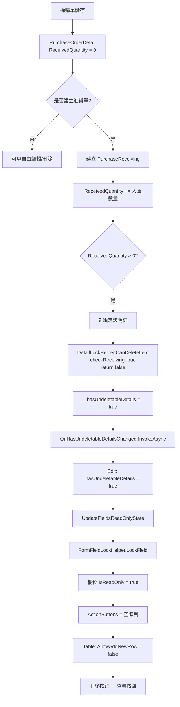
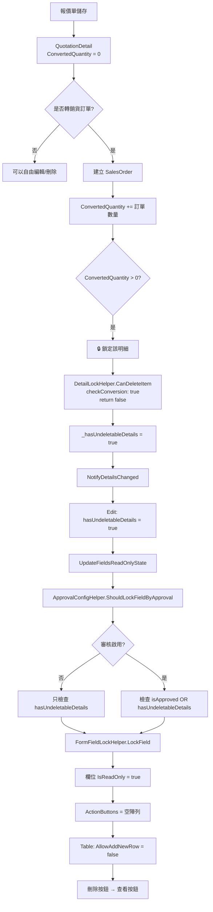

# 📋 有下一步動作時 Edit 和 Table 不能輸入機制說明

> **核心原則**：當單據明細有「下一步動作」時（如：採購單已入庫、報價單已轉訂單），系統會自動鎖定主檔欄位和明細表格，防止資料不一致。

**📅 文檔日期**: 2025-12-10  
**🔖 版本**: v1.0  
**📝 作者**: System Analysis

---

## 📑 目錄

1. [核心概念](#核心概念)
2. [採購單系統 - PurchaseOrder](#採購單系統---purchaseorder)
3. [報價單系統 - Quotation](#報價單系統---quotation)
4. [共用 Helper 說明](#共用-helper-說明)
5. [資料表判斷邏輯](#資料表判斷邏輯)
6. [完整流程圖](#完整流程圖)

---

## 🎯 核心概念

### 什麼是「下一步動作」？

在 ERP 系統中，單據之間存在業務流程關聯：

```
報價單 → 銷貨訂單 → 出貨單 → 銷貨發票
採購單 → 進貨單 → 驗收單 → 付款單
```

當 A 單據的明細已經產生 B 單據時：
- ✅ A 單據的明細 = **有下一步動作**（已被後續單據使用）
- 🔒 A 單據需要 **鎖定**，防止修改影響後續單據

### 鎖定的目的

1. **資料一致性**：確保前後單據數量、金額一致
2. **業務完整性**：防止刪除已執行的訂單項目
3. **稽核追蹤**：保持交易記錄的完整性

---

## 🛒 採購單系統 - PurchaseOrder

### 1️⃣ Edit Modal 如何鎖住欄位

#### 🔹 鎖定狀態變數

**檔案**: `PurchaseOrderEditModalComponent.razor`

```csharp
// ===== 鎖定狀態 =====
private bool hasUndeletableDetails = false; // 是否有不可刪除的明細（已有進貨記錄）
```

#### 🔹 鎖定觸發時機

**時機 1**: Table 明細變更時通知 Edit Modal

```csharp
/// <summary>
/// 處理有不可刪除明細的狀態變更
/// 當明細動態變化時（新增進貨、刪除進貨記錄等），這個方法會被調用
/// </summary>
private async Task HandleHasUndeletableDetailsChanged(bool hasUndeletable)
{
    if (hasUndeletableDetails != hasUndeletable)
    {
        hasUndeletableDetails = hasUndeletable;
        
        // 🔥 關鍵：狀態變更後立即更新欄位的唯讀狀態
        UpdateFieldsReadOnlyState();
    }
}
```

**時機 2**: 資料載入完成時

```csharp
private async Task LoadPurchaseOrderDetails(int purchaseOrderId)
{
    // 載入明細...
    
    // 檢查是否有不可刪除的明細
    bool hasUndeletableDetails = purchaseOrderDetails.Any(d => 
        d.ReceivedQuantity > 0  // 已有進貨記錄
    );
    
    if (this.hasUndeletableDetails != hasUndeletableDetails)
    {
        this.hasUndeletableDetails = hasUndeletableDetails;
        UpdateFieldsReadOnlyState();
    }
}
```

#### 🔹 欄位鎖定邏輯

使用 **`FormFieldLockHelper`** 統一處理：

```csharp
/// <summary>
/// 更新欄位的唯讀狀態 - 根據是否有不可刪除的明細
/// 使用 FormFieldLockHelper 統一處理欄位鎖定邏輯
/// </summary>
private async void UpdateFieldsReadOnlyState()
{
    // 使用 FormFieldLockHelper 批次鎖定/解鎖欄位
    var fieldsToLock = new[]
    {
        nameof(PurchaseOrder.CompanyId),
        nameof(PurchaseOrder.Code),
        nameof(PurchaseOrder.OrderDate),
        nameof(PurchaseOrder.ExpectedDeliveryDate),
        nameof(PurchaseOrder.Remarks),
        nameof(PurchaseOrder.RejectReason)
    };
    
    // 鎖定或解鎖一般欄位（不需要 ActionButtons）
    FormFieldLockHelper.LockMultipleFieldsSimple(
        formFields, 
        fieldsToLock, 
        isLocked: hasUndeletableDetails
    );
    
    // 特殊處理廠商欄位（需要 ActionButtons）
    if (hasUndeletableDetails)
    {
        // 鎖定：移除 ActionButtons
        FormFieldLockHelper.LockField(
            formFields,
            nameof(PurchaseOrder.SupplierId),
            isLocked: true
        );
    }
    else
    {
        // 解鎖：恢復 ActionButtons
        FormFieldLockHelper.LockField(
            formFields,
            nameof(PurchaseOrder.SupplierId),
            isLocked: false,
            actionButtonsGetter: GetSupplierActionButtonsAsync
        );
    }
    
    // 重新初始化表單欄位以強制更新 UI
    await InvokeAsync(async () =>
    {
        await InitializeFormFieldsAsync();
        StateHasChanged();
    });
}
```

#### 🔹 結合審核機制

使用 **`ApprovalConfigHelper`** 判斷是否鎖定：

```csharp
private async Task<List<FieldActionButton>> GetSupplierActionButtonsAsync()
{
    // 使用 ApprovalConfigHelper 統一判斷是否鎖定
    var shouldLock = ApprovalConfigHelper.ShouldLockFieldByApproval(
        isApprovalEnabled,                          // 是否啟用審核
        editModalComponent?.Entity?.IsApproved ?? false,  // 是否已審核
        hasUndeletableDetails                       // 是否有下一步動作
    );
    
    if (shouldLock)
    {
        return new List<FieldActionButton>();  // 鎖定：不顯示按鈕
    }
    
    // 未鎖定：顯示新增/編輯按鈕
    var buttons = await ActionButtonHelper.GenerateFieldActionButtonsAsync(
        editModalComponent, 
        supplierModalManager, 
        nameof(PurchaseOrder.SupplierId)
    );
    
    return buttons;
}
```

---

### 2️⃣ Table 如何鎖住明細

#### 🔹 鎖定狀態變數

**檔案**: `PurchaseOrderTable.razor`

```csharp
// ===== 不可刪除明細狀態追蹤 =====
private bool _hasUndeletableDetails = false;  // 是否有不可刪除的明細（已有進貨記錄）
```

#### 🔹 鎖定檢查邏輯

使用 **`DetailLockHelper`** 檢查每個明細項目：

```csharp
/// <summary>
/// 從現有明細資料載入到 ProductItems
/// </summary>
private async Task LoadExistingDetailsAsync()
{
    // ... 載入明細資料 ...
    
    foreach (var detail in ExistingDetails)
    {
        // 檢查是否已被入庫單使用
        item.HasUsageRecordCache = await HasUsageRecord(item);
        
        ProductItems.Add(item);
    }
    
    // 🔥 關鍵：載入後立即檢查是否有不可刪除的明細
    bool hasUndeletableDetails = ProductItems.Any(p => 
        !DetailLockHelper.CanDeleteItem(p, out _, checkReceiving: true)
    );
    
    if (_hasUndeletableDetails != hasUndeletableDetails)
    {
        _hasUndeletableDetails = hasUndeletableDetails;
    }
    
    // 資料載入完成 - 觸發空行檢查
    _dataLoadCompleted = true;
    StateHasChanged();
}
```

#### 🔹 通知父組件（Edit Modal）

```csharp
/// <summary>
/// 直接通知詳細資料變更
/// </summary>
private async Task NotifyDetailsChanged()
{
    var details = ConvertToDetailEntities();
    await DetailSyncHelper.SyncToParentAsync(details, OnDetailsChanged);
    
    // 檢查是否有不可刪除的明細（已有進貨記錄）
    bool hasUndeletableDetails = ProductItems.Any(p => 
        !DetailLockHelper.CanDeleteItem(p, out _, checkReceiving: true)
    );
    
    // 狀態變更時才通知父組件並觸發 UI 更新
    if (_hasUndeletableDetails != hasUndeletableDetails)
    {
        _hasUndeletableDetails = hasUndeletableDetails;
        
        // 🔥 通知父組件（Edit Modal）
        await OnHasUndeletableDetailsChanged.InvokeAsync(hasUndeletableDetails);
        
        // 🔥 關鍵：狀態變更後，立即刷新空行（移除或新增）
        tableComponent?.RefreshEmptyRow();
        
        StateHasChanged();  // 觸發 UI 更新
    }
}
```

#### 🔹 控制新增空行

透過 `InteractiveTableComponent` 的 `AllowAddNewRow` 參數：

```razor
<InteractiveTableComponent @ref="tableComponent"
                          TItem="ProductItem" 
                          Items="@ProductItems"
                          ColumnDefinitions="@GetColumnDefinitions()"
                          IsReadOnly="@IsReadOnly"
                          ShowBuiltInActions="true"
                          ShowBuiltInDeleteButton="false"
                          CustomActionsTemplate="@GetCustomActionsTemplate"
                          EnableAutoEmptyRow="true"
                          AllowAddNewRow="@(!_hasUndeletableDetails && !IsReadOnly)"
                          DataLoadCompleted="@_dataLoadCompleted"
                          CreateEmptyItem="@(() => new ProductItem())" />
```

**邏輯說明**：
- `AllowAddNewRow="@(!_hasUndeletableDetails && !IsReadOnly)"`
- 當 `_hasUndeletableDetails = true` 時，不允許新增空行
- 當 `IsReadOnly = true` 時，也不允許新增空行

#### 🔹 控制刪除按鈕顯示

```csharp
private RenderFragment<ProductItem> GetCustomActionsTemplate => item => __builder =>
{
    // 使用 DetailLockHelper 檢查是否可以刪除
    if (DetailLockHelper.CanDeleteItem(item, out _, checkReceiving: true))
    {
        // 可以刪除：顯示刪除按鈕
        <GenericButtonComponent Variant="ButtonVariant.Red"
                               IconClass="bi bi-trash text-white"
                               Size="ButtonSize.Large"
                               IsDisabled="@IsReadOnly"
                               Title="刪除"
                               OnClick="async () => await HandleItemDelete(item)"
                               StopPropagation="true"
                               CssClass="btn-square" />
    }
    else
    {
        // 已被使用：顯示查看相關單據按鈕
        <GenericButtonComponent Variant="ButtonVariant.Blue"
                               IconClass="bi bi-eye text-white"
                               Size="ButtonSize.Large"
                               Title="查看相關單據"
                               OnClick="async () => await ShowRelatedDocuments(item)"
                               StopPropagation="true"
                               CssClass="btn-square" />
    }
};
```

#### 🔹 欄位鎖定邏輯

**備註欄位** 特殊處理（核准後仍可編輯）：

```csharp
columns.Add(new() 
{ 
    Title = "備註", 
    PropertyName = "Remarks",
    CustomTemplate = item => 
    {
        var productItem = (ProductItem)item;
        // 🔥 備註欄位只受 IsReadOnly 影響，核准後仍可編輯
        var isFieldReadOnly = IsReadOnly;
        
        if (isFieldReadOnly)
        {
            var displayText = string.IsNullOrEmpty(productItem.Remarks) ? "無備註" : productItem.Remarks;
            return @<span class="text-muted">@displayText</span>;
        }
        
        return @<input type="text" class="form-control" 
                       value="@productItem.Remarks"
                       @oninput="(e) => OnRemarksInput(productItem, e.Value?.ToString())" />;
    }
});
```

---

### 3️⃣ 服務層變化

採購單系統的服務層**不需要特殊處理**，因為：

1. **明細鎖定檢查** 是在前端 UI 層完成（透過 `DetailLockHelper`）
2. **欄位鎖定** 是透過表單欄位的 `IsReadOnly` 屬性控制
3. **後端驗證** 是在 `SavePurchaseOrderWithDetails` 方法中進行

```csharp
private async Task<bool> SavePurchaseOrderWithDetails(PurchaseOrder purchaseOrder, bool isPreApprovalSave = false)
{
    try
    {
        // 🔥 特殊處理：審核通過後仍允許儲存（用於更新「完成進貨」等執行狀態）
        // 不使用 ApprovalConfigHelper.CanSaveWhenApproved 的限制
        
        // 驗證：如果已經有明細被入庫，不允許修改主檔的關鍵欄位
        if (hasUndeletableDetails && !isPreApprovalSave)
        {
            // 允許儲存，但前端已鎖定關鍵欄位，所以這裡不會收到被修改的值
            // 只會更新「完成進貨」、「備註」等允許編輯的欄位
        }
        
        // 儲存主檔和明細...
    }
}
```

---

### 4️⃣ 資料表判斷邏輯

#### 🔹 採購單明細 - PurchaseOrderDetail

**判斷依據**: `ReceivedQuantity` 欄位

```sql
-- 資料表結構（簡化）
CREATE TABLE PurchaseOrderDetail (
    Id INT PRIMARY KEY,
    PurchaseOrderId INT,
    ProductId INT,
    Quantity DECIMAL(18, 2),
    ReceivedQuantity DECIMAL(18, 2),  -- 🔥 已入庫數量
    ...
);
```

**判斷邏輯**:
```csharp
public static bool HasReceivingRecord<TEntity>(TEntity entity) where TEntity : class
{
    // 檢查 ReceivedQuantity 屬性
    var receivedProperty = type.GetProperty("ReceivedQuantity");
    if (receivedProperty != null)
    {
        var value = (decimal)(receivedProperty.GetValue(entity) ?? 0m);
        return value > 0;  // 🔥 只要 > 0 就表示有進貨記錄
    }
    
    return false;
}
```

**業務邏輯**:
1. 採購單儲存時，`ReceivedQuantity = 0`
2. 建立進貨單時，`ReceivedQuantity` 累加
3. 刪除進貨單時，`ReceivedQuantity` 減少
4. 當 `ReceivedQuantity > 0`，該明細項目鎖定

---

## 💰 報價單系統 - Quotation

### 1️⃣ Edit Modal 如何鎖住欄位

#### 🔹 鎖定狀態變數

**檔案**: `QuotationEditModalComponent.razor`

```csharp
// ===== 鎖定狀態 =====
private bool hasUndeletableDetails = false; // 是否有不可刪除的明細（已有轉單記錄）
```

#### 🔹 鎖定觸發邏輯

**觸發時機 1**: 明細變更時

```csharp
/// <summary>
/// 處理報價單明細變更 - 根據稅別自動計算金額欄位
/// </summary>
private async Task HandleQuotationDetailsChanged(List<QuotationDetail> details)
{
    quotationDetails = details;
    
    // 檢查是否有不可刪除的明細（已轉訂單）
    bool hasUndeletableDetails = quotationDetails.Any(d => d.ConvertedQuantity > 0);
    
    if (this.hasUndeletableDetails != hasUndeletableDetails)
    {
        this.hasUndeletableDetails = hasUndeletableDetails;
        
        // 🔥 更新欄位鎖定狀態
        UpdateFieldsReadOnlyState();
    }
}
```

**觸發時機 2**: 載入明細時

```csharp
private async Task LoadQuotationDetails(int quotationId)
{
    quotationDetails = await QuotationDetailService.GetByQuotationIdAsync(quotationId);
    
    // 檢查是否有已轉單的明細
    bool hasUndeletableDetails = quotationDetails.Any(d => d.ConvertedQuantity > 0);
    
    if (this.hasUndeletableDetails != hasUndeletableDetails)
    {
        this.hasUndeletableDetails = hasUndeletableDetails;
        UpdateFieldsReadOnlyState();
    }
}
```

#### 🔹 欄位鎖定邏輯

使用 **`FormFieldLockHelper`** + **`ApprovalConfigHelper`**:

```csharp
/// <summary>
/// 更新欄位的唯讀狀態 - 根據審核狀態和明細轉單狀態
/// 使用 FormFieldLockHelper 統一處理欄位鎖定邏輯
/// </summary>
private async void UpdateFieldsReadOnlyState()
{
    // 計算是否應該鎖定欄位
    var shouldLock = ApprovalConfigHelper.ShouldLockFieldByApproval(
        isApprovalEnabled,                          // 是否啟用審核
        editModalComponent?.Entity?.IsApproved ?? false,  // 是否已審核
        hasUndeletableDetails                       // 是否有下一步動作（已轉訂單）
    );

    // 使用 FormFieldLockHelper 批次鎖定/解鎖欄位
    var fieldsToLock = new[]
    {
        nameof(Quotation.Code),
        nameof(Quotation.QuotationDate),
        nameof(Quotation.PaymentTerms),
        nameof(Quotation.DeliveryTerms),
        nameof(Quotation.ProjectName),
        nameof(BaseEntity.Remarks)
    };
    
    // 鎖定或解鎖一般欄位（不需要 ActionButtons）
    FormFieldLockHelper.LockMultipleFieldsSimple(
        formFields, 
        fieldsToLock, 
        isLocked: shouldLock
    );
    
    // 特殊處理有 ActionButtons 的欄位
    var fieldsWithActionButtons = new Dictionary<string, Func<Task<List<FieldActionButton>>>>
    {
        { nameof(Quotation.CustomerId), GetCustomerActionButtonsAsync },
        { nameof(Quotation.CompanyId), GetCompanyActionButtonsAsync },
        { nameof(Quotation.EmployeeId), GetEmployeeActionButtonsAsync }
    };

    foreach (var kvp in fieldsWithActionButtons)
    {
        if (shouldLock)
        {
            // 鎖定：移除 ActionButtons
            FormFieldLockHelper.LockField(formFields, kvp.Key, isLocked: true);
        }
        else
        {
            // 解鎖：恢復 ActionButtons
            FormFieldLockHelper.LockField(
                formFields, 
                kvp.Key, 
                isLocked: false, 
                actionButtonsGetter: kvp.Value
            );
        }
    }
    
    // 強制更新 UI
    await InvokeAsync(() => StateHasChanged());
}
```

---

### 2️⃣ Table 如何鎖住明細

#### 🔹 鎖定狀態變數

**檔案**: `QuotationTable.razor`

```csharp
// ===== 私有欄位 =====
private bool _hasUndeletableDetails = false;  // 是否有不可刪除的明細（已轉訂單）
```

#### 🔹 鎖定檢查邏輯

```csharp
/// <summary>
/// 從現有明細資料載入
/// </summary>
private async Task LoadExistingDetailsAsync()
{
    foreach (var detail in ExistingDetails)
    {
        var item = new QuotationItem
        {
            // ... 設定屬性 ...
            ConvertedQuantity = detail.ConvertedQuantity,  // 🔥 已轉單數量
            ExistingDetailEntity = detail
        };
        
        QuotationItems.Add(item);
    }
    
    // 檢查是否有不可刪除的明細（已轉訂單）
    bool hasUndeletableDetails = QuotationItems.Any(item => 
        item.SelectedProduct != null && 
        !DetailLockHelper.CanDeleteItem(item, out _, checkConversion: true)
    );
    
    if (_hasUndeletableDetails != hasUndeletableDetails)
    {
        _hasUndeletableDetails = hasUndeletableDetails;
    }
}
```

#### 🔹 通知父組件

```csharp
private async Task NotifyDetailsChanged()
{
    var details = ConvertToDetailEntities();
    await DetailSyncHelper.SyncToParentAsync(details, OnDetailsChanged);
    
    // 檢查並更新不可刪除明細的狀態
    bool hasUndeletableDetails = QuotationItems.Any(item => 
        item.SelectedProduct != null && 
        !DetailLockHelper.CanDeleteItem(item, out _, checkConversion: true)
    );
    
    if (_hasUndeletableDetails != hasUndeletableDetails)
    {
        _hasUndeletableDetails = hasUndeletableDetails;
        tableComponent?.RefreshEmptyRow();  // 🔥 刷新空行狀態
        StateHasChanged();
    }
}
```

#### 🔹 控制新增空行

```razor
<InteractiveTableComponent @ref="tableComponent"
                          TItem="QuotationItem" 
                          Items="@QuotationItems"
                          ColumnDefinitions="@GetColumnDefinitions()"
                          IsReadOnly="@IsReadOnly"
                          EnableAutoEmptyRow="true"
                          AllowAddNewRow="@(!_hasUndeletableDetails && !IsReadOnly)"
                          DataLoadCompleted="@_dataLoadCompleted"
                          CreateEmptyItem="@CreateEmptyItem" />
```

#### 🔹 控制刪除按鈕顯示

```csharp
private RenderFragment<QuotationItem> GetCustomActionsTemplate => item => __builder =>
{
    var quotationItem = (QuotationItem)item;
    var isEmptyRow = quotationItem.SelectedProduct == null;
    var canDelete = DetailLockHelper.CanDeleteItem(quotationItem, out _, checkConversion: true);
    var hasComposition = quotationItem.SelectedProduct != null && 
                         HasProductComposition(quotationItem.SelectedProduct.Id);
    
    <div class="d-flex gap-1">
        @* BOM 編輯按鈕 *@
        @if (hasComposition && !isEmptyRow)
        {
            <GenericButtonComponent ... />
        }
        
        @* 刪除/查看按鈕 *@
        @if (IsReadOnly)
        {
            // 唯讀模式：顯示檢視按鈕
            <GenericButtonComponent Variant="ButtonVariant.Blue" ... />
        }
        else if (canDelete || isEmptyRow)
        {
            // 可編輯且未轉單：顯示刪除按鈕
            <GenericButtonComponent Variant="ButtonVariant.Red" ... />
        }
        else
        {
            // 已轉訂單：顯示查看相關單據按鈕
            <GenericButtonComponent Variant="ButtonVariant.Blue" ... />
        }
    </div>
};
```

---

### 3️⃣ 服務層變化

報價單系統的服務層同樣**不需要特殊處理**：

```csharp
private async Task<bool> SaveQuotationWithDetails(Quotation quotation)
{
    // 特殊處理：審核通過或已轉單後仍允許儲存，用於更新明細的執行狀態
    // 但前端已鎖定關鍵欄位，只會更新允許編輯的欄位（如備註）
    
    // 驗證和儲存邏輯...
}
```

---

### 4️⃣ 資料表判斷邏輯

#### 🔹 報價單明細 - QuotationDetail

**判斷依據**: `ConvertedQuantity` 欄位

```sql
-- 資料表結構（簡化）
CREATE TABLE QuotationDetail (
    Id INT PRIMARY KEY,
    QuotationId INT,
    ProductId INT,
    Quantity DECIMAL(18, 2),
    ConvertedQuantity DECIMAL(18, 2),  -- 🔥 已轉單數量
    ...
);
```

**判斷邏輯**:
```csharp
public static bool HasConversionRecord<TEntity>(TEntity entity) where TEntity : class
{
    // 檢查 ConvertedQuantity 屬性
    var convertedProperty = type.GetProperty("ConvertedQuantity");
    if (convertedProperty != null && convertedProperty.PropertyType == typeof(decimal))
    {
        var value = (decimal)(convertedProperty.GetValue(entity) ?? 0m);
        return value > 0;  // 🔥 只要 > 0 就表示有轉單記錄
    }
    
    return false;
}
```

**業務邏輯**:
1. 報價單儲存時，`ConvertedQuantity = 0`
2. 建立銷貨訂單時，`ConvertedQuantity` 累加
3. 刪除銷貨訂單時，`ConvertedQuantity` 減少
4. 當 `ConvertedQuantity > 0`，該明細項目鎖定

---

## 🛠️ 共用 Helper 說明

### 1️⃣ DetailLockHelper - 明細鎖定檢查

**檔案位置**: `Helpers/InteractiveTableComponentHelper/DetailLockHelper.cs`

#### 核心方法

```csharp
/// <summary>
/// 綜合檢查項目是否可以刪除（單一檢查點版本）
/// </summary>
/// <param name="entity">要檢查的實體</param>
/// <param name="reason">不可刪除的原因（輸出參數）</param>
/// <param name="checkPayment">是否檢查付款/收款記錄</param>
/// <param name="checkReturn">是否檢查退貨記錄</param>
/// <param name="checkConversion">是否檢查轉單記錄</param>
/// <param name="checkReceiving">是否檢查進貨記錄</param>
/// <param name="returnedQuantities">已退貨數量字典</param>
/// <returns>true 表示可以刪除，false 表示不可刪除</returns>
public static bool CanDeleteItem<TEntity>(
    TEntity? entity,
    out string reason,
    bool checkPayment = false,
    bool checkReturn = false,
    bool checkConversion = false,
    bool checkReceiving = false,
    Dictionary<int, decimal>? returnedQuantities = null) where TEntity : class
{
    reason = string.Empty;
    if (entity == null) return true;
    
    // 檢查退貨記錄
    if (checkReturn && HasReturnRecord(entity, returnedQuantities))
    {
        var returnedQty = GetReturnedQuantity(entity, returnedQuantities);
        reason = $"此商品已有退貨記錄（已退貨 {returnedQty} 個），無法刪除";
        return false;
    }
    
    // 檢查沖款記錄
    if (checkPayment && HasPaymentRecord(entity))
    {
        var amount = GetPaymentAmount(entity);
        reason = $"此商品已有沖款記錄（金額 {amount:N0} 元），無法刪除";
        return false;
    }
    
    // 檢查轉單記錄
    if (checkConversion && HasConversionRecord(entity))
    {
        var convertedQty = GetConvertedQuantity(entity);
        reason = $"此商品已轉單（已轉 {convertedQty} 個），無法刪除";
        return false;
    }
    
    // 檢查進貨記錄
    if (checkReceiving && HasReceivingRecord(entity))
    {
        var receivedQty = GetReceivedQuantity(entity);
        reason = $"此商品已有進貨記錄（已入庫 {receivedQty} 個），無法刪除";
        return false;
    }
    
    return true;
}
```

#### 使用範例

**採購單 Table**:
```csharp
DetailLockHelper.CanDeleteItem(item, out _, checkReceiving: true)
// 只檢查是否有進貨記錄
```

**報價單 Table**:
```csharp
DetailLockHelper.CanDeleteItem(item, out _, checkConversion: true)
// 只檢查是否有轉單記錄
```

**銷貨訂單 Table** (未來):
```csharp
DetailLockHelper.CanDeleteItem(item, out _, 
    checkReturn: true,      // 檢查退貨
    checkPayment: true,     // 檢查收款
    returnedQuantities: _returnedQuantities)
// 同時檢查多個條件
```

---

### 2️⃣ FormFieldLockHelper - 欄位鎖定控制

**檔案位置**: `Helpers/EditModal/FormFieldLockHelper.cs`

#### 核心方法

```csharp
/// <summary>
/// 鎖定或解鎖單一欄位
/// </summary>
public static bool LockField(
    List<FormFieldDefinition> formFields,
    string propertyName,
    bool isLocked,
    Func<Task<List<FieldActionButton>>>? actionButtonsGetter = null)
{
    var field = formFields.FirstOrDefault(f => f.PropertyName == propertyName);
    if (field == null) return false;

    field.IsReadOnly = isLocked;

    if (isLocked)
    {
        // 鎖定時移除所有操作按鈕
        field.ActionButtons = new List<FieldActionButton>();
    }
    else if (actionButtonsGetter != null)
    {
        // 解鎖時恢復操作按鈕
        field.ActionButtons = actionButtonsGetter().Result;
    }

    return true;
}

/// <summary>
/// 批次鎖定多個欄位（簡化版本，不處理 ActionButtons）
/// </summary>
public static int LockMultipleFieldsSimple(
    List<FormFieldDefinition> formFields,
    IEnumerable<string> propertyNames,
    bool isLocked)
{
    int count = 0;
    foreach (var propertyName in propertyNames)
    {
        if (LockFieldSimple(formFields, propertyName, isLocked))
            count++;
    }
    return count;
}
```

#### 使用範例

**簡單欄位鎖定** (無 ActionButtons):
```csharp
FormFieldLockHelper.LockMultipleFieldsSimple(
    formFields, 
    new[] { "Code", "OrderDate", "Remarks" }, 
    isLocked: hasUndeletableDetails
);
```

**複雜欄位鎖定** (有 ActionButtons):
```csharp
FormFieldLockHelper.LockField(
    formFields,
    nameof(Entity.SupplierId),
    isLocked: false,
    actionButtonsGetter: GetSupplierActionButtonsAsync
);
```

---

### 3️⃣ ApprovalConfigHelper - 審核邏輯統一管理

**檔案位置**: `Helpers/EditModal/ApprovalConfigHelper.cs`

#### 核心方法

```csharp
/// <summary>
/// 根據審核開關決定是否需要鎖定欄位
/// </summary>
/// <param name="isApprovalEnabled">是否啟用審核功能</param>
/// <param name="isApproved">實體是否已審核通過</param>
/// <param name="hasUndeletableDetails">是否有不可刪除的明細（已有下一步動作）</param>
/// <returns>是否應該鎖定欄位</returns>
public static bool ShouldLockFieldByApproval(
    bool isApprovalEnabled,
    bool isApproved,
    bool hasUndeletableDetails)
{
    if (!isApprovalEnabled)
    {
        // 未啟用審核：只根據「是否有下一步動作」鎖定
        return hasUndeletableDetails;
    }
    else
    {
        // 已啟用審核：根據「審核狀態 或 是否有下一步動作」鎖定
        return isApproved || hasUndeletableDetails;
    }
}
```

#### 使用範例

```csharp
var shouldLock = ApprovalConfigHelper.ShouldLockFieldByApproval(
    isApprovalEnabled: true,        // 系統參數：是否啟用審核
    isApproved: entity.IsApproved,  // 單據是否已審核
    hasUndeletableDetails: true     // 是否有下一步動作
);

if (shouldLock)
{
    // 鎖定欄位邏輯...
}
```

---

## 📊 資料表判斷邏輯總覽

### 不同單據的判斷欄位對照表

| 單據類型 | 明細 Table | 判斷欄位 | 判斷邏輯 | Helper 檢查參數 |
|---------|-----------|---------|---------|----------------|
| **採購單** | `PurchaseOrderDetail` | `ReceivedQuantity` | `> 0` 表示已入庫 | `checkReceiving: true` |
| **進貨單** | `PurchaseReceivingDetail` | `TotalPaidAmount` | `> 0` 表示已沖款（應付） | `checkPayment: true` |
| **採購退回** | `PurchaseReturnDetail` | `TotalReceivedAmount` | `> 0` 表示已沖款（應付退款） | `checkPayment: true` |
| **報價單** | `QuotationDetail` | `ConvertedQuantity` | `> 0` 表示已轉訂單 | `checkConversion: true` |
| **銷貨訂單** | `SalesOrderDetail` | `ScheduledQuantity`<br/>`DeliveredQuantity`<br/>`TotalReceivedAmount` | 任一 `> 0` 表示有排程/出貨/收款 | `checkSchedule: true`<br/>`checkDelivery: true`<br/>`checkPayment: true` |
| **銷貨單** | `SalesDeliveryDetail` | `TotalReceivedAmount` | `> 0` 表示已收款（應收） | `checkPayment: true` |
| **銷貨退回** | `SalesReturnDetail` | `TotalPaidAmount` | `> 0` 表示已沖款（應收退款） | `checkPayment: true` |

### 判斷欄位的共同特性

所有判斷欄位都符合以下規則：

1. **數值型欄位**: `decimal` 或 `int` 類型
2. **預設值為 0**: 新增時自動為 0
3. **累加/減少**: 由系統自動維護，不由使用者手動輸入
4. **大於 0 = 有下一步**: 只要 `> 0` 就表示該明細已被後續單據使用

### 欄位命名規範

| 欄位用途 | 命名規範 | 流程範例 | 所在明細表 |
|---------|---------|---------|-----------|
| 已入庫數量 | `ReceivedQuantity` | 採購單 → 進貨單 | `PurchaseOrderDetail` |
| 已轉單數量 | `ConvertedQuantity` | 報價單 → 銷貨訂單 | `QuotationDetail` |
| 已排程數量 | `ScheduledQuantity` | 銷貨訂單 → 生產排程 | `SalesOrderDetail` |
| 已出貨數量 | `DeliveredQuantity` | 銷貨訂單 → 銷貨單 | `SalesOrderDetail` |
| 已付款金額（應付） | `TotalPaidAmount` | 進貨單 → 沖款單 | `PurchaseReceivingDetail` |
| 已收款金額（應付退款） | `TotalReceivedAmount` | 採購退回 → 沖款單 | `PurchaseReturnDetail` |
| 已收款金額（應收） | `TotalReceivedAmount` | 銷貨單 → 沖款單 | `SalesDeliveryDetail` |
| 已收款金額（應收） | `TotalReceivedAmount` | 銷貨訂單 → 沖款單（預收） | `SalesOrderDetail` |
| 已付款金額（應收退款） | `TotalPaidAmount` | 銷貨退回 → 沖款單 | `SalesReturnDetail` |

---

## 🔄 完整流程圖

### 採購單鎖定流程



### 報價單鎖定流程



---

## 📝 總結

### 鎖定機制的三層防護

| 層級 | 位置 | 機制 | 目的 |
|-----|------|-----|-----|
| **UI 層** | Table Component | `DetailLockHelper` 檢查<br/>`AllowAddNewRow` 控制<br/>刪除按鈕隱藏 | 防止使用者刪除/新增 |
| **表單層** | Edit Modal | `FormFieldLockHelper` 鎖定欄位<br/>移除 ActionButtons | 防止使用者修改關鍵欄位 |
| **邏輯層** | Save Handler | `ApprovalConfigHelper` 驗證<br/>允許儲存但限制修改範圍 | 允許更新執行狀態（如備註） |

### 核心設計原則

1. **反應式狀態管理**: Table 變更 → 通知 Edit Modal → 更新欄位狀態
2. **單一真相來源**: 所有判斷邏輯集中在 `DetailLockHelper`
3. **漸進式鎖定**: 隨著業務流程推進，逐步鎖定更多欄位
4. **保留彈性**: 允許更新「執行狀態」欄位（如備註、完成進貨）

### 各單據系統的共同點

✅ 所有系統都使用相同的 Helper  
✅ 所有系統都遵循相同的鎖定邏輯  
✅ 所有系統都透過數值欄位判斷「下一步動作」  
✅ 所有系統都支援審核機制整合

### 各單據系統的差異點

| 單據類型 | 判斷欄位 | 下一步單據 | Helper 參數 | 業務邏輯 |
|---------|---------|-----------|-------------|---------|
| **採購單** | `ReceivedQuantity` | 進貨單 | `checkReceiving: true` | 實物流（入庫） |
| **進貨單** | `TotalPaidAmount` | 沖款單（應付） | `checkPayment: true` | 財務流（付款） |
| **採購退回** | `TotalReceivedAmount` | 沖款單（應付退款） | `checkPayment: true` | 財務流（退款沖銷） |
| **報價單** | `ConvertedQuantity` | 銷貨訂單 | `checkConversion: true` | 訂單流（轉單） |
| **銷貨訂單** | `ScheduledQuantity`<br/>`DeliveredQuantity`<br/>`TotalReceivedAmount` | 生產排程<br/>銷貨單<br/>沖款單（預收） | `checkSchedule: true`<br/>`checkDelivery: true`<br/>`checkPayment: true` | 生產流+實物流+財務流 |
| **銷貨單** | `TotalReceivedAmount` | 沖款單（應收） | `checkPayment: true` | 財務流（收款） |
| **銷貨退回** | `TotalPaidAmount` | 沖款單（應收退款） | `checkPayment: true` | 財務流（退款沖銷） |

---

## 🔗 相關文檔

- [DetailLockHelper 使用說明](../Helpers/InteractiveTableComponentHelper/README_互動Table_套用新Helper.md)
- [FormFieldLockHelper 使用說明](../Helpers/EditModal/README_EditModal_Helper建構.md)
- [ApprovalConfigHelper 使用說明](./README_使用者控制審核機制.md)
- [A單轉B單簡化修改說明](./README_A單轉B單簡化修改說明.md)

---

**📌 最後更新**: 2025-12-10  
**✍️ 維護者**: System Analysis Team
