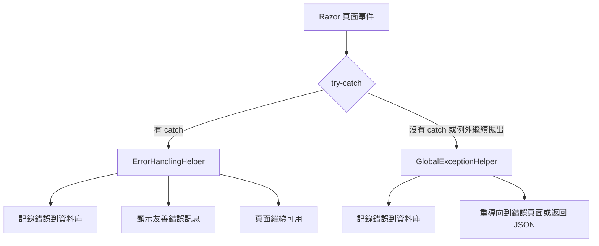

# ErrorHandlingHelper 使用指南

## 概述

`ErrorHandlingHelper` 是一個統一的錯誤處理工具，旨在簡化 Razor 頁面中的錯誤處理邏輯，與 `GlobalExceptionHelper`（中間件）搭配使用，提供完整的錯誤處理方案。

## 架構說明

### 兩層錯誤處理架構

1. **ErrorHandlingHelper** - 處理**已捕獲**的例外（主動錯誤處理）
2. **GlobalExceptionHelper** - 處理**未捕獲**的例外（被動錯誤處理/安全網）



## 主要方法

### 1. HandleErrorSafelyAsync - 完整錯誤處理

用於需要完整錯誤記錄和通知的場景。

```csharp
private async Task OnSaveClick()
{
    try 
    { 
        await SaveDataAsync(); 
    }
    catch (Exception ex) 
    { 
        var errorId = await ErrorHandlingHelper.HandleErrorSafelyAsync(
            ex, 
            nameof(OnSaveClick),  // 方法名稱
            GetType(),            // 元件類型
            ErrorLogService, 
            NotificationService,
            showUserFriendlyMessage: true,  // 是否顯示友善訊息
            additionalData: new { UserId = CurrentUserId }  // 額外資料
        );
        
        StateHasChanged();
    }
}
```

### 2. HandleErrorSimplyAsync - 簡化錯誤處理

用於只需要顯示錯誤訊息的場景（不記錄到資料庫）。

```csharp
private async Task OnValidateClick()
{
    try 
    { 
        ValidateUserInput(); 
    }
    catch (Exception ex) 
    { 
        await ErrorHandlingHelper.HandleErrorSimplyAsync(
            ex, 
            nameof(OnValidateClick), 
            NotificationService,
            customMessage: "資料驗證失敗，請檢查輸入內容"
        );
        
        StateHasChanged();
    }
}
```

### 3. HandleServiceErrorAsync - Service 錯誤處理

用於處理 Service 方法返回的 `ServiceResult` 失敗結果。

```csharp
private async Task OnDeleteClick()
{
    try 
    { 
        var result = await UserService.DeleteAsync(userId);
        
        if (!result.IsSuccess)
        {
            await ErrorHandlingHelper.HandleServiceErrorAsync(
                result,
                nameof(OnDeleteClick),
                NotificationService,
                customErrorMessage: "刪除使用者失敗"
            );
        }
        else 
        {
            await NotificationService.ShowSuccessAsync("使用者已成功刪除");
        }
        
        StateHasChanged();
    }
    catch (Exception ex) 
    { 
        await ErrorHandlingHelper.HandleErrorSafelyAsync(
            ex, nameof(OnDeleteClick), GetType(),
            ErrorLogService, NotificationService);
        StateHasChanged();
    }
}
```

## 使用模式

### 事件處理器標準模式

```csharp
private async Task OnButtonClick()
{
    try
    {
        // 業務邏輯
        await DoSomethingAsync();
    }
    catch (Exception ex)
    {
        await ErrorHandlingHelper.HandleErrorSafelyAsync(
            ex, nameof(OnButtonClick), GetType(),
            ErrorLogService, NotificationService);
        StateHasChanged();
    }
}
```

### Service 調用標準模式

```csharp
private async Task CallService()
{
    try
    {
        var result = await SomeService.PerformActionAsync();
        
        if (result.IsSuccess)
        {
            // 處理成功結果
            await NotificationService.ShowSuccessAsync("操作成功");
        }
        else
        {
            // 處理失敗結果
            await ErrorHandlingHelper.HandleServiceErrorAsync(
                result, nameof(CallService), NotificationService);
        }
        
        StateHasChanged();
    }
    catch (Exception ex)
    {
        await ErrorHandlingHelper.HandleErrorSafelyAsync(
            ex, nameof(CallService), GetType(),
            ErrorLogService, NotificationService);
        StateHasChanged();
    }
}
```

## 友善錯誤訊息映射

ErrorHandlingHelper 會自動將技術性錯誤轉換為使用者友善的訊息：

| 例外類型 | 友善訊息 |
|---------|---------|
| `TimeoutException` | 系統回應逾時，請稍後再試 |
| `UnauthorizedAccessException` | 權限不足，請聯繫管理員 |
| `ArgumentNullException` | 必要資料不完整 |
| `ArgumentException` | 輸入資料格式不正確 |
| `InvalidOperationException` | 目前無法執行此操作，請檢查資料狀態 |
| 其他例外 | 系統發生錯誤，請稍後再試或聯繫技術人員 |

## 最佳實踐

### 1. 統一使用模式
- 所有 Razor 頁面的事件處理器都應該使用 try-catch
- 優先使用 `HandleErrorSafelyAsync` 進行完整錯誤處理
- Service 調用失敗時使用 `HandleServiceErrorAsync`

### 2. 錯誤資料記錄
```csharp
// 記錄有用的額外資料
await ErrorHandlingHelper.HandleErrorSafelyAsync(
    ex, methodName, GetType(),
    ErrorLogService, NotificationService,
    additionalData: new 
    { 
        UserId = CurrentUser?.Id,
        OperationType = "DataModification",
        AffectedEntity = entityId,
        UserAction = "Save"
    });
```

### 3. 適當的錯誤層級
- **UI 交互錯誤** → 使用 `HandleErrorSimplyAsync`
- **業務邏輯錯誤** → 使用 `HandleErrorSafelyAsync`
- **Service 調用錯誤** → 使用 `HandleServiceErrorAsync`

### 4. 記住更新 UI
```csharp
catch (Exception ex)
{
    await ErrorHandlingHelper.HandleErrorSafelyAsync(/*...*/);
    StateHasChanged(); // 重要：確保 UI 更新
}
```

## 範例頁面

訪問 `/error-helper-demo` 頁面可以看到完整的使用範例和與傳統錯誤處理方式的對比。

## 未來擴展

可以根據需要擴展 ErrorHandlingHelper：

1. 添加更多錯誤類型的友善訊息映射
2. 支援多語系錯誤訊息
3. 添加錯誤分類和優先級處理
4. 整合更多通知方式（Email、SMS 等）

---

**記住**：ErrorHandlingHelper 是為了讓錯誤處理變得簡單一致，不是為了取代所有錯誤處理邏輯。適當的使用它可以大大提升程式碼的可維護性和使用者體驗。
