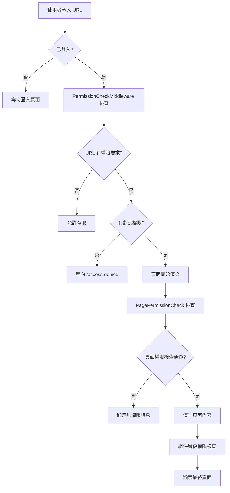
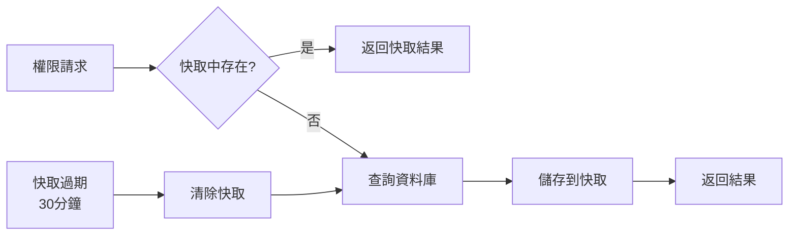

# 權限系統架構說明 (Authorization System)

## 🎯 系統概述

本權限系統採用**多層次防護**策略，確保應用程式在各個層級都能有效控制使用者存取權限：

### 防護層級
1. **路由層級** - URL 存取控制
2. **頁面層級** - 整個頁面的權限檢查
3. **組件層級** - 個別功能按鈕的權限控制
4. **導航層級** - 選單項目的顯示控制

### 核心特性
- ✅ **防止直接 URL 存取** - 透過中間件攔截
- ✅ **智慧選單顯示** - 無權限項目自動隱藏
- ✅ **細粒度控制** - 支援單一權限、多權限選擇、模組權限
- ✅ **使用者友善** - 優雅的錯誤處理和提示
- ✅ **效能優化** - 權限快取機制

## 🏗️ 架構設計

```
┌─────────────────────────────────────────────────────────────┐
│                     使用者請求 (HTTP Request)                    │
└─────────────────────┬───────────────────────────────────────┘
                      │
┌─────────────────────▼───────────────────────────────────────┐
│              1. Authentication 中間件                        │
│                   (驗證使用者身分)                            │
└─────────────────────┬───────────────────────────────────────┘
                      │
┌─────────────────────▼───────────────────────────────────────┐
│              2. Authorization 中間件                         │
│                   (基本授權檢查)                             │
└─────────────────────┬───────────────────────────────────────┘
                      │
┌─────────────────────▼───────────────────────────────────────┐
│           3. PermissionCheckMiddleware                      │
│              (URL 路由權限檢查)                              │
└─────────────────────┬───────────────────────────────────────┘
                      │
┌─────────────────────▼───────────────────────────────────────┐
│                4. Blazor 頁面渲染                           │
│         (PagePermissionCheck 組件權限檢查)                   │
└─────────────────────┬───────────────────────────────────────┘
                      │
┌─────────────────────▼───────────────────────────────────────┐
│              5. 組件層級權限檢查                             │
│        (PermissionCheck, NavigationPermissionCheck)        │
└─────────────────────────────────────────────────────────────┘
```

## 🔧 核心組件

### 1. 授權處理器 (Authorization Handler)
- **檔案**: `PermissionAuthorizationHandler.cs`
- **功能**: 處理自定義權限需求的檢查邏輯
- **用途**: API 權限檢查、頁面層級授權

### 2. 權限中間件 (Permission Middleware)  
- **檔案**: `PermissionCheckMiddleware.cs`
- **功能**: 攔截 HTTP 請求，檢查 URL 存取權限
- **防護**: 防止直接輸入 URL 繞過權限檢查

### 3. 權限服務 (Permission Services)
- **檔案**: `NavigationPermissionService.cs`
- **功能**: 提供權限檢查的統一介面
- **特性**: 支援快取、效能優化

### 4. 權限檢查組件 (Permission Components)

#### PagePermissionCheck 
- **用途**: 整個頁面的權限包裹器
- **顯示**: 無權限時顯示友善的錯誤頁面

#### NavigationPermissionCheck
- **用途**: 導航選單的權限控制
- **行為**: 無權限項目自動隱藏

#### PermissionCheck
- **用途**: 個別功能按鈕的權限控制
- **靈活性**: 支援多種權限檢查模式

## 📝 使用方式

### 1. 頁面權限保護

```razor
@page "/customers"
@attribute [Authorize]

<PagePermissionCheck RequiredPermission="Customer.Read">
    <PageTitle>客戶維護</PageTitle>
    
    <!-- 頁面內容 -->
    <GenericIndexPageComponent TEntity="Customer" 
                              Service="@CustomerService"
                              ... />
</PagePermissionCheck>
```

### 2. 按鈕權限控制

```razor
<!-- 新增按鈕 -->
<PermissionCheck Permission="Customer.Create">
    <button class="btn btn-primary" @onclick="CreateCustomer">
        <i class="bi bi-plus-circle me-2"></i>
        新增客戶
    </button>
</PermissionCheck>

<!-- 編輯按鈕 -->
<PermissionCheck Permission="Customer.Update">
    <button class="btn btn-outline-primary" @onclick="() => EditCustomer(customer.Id)">
        <i class="bi bi-pencil me-2"></i>
        編輯
    </button>
</PermissionCheck>

<!-- 刪除按鈕 -->
<PermissionCheck Permission="Customer.Delete">
    <button class="btn btn-outline-danger" @onclick="() => DeleteCustomer(customer.Id)">
        <i class="bi bi-trash me-2"></i>
        刪除
    </button>
</PermissionCheck>
```

### 3. 導航選單權限

```razor
<!-- 模組層級權限 -->
<NavigationPermissionCheck Module="Customer">
    <NavMenuItem Text="客戶管理" IconClass="bi bi-people-fill">
        <DropdownItems>
            <!-- 功能層級權限 -->
            <NavigationPermissionCheck Permission="Customer.Read">
                <NavDropdownItem Text="客戶維護" Url="/customers" />
            </NavigationPermissionCheck>
        </DropdownItems>
    </NavMenuItem>
</NavigationPermissionCheck>
```

### 4. 多權限檢查

```razor
<!-- 需要任一權限 -->
<PermissionCheck AnyPermissions="new[] { \"Customer.Read\", \"Customer.Update\" }">
    <div class="customer-info">
        <!-- 客戶資訊顯示 -->
    </div>
</PermissionCheck>

<!-- 需要所有權限 -->
<PermissionCheck AnyPermissions="new[] { \"Customer.Update\", \"Customer.Delete\" }" 
                 RequireAll="true">
    <button class="btn btn-danger">高風險操作</button>
</PermissionCheck>
```

## 🔄 權限檢查流程

### 使用者訪問頁面的完整流程



### 權限快取機制



## 💼 實作範例

### 範例 1: 客戶管理頁面

```razor
@page "/customers"
@attribute [Authorize]

<PagePermissionCheck RequiredPermission="Customer.Read">
    <div class="container-fluid">
        <div class="row mb-3">
            <div class="col">
                <h2>客戶管理</h2>
            </div>
            <div class="col-auto">
                <PermissionCheck Permission="Customer.Create">
                    <a href="/customers/create" class="btn btn-primary">
                        新增客戶
                    </a>
                </PermissionCheck>
            </div>
        </div>
        
        <!-- 客戶列表 -->
        <GenericIndexPageComponent TEntity="Customer" ... />
    </div>
</PagePermissionCheck>
```

### 範例 2: 條件式權限檢查

```razor
@code {
    private async Task<bool> CanEditCustomer(Customer customer)
    {
        // 業務邏輯：只有客戶的負責人或管理員可以編輯
        var employeeId = await navigationPermissionService.GetCurrentEmployeeIdAsync();
        return customer.ResponsibleEmployeeId == employeeId || 
               await navigationPermissionService.CanAccessAsync("Customer.UpdateAll");
    }
}

<PermissionCheck Permission="Customer.Update">
    @if (await CanEditCustomer(customer))
    {
        <button class="btn btn-primary" @onclick="() => EditCustomer(customer.Id)">
            編輯
        </button>
    }
</PermissionCheck>
```

## 🔧 設定說明

### 1. Program.cs 設定

```csharp
// 註冊授權服務
builder.Services.AddAuthorizationBuilder()
    .AddPolicy("Permission", policy =>
    {
        policy.Requirements.Add(new PermissionRequirement(""));
    });

// 註冊授權處理器
builder.Services.AddScoped<IAuthorizationHandler, PermissionAuthorizationHandler>();

// 註冊導航權限服務
builder.Services.AddScoped<INavigationPermissionService, NavigationPermissionService>();

// 使用中間件
app.UseAuthentication();
app.UseAuthorization();
app.UseMiddleware<PermissionCheckMiddleware>();
```

### 2. 權限資料結構

```sql
-- 權限表
Permissions
├── Id (int)
├── PermissionCode (string) -- 例如: "Customer.Read"
├── PermissionName (string) -- 例如: "檢視客戶"
├── Module (string) -- 例如: "Customer"
├── Action (string) -- 例如: "Read"
└── PermissionGroup (string) -- 例如: "客戶管理"

-- 角色權限關聯表  
RolePermissions
├── RoleId (int)
├── PermissionId (int)
└── Status (EntityStatus)
```

## ❓ 常見問題

### Q1: 如何新增一個新的權限？

**A**: 在 `PermissionSeeder.cs` 中新增權限定義：

```csharp
new Permission 
{ 
    PermissionCode = "Customer.Export", 
    PermissionName = "匯出客戶資料", 
    Module = "Customer", 
    Action = "Export", 
    PermissionGroup = "客戶管理"
}
```

### Q2: 如何為新頁面加入權限保護？

**A**: 按照以下步驟：

1. 在頁面加入 `[Authorize]` 屬性
2. 用 `PagePermissionCheck` 包裹頁面內容
3. 在 `PermissionCheckMiddleware` 中加入路由對應
4. 為功能按鈕加入 `PermissionCheck`

### Q3: 權限檢查失敗時會發生什麼？

**A**: 根據不同層級有不同處理：

- **URL 層級**: 導向 `/access-denied` 頁面
- **頁面層級**: 顯示友善的無權限訊息
- **組件層級**: 隱藏對應的按鈕或功能

### Q4: 如何除錯權限問題？

**A**: 檢查以下項目：

1. 使用者是否已登入
2. 使用者角色是否有對應權限
3. 權限代碼是否正確
4. 權限是否已正確載入到快取

### Q5: 權限快取何時會更新？

**A**: 在以下情況會更新：

- 權限過期（30分鐘）
- 使用者重新登入
- 手動清除快取
- 角色權限異動

## 🚀 最佳實務

### 1. 權限命名規範
```
模組.動作
例如：Customer.Read, Customer.Create, Customer.Update, Customer.Delete
```

### 2. 權限分組建議
- **基礎權限**: Read, Create, Update, Delete
- **進階權限**: Export, Import, Approve, Reject
- **管理權限**: ManagePermissions, ViewReports

### 3. 效能考量
- 適當使用權限快取
- 避免在迴圈中進行權限檢查
- 批次檢查多個權限

### 4. 安全建議
- 始終在伺服器端驗證權限
- 不要僅依賴前端隱藏功能
- 定期審核權限設定